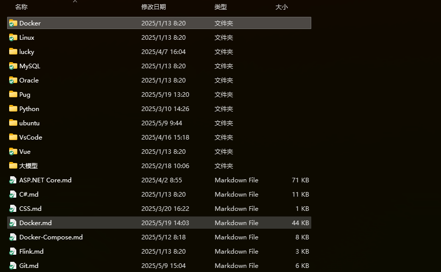
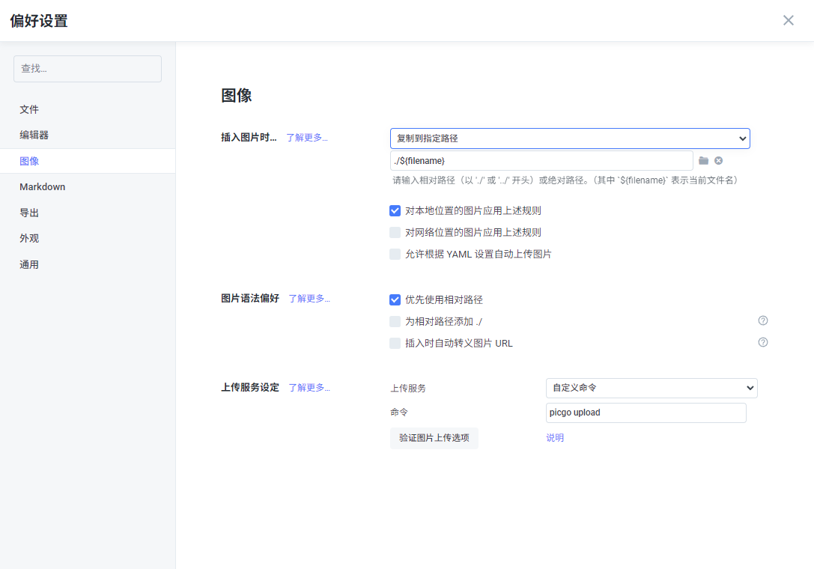
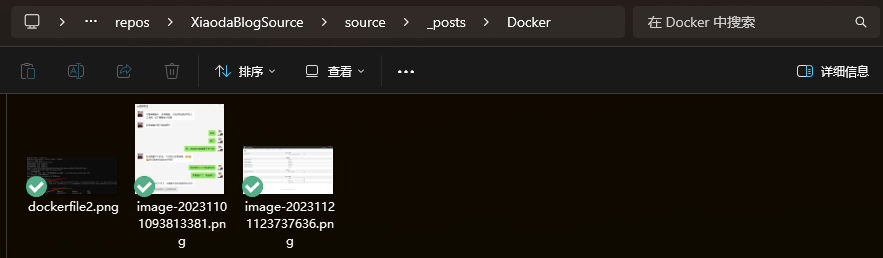

# Hexo

启动本地开发服务器

```shell
hexo server
# or
hexo s
```

清空本地缓存

```shell
hexo clean
```

构建并发布到Git上

```shell
hexo g -d
```

只构建

```shell
hexo g
```

将安装的主题推送到Git上

因为主题也是一个git项目，需要先把`.git`剪切到任意位置

`.git`文件夹在 `themes/butterfly`目录下，是一个隐藏文件夹

```shell
git rm --cache themes/butterfly
git status
git add themes/butterfly
```

新建文章

```shell
hexo new [layout] <title>
```

新建一篇文章。如果没有设置 `layout` 的话，默认使用 [_config.yml](https://hexo.io/zh-cn/docs/configuration) 中的 `default_layout` 参数代替。如果标题包含空格的话，请使用引号括起来。

## 图片上传

### 本地目录

**先将 _config.yml 文件中的 post_asset_folder 选项设为 true**

该操作的目的就是在使用`hexo new xxx`指令新建md文档博文时，在相同路径下同步创建一个`xxx`文件夹，而`xxx`文件夹就是用来存放新建md文档里的图片的



就像这样，新建的md文档和其对于的同名文件夹都在/source/_posts路径下

但如果你习惯不用hexo new xxx指令创建新md文档，而是直接打开typora写然后保存到/source/_posts下，这个时候你就需要自己手动创建一个**同名的文件夹**才可以。

#### 解决图片路径问题

typora的图片插入的语法我是一般不会用的，大多数时候就是复制粘贴图片到md文档里面。这个时候我们再慢慢修改路径到上面我们创建的文件夹下面就太麻烦了。

我们可以通过以下设置来舒舒服服按照简单粗暴的复制粘贴插入图片：

**打开typora，点击文件，点击偏好设置，点击图像**



第一个，将图片复制到指定路径./$(filename)的效果就是：**我们粘贴图片到md文档的时候，typora会自动把图片再复制一份到我们上面创建的同名文件夹下**

这样的好处还有一点，就是也不用我们自己创建同名文件夹了，typora会自己帮我们创建（有的话就复制到这里面）（**但 _config.yml文件中的post_asset_folder选项还是得设为 true，这是必须的**）

效果就像这样：



#### 解决md文档转换到html文档路径不一样的问题

转换需要用到**hexo-asset-img**插件

在博客的源码文件夹下启动命令行，下载插件hexo-asset-img：

```shell
yarn add hexo-asset-img
```

是**hexo-asset-img**，**不是**其他文章里写的**hexo-asset-image**，这也是我之前用了不好使的原因

# Butterfly 主题

## 鼠标样式修改

1. 在\themes\butterfly\source\css路径下创建一个mouse.css文件，在文件中添加如下代码：
   ```css
   body {
       cursor: url(https://cdn.jsdelivr.net/gh/sviptzk/HexoStaticFile@latest/Hexo/img/default.cur),
           default;
   }
   a,
   img {
       cursor: url(https://cdn.jsdelivr.net/gh/sviptzk/HexoStaticFile@latest/Hexo/img/pointer.cur),
           default;
   }
   ```

   

2. 打开站点的主题配置文件_config.butterfly.yml，找到inject，在head处直接引入该文件：
   ```yaml
   inject:
     head:
     - <link rel="stylesheet" href="/css/mouse.css">
   ```

   

3. 重新部署，即可看到效果

## 增加网站备案信息

找到`themes/butterfly/layout/includes/footer.pug`文件

在文件 `if theme.footer.copyright`中增加

```pug
      br
      center
        | ICP备案号:
        a(href="https://beian.miit.gov.cn" target="_blank") 辽ICP备2025052969号-1
```

完整如下：

```pug
#footer-wrap
  if theme.footer.owner.enable
    - var now = new Date()
    - var nowYear = now.getFullYear()
    if theme.footer.owner.since && theme.footer.owner.since != nowYear
      .copyright!= `&copy;${theme.footer.owner.since} - ${nowYear} By ${config.author}`
    else
      .copyright!= `&copy;${nowYear} By ${config.author}`
  if theme.footer.copyright
    .framework-info
      span= _p('footer.framework') + ' '
      a(href='https://hexo.io')= 'Hexo'
      span.footer-separator |
      span= _p('footer.theme') + ' '
      a(href='https://github.com/jerryc127/hexo-theme-butterfly')= 'Butterfly'
      br
      center
        | ICP备案号:
        a(href="https://beian.miit.gov.cn" target="_blank") 辽ICP备2025052969号-1
  if theme.footer.custom_text
    .footer_custom_text!=`${theme.footer.custom_text}`
```

