# Linux

## 简介

> 在linux系统中，没有盘符的概念。
> 一个盘。/根目录
> 没有图形化界面
> 通过指令操作
>
> linux指令是可以传参数的。
>
> 在Linux系统下，万事万物皆文件。

## Linux的文件结构（19个）

- bin：存放的是二进制的可以执行文件。（重点）
- sbin：存放的是二进制的可以执行文件。super，只有root用户才能访问
- etc：存放系统配置文件（重点）
- usr：用来存放共享的系统资源
- home：除了root用户的家目录（重点）
- root：就是root用户的家目录
- dev：存放设备文件

## Linux指令

- Ctrl+u 键: 删除命令行开始至光标处
- Ctrl+k 键: 删除光标至命令行结尾
- Ctrl+a 键: 光标移到最前
- Ctrl+e 键: 光标移到最后
- ip addr（ip a）：查看主机的ip地址
- clear：清屏
- tab 键: 提示作用。自动补全。

### 跳转目录：

```shell
# 跳转指定目录 root目录下的www
cd /root/www
# 返回跳转前的目录
cd -
# 跳转上一级目录
cd ../
# 跳转根目录
cd /
# 跳转root目录
cd ~
# 跳转至主目录（后面跟个空格就行）
cd 
```

### 复制粘贴：

```shell
# 把aa.txt复制到init目录下
cp aa.txt init/
# 把init文件夹以及所包含的文件复制到 spring文件夹下
cp -r init spring/
```

### 列出目录内容：

```shell
# 列出当前目录下的所有文件及目录（不含隐藏的）
ls
# 给ls指令传了一个参数l。等同于ll。列出当前目录下的所有文件及目录的详情。
ls -l
# 列出当前目录下的所有文件及目录（含隐藏的）
ls -a
# ls后可以接目录名（相对路径），要么接绝对路径，查看目录下的文件及目录
ls <当前目录下的文件夹>

ls -l                    # 以长格式显示当前目录中的文件和目录
ls -a                    # 显示当前目录中的所有文件和目录，包括隐藏文件
ls -lh                   # 以人类可读的方式显示当前目录中的文件和目录大小
ls -t                    # 按照修改时间排序显示当前目录中的文件和目录
ls -R                    # 递归显示当前目录中的所有文件和子目录
ls -l /etc/passwd        # 显示/etc/passwd文件的详细信息
```


pwd：查看当前所在的目录
方向键↑和↓：浏览历史指令

mkdir：创建目录
mkdir -p：创建多级目录
cp -r init spring：复制粘贴。把init目录以及包含的文件复制到spring目录下
mv aa.txt xiaoqiang.txt：重命名。把aa.txt重命名为xiaoqiang.txt。
mv bb.txt spring：移动。把bb.txt移动到spring目录。
mv -f spring aaaaa：在覆盖前不提示
mv -r aaaaa bbbbb：强行覆盖。前提是被覆盖的目录和覆盖的目录要结构相同。（慎用）
rm xiaoqiang.txt：删除xiaoqiang.txt
rm -f spring.xml：强行删除spring.xml，没有确认提示
rm -r init：递归删除init目录
rm -rf bbbbb：递归删除bbbbb并且没有确认提示（慎用）
rmdir aa：删除空目录aa（用的很少）
rm -rf *：删除所有的目录及文件（慎用）

cat：显示文本文件的内容（一部分）。.java，.py，.c++，.xml，.html，.js，.css
more：分页显示文本文件的内容。只能向下查看，不能向上翻页。
less：分页显示文本文件的内容。上下翻页。通过PgUp和PgDn进行上下翻页，↑和↓一行一行的查看。输入q退出查看。
top -n 10 xxxx：查看文本文件的前10行
tail -n 10 xxxx：查看文本文件的后10行
tail -f xxxx：实时监控文本文件的变化
Ctrl + c：几乎可以退出所有的操作
echo：打印输出一句话。也可以用作向文本文件内写入信息。会自动追加并换行。

find: 查找文件夹或目录 find /usr -iname "\*docker\*" 查找/usr目录下 名称为docker 的文件或目录 模糊查询 并忽略大小写

### 压缩：

1、打包，把多个文件打成一个包。
2、压缩，把文件占用的大小进行压缩。

tar命令：用来进行压缩和解压缩的。
	-c 建立一个压缩文件（打包）
	-x 解开一个压缩文件（解包）
	-z 是否需要使用gzip压缩
	-v 压缩过程中是否显示文件日志
	-f 使用的文件名
tar -cf：只打包，不压缩，不显示日志
tar -xf：解压文件，不显示日志
tar -cvf：只打包，不压缩，显示日志
tar -xvf：解压文件，显示日志。
tar -zcvf：打包压缩，显示日志

```shell
tar -zcvf wwwroot.tar.gz wwwroot/
```

tar -zxvf：解压（最常用）

```shell
tar -zxvf wwwroot.tar.gz
```

tar.gz 和 tgz 的区别

tar.gz 和 tgz 是两种常见的压缩文件格式，它们在本质上是相同的，只是文件扩展名不同。两者都是通过 tar 命令将多个文件打包成一个文件，然后再使用 gzip 压缩工具进行压缩。

### 系统服务：

systemstl：操作系统服务。
	status：查看某个服务的状态
	stop：终止某个服务
	start：启动某个服务
	restart：重启某个服务

```shell
systemctl status mysqld
```

网络服务：network
防火墙服务：firewalld
Mysql：mysqld
systemctl status network

### 网络状态:

```shell
# -l或--listening 显示监控中的服务器的Socket
# -n或--numeric 直接使用IP地址，而不通过域名服务器。
# -p或--programs 显示正在使用Socket的程序识别码和程序名称。
netstat -lnp | grep 8080
```

### 获取路径：

```shell
readlink -f sample.txt /home/gliu/sample.txt 
realpath -s sample.txt /home/gliu/sample.txt 
find $(pwd) -name sample.txt /home/gliu/sample.txt
ls -l $PWD/sample.txt
```

### 文件目录:

```shell
# 列出当前目录下所有文件的大小，以及所有文件大小的统计总和
ls -lht	
```


## 文件详情：（以home目录为例）

d：说明当前文件是一个目录（- 代表的是文件）
rwx：r，可读；w，可写；x，可执行。（代表当前文件的创建者的权限）
r-x：代表的是和文件创建者的同组的用户的权限
r-x：代表的是其他用户
2：链接数
root：创建者
root：创建者所在的组
6：文件占用空间的大小（字节）
Apr 11 2018：最后一次修改时间
home：文件名或目录名

## 查找文件

### find 命令

基本格式：find path expression

1. 按照文件名查找
   find / -name httpd.conf # 在根目录下 查找文件httpd.conf，表示在整个硬盘查找
   find /etc -name httpd.conf # 在 /etc 目录下查找文件 httpd.conf
   find /etc -name '\*srm*' # 使用通配符\*(0或者任意多个)。表示在 /etc 目录下查找文件名中含有字符串'srm'的文件
2. 按照文件特征查找
   find / -amin -10 # 查找在系统中最后10分钟访问的文件(access time)
   find / atime -2 # 查找在系统中最后48小时访问的文件
   find / -empty # 查找在系统中为空的文件或者文件夹
   find / -group cat # 查找在系统中属于 group 为 cat 的文件
   find / -mmin  -5 # 查找在系统中最后5分钟里修改过的文件(modify time)
   find / -mtime -1 # 查找在系统中最后24小时里修改过的文件
   find / -user fred # 查找在系统中属于fred这个用户的文件
   find / -size +10000c # 查找出大鱼10000字节的文件(c:字节，w:双字, k:KB, M:MB, G:GB)
   find / -size -1000k
3. 使用混合查找方式查找文件
   参数有：!, -and(-a), -or(-0)
   find /tmp -size +10000c -and -mtime +2 # 在/tmp目录下查找大于10000字节并在最后2分钟内修改的文件
   find / -user fred -or -user george # 在根目录下查找用户是fred或者george的文本文件
   find /tmp ! -user panda #在/tmp目录中查找所有不属于panda用户的文件

### du 命令

du 命令可以查看磁盘空间的使用情况，自然也可以用来查看磁盘上占用空间较多的文件和文件夹。

```shell
# 查找/root下5个最大的文件
du -ah /root | sort -nr | head -n5

# 查找当前目录下最大的5个目录
du -ah | sort -nr | head -n5

# 查找根目录下最大目录/文件（包括子文件夹）
du -Sh / | sort -rh | head -n10

# 只看大小在 GB 范围内的所有文件
du -ah / | grep "[0-9]G\b"

# 查看各目录占用（从根目录开始，排序显示）
du -sh /* 2>/dev/null | sort -rh | head -20

# 重点查看 /var 目录
du -sh /var/* 2>/dev/null | sort -rh | head -20
```

## 进程管理

ps 查看前台进程
ps -aux 查看所有进程详细信息 UID 用户 PID 进程ID
ps -ef 查看所有进程详细信息 UID 用户 PID 进程ID PPID 父进程ID
父进程id为1 为系统进程
top 动态显示进程
ps -aux|grep network  查看所有进程详细信息，并搜索network进程
kill 根据PID，终止进程
kill -9 强制终止

## vi命令 编辑器

i  切换到编辑模式
ESC 切换到命令模式
:wq 保存并退出
:q 不保存退出
:w 保存
:q! 强制不保存退出
:wq! 强制保存退出
a  在光标后插入
A 在光标当前行的行尾插入
i 在光标前插入
I 在光标当前行的行头插入
:set nu 显示行号
:set nonu 取消显示行号
gg 到文本的第一行
G 到文本的最后一行
u 后退一步 相当于 Ctrl + z
Ctrl + r 前进一步
Shift + zz 保存退出 跟:wq一样
起始行号，结束行号 del 删除对应范围内的行

安装vim编辑器

```shell
yum install -y vim
```

## 配置网络

```shell
cd /etc/sysconfig/network-scripts
vi ifcfg-ens33

TYPE=Ethernet
PROXY_METHOD=none
BROWSER_ONLY=no
BOOTPROTO=dhcp
DEFROUTE=yes
IPV4_FAILURE_FATAL=no
IPV6INIT=yes
IPV6_AUTOCONF=yes
IPV6_DEFROUTE=yes
IPV6_FAILURE_FATAL=no
IPV6_ADDR_GEN_MODE=stable-privacy
NAME=ens33
UUID=08913b58-0bc2-42c5-8b59-6782e0029d7b
DEVICE=ens33
ONBOOT=yes

# 修改ONBOOT=yes
systemctl restart network

ip addr
```

## 端口映射

```shell
# 将 80 端口 映射到 8080端口上 dport为目标端口 to-port为来源端口
iptables -t nat -A PREROUTING -p tcp --dport 8080 -j REDIRECT --to-port 80
# 查看iptables规则
iptables -t nat -L -n -v

##
Chain PREROUTING (policy ACCEPT 0 packets, 0 bytes)
 pkts bytes target     prot opt in     out     source               destination
12925 4377K DOCKER     all  --  *      *       0.0.0.0/0            0.0.0.0/0            ADDRTYPE match dst-type LOCAL
    0     0 REDIRECT   tcp  --  *      *       0.0.0.0/0            0.0.0.0/0            tcp dpt:8080 redir ports 80
```

## 软件安装

rpm 本地安装
yum centos安装软件 需要源

安装screenFetch

```shell
#使用wget 下载安装包
wget https://github.com/KittyKatt/screenFetch/archive/master.zip
#使用unzip解压，unzip需要安装
yum install unzip
unzip master.zip
#移动
mv screenFetch-master/screenfetch-dev /usr/bin/screenfetch
```

## wget 下载工具

#### 格式

wget [参数] [URL地址]

wget -O 图片名.png https://www.baidu.com/img/bd_logo1.png

#### 记录和输入文件参数

| 短格式 | 长格式              | 说明                                                 |
| ------ | ------------------- | ---------------------------------------------------- |
| -o     | –output-file=FILE   | 把记录写到FILE文件中                                 |
| -a     | –append-output=FILE | 把记录追加到FILE文件中                               |
| -d     | –debug              | 打印调试输出                                         |
| -q     | –quiet              | 安静模式(没有输出)                                   |
| -v     | –verbose            | 冗长模式(这是缺省设置)                               |
| -nv    | –non-verbose        | 关掉冗长模式，但不是安静模式                         |
| -i     | –input-file=FILE    | 下载在FILE文件中出现的URLs                           |
| -F     | –force-html         | 把输入文件当作HTML格式文件对待                       |
| -B     | –base=URL           | 将URL作为在-F -i参数指定的文件中出现的相对链接的前缀 |
|        | –sslcertfile=FILE   | 可选客户端证书                                       |
|        | –sslcertkey=KEYFILE | 可选客户端证书的KEYFILE                              |
|        | –egd-file=FILE      | 指定EGD socket的文件名                               |

#### 下载参数

| 短格式 | 长格式                | 说明                                                     |
| ------ | --------------------- | -------------------------------------------------------- |
|        | –bind-address=ADDRESS | 指定本地使用地址(主机名或IP，当本地有多个IP或名字时使用) |
| -t     | –tries=NUMBER         | 设定最大尝试链接次数(0 表示无限制).                      |
| -O     | –output-document=FILE | 把文档写到FILE文件中                                     |
| -nc    | –no-clobber           | 不要覆盖存在的文件或使用.#前缀                           |
| -c     | –continue             | 接着下载没下载完的文件                                   |
|        | –progress=TYPE        | 设定进程条标记                                           |
| -N     | –timestamping         | 不要重新下载文件除非比本地文件新                         |
| -S     | –server-response      | 打印服务器的回应                                         |
|        | –spider               | 不下载任何东西                                           |
| -T     | –timeout=SECONDS      | 设定响应超时的秒数                                       |
| -w     | –wait=SECONDS         | 两次尝试之间间隔SECONDS秒                                |
|        | –waitretry=SECONDS    | 在重新链接之间等待1…SECONDS秒                            |
|        | –random-wait          | 在下载之间等待0…2*WAIT秒                                 |
| -Y     | –proxy=on/off         | 打开或关闭代理                                           |
| -Q     | –quota=NUMBER         | 设置下载的容量限制                                       |
|        | –limit-rate=RATE      | 限定下载速率                                             |


## 用户

who am i 查看当前用户
who --count  查看当前登录用户数量
exit 退出登录
groupadd 创建用户组
groupdel 删除用户组
useradd xiaoqiang -g user 创建一个用户xiaoqiang，并指定用户组user
passwd xiaoqiangf 给xiaoqiang用户指定密码
su 切换用户 从root切换到其他用户不需要输入密码 如果从其他用户切换到root用户，需要输入密码

### 权限管理

Linux 下文件有三种权限 r 读 w写 x可执行

---

```shell
chmod 755 file
```

### 开启sudo权限

```shell
#添加sudo文件的写权限,命令是:
chmod u+w /etc/sudoers
#编辑sudoers文件
vim /etc/sudoers
#找到这行 root ALL=(ALL) ALL,在他下面添加xxx ALL=(ALL) ALL (这里的xxx是你的用户名)
```

> ps:这里说下你可以sudoers添加下面四行中任意一条
>
> ```
> youuser            ALL=(ALL)                ALL  
> %youuser           ALL=(ALL)                ALL  
> youuser            ALL=(ALL)                NOPASSWD: ALL  
> %youuser           ALL=(ALL)                NOPASSWD: ALL  
> ```
> 第一行:允许用户youuser执行sudo命令(需要输入密码).
> 第二行:允许用户组youuser里面的用户执行sudo命令(需要输入密码).
> 第三行:允许用户youuser执行sudo命令,并且在执行的时候不输入密码.
> 第四行:允许用户组youuser里面的用户执行sudo命令,并且在执行的时候不输入密码.

```shell
#撤销sudoers文件写权限,命令:
chmod u-w /etc/sudoers
```

这样普通用户就可以使用sudo了.

### 修改目录权限

**查看当前目录权限**

```bash
sudo ls -ld /OLAP
```

输出实例：

`drwxr-xr-x 5 root root 4096 Aug  5 08:27 /OLAP`

**修改目录权限**

使当前用户（假设为 `user`）能够对 `/OLAP`目录进行读写操作，可以将目录权限修改为`775`（即`rwxrwxr-x`）：

```bash
sudo chmod 775 /OLAP
```

这样，目录的所有者和所属组的用户都可以读写该目录，其他用户则由读取和执行权限。

**将当前用户加入目录所属组**

如果目录所属组是`root`，可以将当前用户`user`加入`root`组（不推荐，因为`root`组权限过高）：

```bash
sudo usermod -aG root user
```

然后，重新登录或重启系统以使组变更生效。

### 更改目录的所有者

**查看当前目录的所有者**

查看`/OLAP`目录的当前所有者：

```bash
sudo ls -ld /OLAP
```

**更改目录的所有者**

将`/OLAP`目录的所有者更改为当前用户（假设为`user`）：

```bash
sudo chown user:user /OLAP
```

这样，当前用户将拥有对该目录的完全控制权。

### 使用 ACL（访问控制列表）

> ACL 提供了更细粒度的权限控制，允许为特定用户或组设置特定权限。

**安装 ACL 工具**

在某些系统中，ACL 工具可能未默认安装，可以通过以下命令安装：

```bash
sudo apt install acl -y
sudo dnf insyall acl -y
```

**设置 ACL 权限**

为当前用户（假设为`user`）设置读写权限：

```bash
sudo setfacl -m u:user:rwx /OLAP
```

这样，`user`用户将获得对`/OLAP`目录的读写权限，而不会影响其他用户的权限。

**验证 ACL 权限**

查看当前目录的 ACL 权限：

```bash
getfacl /OLAP
```

输出实例：
```
getfacl: Removing leading '/' from absolute path names
# file: OLAP
# owner: user
# group: user
user::rwx
group::r-x
other::r-x
```

### 更改目录的默认权限（可选）

如果要将新创建的文件和子目录自动继承特定权限，可以设置默认 ACL：

```bash
sudo setfacl -dm u:user:rwx /OLAP
```

这样，新创建的文件和子目录将自动继承 `user` 用户的读写权限。

## Shell 脚本

### 为什么大多数 shell 脚本都包含 #! /bin/bash 在 shell 脚本的开头？

“`#!/bin/bash`”这一行被称为`shebang` 行，在某些文献中，它被称为`hashbang` 行，这是因为它以两个字符`hash '#'` 和`bang '!' `开头。

```shell
#! /bin/bash

echo 'Hello, World!'
```

当你在脚本的最顶部包含“`#!/bin/bash`”行时，系统知道你想使用 `bash` 作为脚本的解释器。因此，你现在可以直接运行 `hello.sh` 脚本，而无需在其前面加上 `bash`。

使用 `＃！/bin/bash` 表示该脚本是 `bash shell` 脚本，无论系统上正在使用什么 `shell`，都应该使用 `bash` 作为解释器运行。如果你使用的是 `zsh` 特定的语法，你可以通过添加 `#! /bin/zsh` 作为脚本的第一行。

`#!` 和 `/bin/bash` 之间的空格无关紧要。你也可以使用 `#!/bin/bash`。

## yum

### 改阿里源

```shell
yum install -y wget && mv /etc/yum.repos.d/CentOS-Base.repo /etc/yum.repos.d/CentOS-Base.repo.backup && wget -O /etc/yum.repos.d/CentOS-Base.repo http://mirrors.aliyun.com/repo/Centos-7.repo && yum clean all && yum makecache
```

## dnf


## 安装MySQL

有些Linux会自带MariaDB数据库，所以需要先卸载

列出安装的MariaDB的包

```shell
rpm -qa | grep mariadb
```

得到查看到的包名

卸载包 后面加上包名

```shell
rpm -e --nodeps mariadb-libs-5.5.68-1.el7.x86_64
```

自此下载MariaDB已经完成了

切换到home目录下

```shell
cd /home/
```

安装 wget 并下载yum库

```shell
yum install wget -y
wget https://repo.mysql.com//mysql80-community-release-el7-1.noarch.rpm
rpm -Uvh mysql80-community-release-el7-1.noarch.rpm
cd /etc/yum.repos.d/
vim mysql-community.repo
```

选择要安装的MySQL版本

```shell
[mysql57-community]
name=MySQL 5.7 Community Server
baseurl=http://repo.mysql.com/yum/mysql-5.7-community/el/7/$basearch/
enabled=0  // 将这里的0改为1
gpgcheck=1
gpgkey=file:///etc/pki/rpm-gpg/RPM-GPG-KEY-mysql

[mysql80-community]
name=MySQL 8.0 Community Server
baseurl=http://repo.mysql.com/yum/mysql-8.0-community/el/7/$basearch/
enabled=1  //将这里的1改为0
gpgcheck=1
gpgkey=file:///etc/pki/rpm-gpg/RPM-GPG-KEY-mysql
```

enabled=0为禁用对应版本的YUM库，enabled=1为启用，默认8.0的配置为enabled=1，安装5.7的话，我们就把8.0的enabled=1修改为enabled=0，然后把5.7的enabled=0修改为enabled=1

安装MySQL并启动

```shell
yum install mysql-community-server
service mysqld start
```

第一步安装成功之后，然后启动MySQL

如果失败了，提示GPG

RPM 维护一个单独的密钥环，因为它是一个系统范围的应用程序，而用户的 GPG 公钥环是一个用户特定的文件。要将 MySQL 公钥导入 RPM 密钥环，首先获取密钥，然后使用 rpm --import 导入密钥

```shell
# centos
rpm --import https://repo.mysql.com/RPM-GPG-KEY-mysql-2022

# Ubuntu：
wget -q -O - https://repo.mysql.com/RPM-GPG-KEY-mysql-2022 | apt-key add -

yum install mysql-community-server
```

查看MySQL初始密码

```shell
sudo grep 'temporary password' /var/log/mysqld.log
```

登录MySQL

```shell
mysql -u root -p
```

设置密码的验证强度等级

```shell
set global validate_password_policy=LOW;
```

设置密码长度为6位

```shell
set global validate_password_length=6;
```

修改MySQL初始密码

```shell
ALTER USER 'root'@'localhost' IDENTIFIED BY '123456';
```

给root权限开启远程登录

```shell
use mysql;
select user,host from user;
update user set host = '%' where user = 'root';
flush privileges;
```

---

### AlmaLinux 安装 (dnf包管理器方式)

1. 首先确保系统是最新的。

    ```shell
    sudo dnf clean all
    sudo dnf update
    sudo dnf groupinstall "Development Tools"
    ```

2. 安装 MySQL
    默认情况下，MySQL 在 AlmaLinux 9 基础存储库中可用。 只需使用以下命令安装 MySQL 服务器包 `dnf` 命令：

    ```shell
    sudo dnf install mysql mysql-server
    ```

    设置表名不区分大小写
    
    ```shell
    vim /etc/my.cnf.d/mysql-server.cnf
    # 在 [mysqld] 中添加
    lower_case_table_names=1
    ```
    
    初始化后查询是否生效
    
    ```mysql
    show global variables like '%lower_case%';
    # lower_case_table_names 为 1
    ```
    
    启动 MySQL 服务并通过运行以下命令使其在启动时自动启动:
    
    ```shell
    sudo systemctl status mysqld
    sudo systemctl enable --now mysqld
    ```
    
    确认安装并检查已安装的 MySQL 构建版本：
    ```shell
    mysql --version
    ```
    
3. 在 AlmaLinux 9 上保护 MySQL。
    默认情况下，MySQL 未加固。 您可以使用 `mysql_secure_installation` 脚本。 您应该仔细阅读以下每个步骤，这些步骤将设置 root 密码、删除匿名用户、禁止远程 root 登录、删除测试数据库和访问安全 MySQL：

    ```shell
    mysql_secure_installation
    ```

    对提示使用以下选项：
    ```shell
    Enter current password for root (enter for none): Just press the Enter
    Set root password? [Y/n]: Y
    New password: Enter your password
    Re-enter new password: Repeat your password
    Remove anonymous users? [Y/n]: Y
    Disallow root login remotely? [Y/n]: Y
    Remove test database and access to it? [Y/n]: Y
    Reload privilege tables now? [Y/n]: Y
    ```

    安全后，您可以使用以下命令登录 MySQL shell:
    ```shell
    sudo mysql -u root -p
    ```

    要创建数据库、数据库用户并向数据库用户授予所有权限，请运行以下命令：
    ```mysql
    CREATE DATABASE test_db;
    CREATE USER 'test_user'@'localhost' IDENTIFIED BY 'your-password';
    GRANT ALL ON tests_db.* TO 'test_user'@'localhost';
    FLUSH PRIVILEGES;
    EXIT
    ```


### AlmaLinux 安装 (rpm手动方式)

```shell
mkdir mysql_install
cd mysql_install
# 下载安装包
wget https://cdn.mysql.com/archives/mysql-5.7/mysql-5.7.41-1.el7.x86_64.rpm-bundle.tar
tar -xvf mysql-5.7.41-1.el7.x86_64.rpm-bundle.tar

rpm -ivh mysql-community-common-5.7.41-1.el7.x86_64.rpm

rpm -ivh mysql-community-libs-5.7.41-1.el7.x86_64.rpm

rpm -ivh mysql-community-libs-compat-5.7.41-1.el7.x86_64.rpm
# 如果出现以下错误
error: Failed dependencies:
        libcrypto.so.10()(64bit) is needed by mysql-community-libs-compat-5.7.41-1.el7.x86_64
        libcrypto.so.10(libcrypto.so.10)(64bit) is needed by mysql-community-libs-compat-5.7.41-1.el7.x86_64
        libssl.so.10()(64bit) is needed by mysql-community-libs-compat-5.7.41-1.el7.x86_64
        libssl.so.10(libssl.so.10)(64bit) is needed by mysql-community-libs-compat-5.7.41-1.el7.x86_64
# 执行
dnf install -y https://repo.almalinux.org/almalinux/8/AppStream/x86_64/os/Packages/compat-openssl10-1.0.2o-4.el8_6.x86_64.rpm

rpm -ivh mysql-community-devel-5.7.41-1.el7.x86_64.rpm
# 如果出现以下错误
error: Failed dependencies:
        /usr/bin/pkg-config is needed by mysql-community-devel-5.7.41-1.el7.x86_64
# 执行
dnf install openssl-devel -y

rpm -ivh mysql-community-client-5.7.41-1.el7.x86_64.rpm
# 如果出现以下错误
错误：依赖检测失败：
        libncurses.so.5()(64bit) 被 mysql-community-client-5.7.41-1.el7.x86_64 需要
        libtinfo.so.5()(64bit) 被 mysql-community-client-5.7.41-1.el7.x86_64 需要
# 执行
dnf install libncurses* -y
dnf install epel-release -y
dnf install ncurses-compat-libs -y

rpm -ivh mysql-community-server-5.7.41-1.el7.x86_64.rpm
# 如果出现以下提示
/usr/lib/tmpfiles.d/mysql.conf:23: Line references path below legacy directory /var/run/, updating /var/run/mysqld → /run/mysqld; please update the tmpfiles.d/ drop-in file accordingly.
# 执行
vim /usr/lib/tmpfiles.d/mysql.conf
# 将/var/run/mysqld 改为 /run/mysqld

# 如果出现以下提示
error: Failed dependencies:
        libcrypt.so.1()(64bit) is needed by mysql-community-server-5.7.41-1.el7.x86_64
        libcrypt.so.1(GLIBC_2.2.5)(64bit) is needed by mysql-community-server-5.7.41-1.el7.x86_64
# 执行
dnf install -y libxcrypt-compat

# 如果出现以下提示
error: Failed dependencies:
        /usr/bin/perl is needed by mysql-community-server-5.7.41-1.el7.x86_64
        perl(Getopt::Long) is needed by mysql-community-server-5.7.41-1.el7.x86_64
        perl(strict) is needed by mysql-community-server-5.7.41-1.el7.x86_64
dnf install -y perl.x86_64
# 如果出现以下提示
error: Failed dependencies:
        net-tools is needed by mysql-community-server-5.7.41-1.el7.x86_64
# 执行
dnf install net-tools -y

rpm -ivh mysql-community-embedded-compat-5.7.41-1.el7.x86_64.rpm

```

**编辑配置文件**

```shell
vim /etc/my.cnf

# For advice on how to change settings please see
# http://dev.mysql.com/doc/refman/5.7/en/server-configuration-defaults.html
[client]
port = 3306
user = mysql

[mysqld]
#
# Remove leading # and set to the amount of RAM for the most important data
# cache in MySQL. Start at 70% of total RAM for dedicated server, else 10%.
# innodb_buffer_pool_size = 128M
#
# Remove leading # to turn on a very important data integrity option: logging
# changes to the binary log between backups.
# log_bin
#
# Remove leading # to set options mainly useful for reporting servers.
# The server defaults are faster for transactions and fast SELECTs.
# Adjust sizes as needed, experiment to find the optimal values.
# join_buffer_size = 128M
# sort_buffer_size = 2M
# read_rnd_buffer_size = 2M
basedir=/usr/local/mysql
datadir=/var/lib/mysql
socket=/var/lib/mysql/mysql.sock

# Disabling symbolic-links is recommended to prevent assorted security risks
symbolic-links=0

log-error=/var/log/mysqld.log
pid-file=/var/run/mysqld/mysqld.pid

max_connections = 400
character-set-server = utf8mb4
explicit_defaults_for_timestamp = true
lower_case_table_names = 1
```

**初始化**

```shell
mysqld --defaults-file=/etc/my.cnf --initialize-insecure --user=mysql
# 给mysql用户添加数据目录权限
chown mysql:mysql /var/lib/mysql -R
systemctl start mysqld
systemctl enable mysqld

# 查看root随机生成密码
grep 'temporary password' /var/log/mysqld.log
# 若没有提示，则没有密码，可直接登录
mysql -uroot
```

## 配置Java环境变量

将tar.gz格式的jdk解压后移动到/usr目录下

```shell
mv jdk1.8.0_301/ /usr/
```

编辑/etc目录下profile文件 G到最后一行

```shell
vim /etc/profile

export JAVA_HOME=/usr/jdk1.8.0_301
export PATH=$PATH:$JAVA_HOME/bin

```

:wq保存退出

重新加载配置文件

```shell
source /etc/profile
```

---

## CentOS7防火墙

放行特定端口

```shell
firewall-cmd --add-port=6379/tcp --permanent
```

移除放行端口

```shell
firewall-cmd --permanent --remove-port=8080/tcp
```

查询端口是否开放

```shell
firewall-cmd --query-port=8080/tcp
```

任何修改操作，配置完成后，需要重新加载firewall

重新加载防火墙

```shell
firewall-cmd --reload
```

查看防火墙开放的端口

```shell
firewall-cmd --list-all
```

指定作用域开发防火墙端口

```shell
firewall-cmd --zone=public --add-port=3306/tcp --permanent
# -zone 作用域
# -add-port 添加端口，格式为端口/协议
# -permanent 永久生效，没有此参数重启后失效

```

## 安装与分区

Linux分区：顺序（主要是boot swap /）

1，boot  分区（因为boot是引导启动的分区，所以分区的时候必须先分boot，通常设置大小为200M 空间足够300 - 500M）

2，swap（缓存分区，通常设置大小为1G  通常是物理内存大小的2倍，比如你电脑是4G的物理内存，swap分区可以是8G）

3，/ （根分区，通常把硬盘剩下所有的都分配给根/）

4，/home分区 （可选）


## 查看硬盘空间

```shell
# 统计磁盘整体情况，包括磁盘大小，已使用，可用
df -lh
# 查看根目录下文件夹大小
du -sh /*
```

## 快速查找大文件

```shell
# 查找当前用户目录下面大于100M的文件、需包含文件属性、以及从大到小排序：
find ~ -type f -size +100M | xargs ls -lhS
# 只显示文件大小和文件路径
find ~ -type f -size +100M | xargs du -h | sort -hr
```

## 扩容

### LVM

#### 旧有卷

将 `/home`部分空间合并至`/`下

```shell
df -h
```

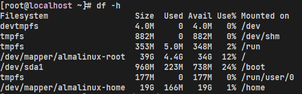

查看卷的文件系统类型

```shell
mount |grep home
```

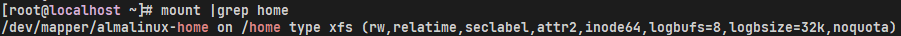

安装`xfsdump`备份工具

```shell
dnf install -y xfsdump
```

备份`/home`

```shell
xfsdump -f ~/sdb_dump/ /home -M sdb_home -L sdb_home_1
```

卸载`/home`

```shell
umount /home/
df -h
```

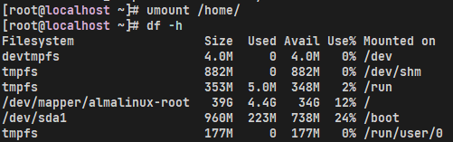

移除 `/dev/mapper/almalinux-home`(删除前请确保重要文件已备份)

```shell
lvremove /dev/mapper/almalinux-home
```

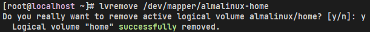

```shell
lsblk
```

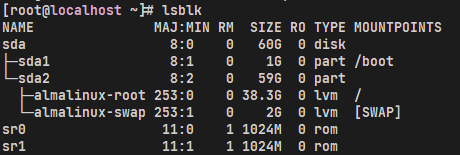

扩展`/dev/mapper/almalinux-root`增加8.7G

```shell
lvresize -L +8.7G /dev/mapper/almalinux-root
lsblk
```

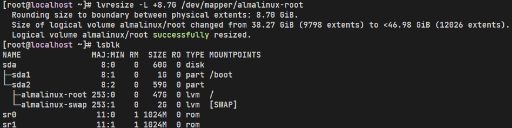

```shell
df -h
```

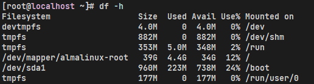

扩展文件系统根目录

```shell
xfs_growfs /
```

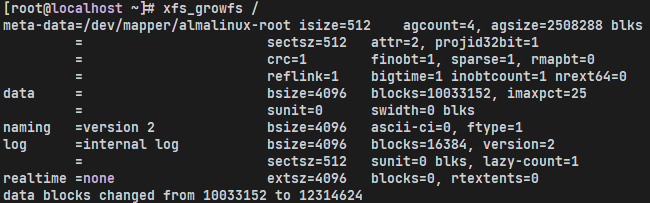

```shell
df -h
```

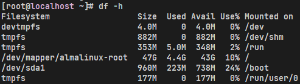

重新创建`/dev/mapper/almalinux-home`

```shell
lvcreate -L 9G -n home almalinux
lsblk
```

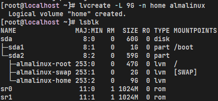

将剩余空闲空间扩展给`/dev/mapper/almalinux-home`

```shell
lvextend -l +100%FREE -n /dev/mapper/almalinux-home
lsblk
```

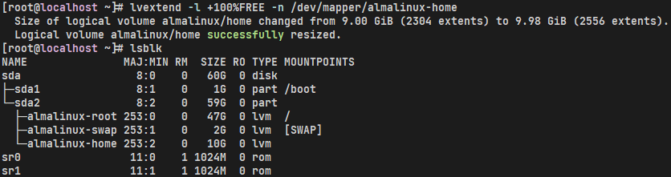

格式化`/dev/mapper/almalinux-home`

```shell
mkfs.xfs /dev/mapper/almalinux-home
```

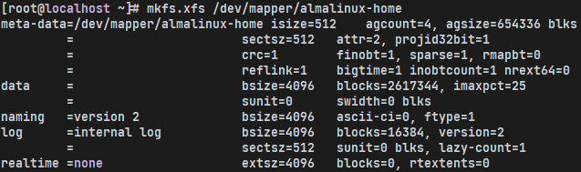

挂载

**因为lv名称和挂载点不变，因此无需修改/etc/fstab**

```shell
mount -a
df -Th
```

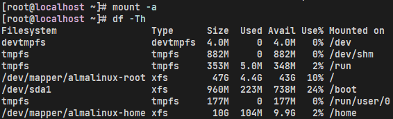

还原

```shell
xfsrestore -f sdb_dump /home/
```

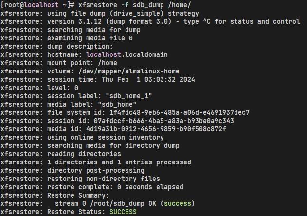

#### 新加卷

Orale VirtualBox

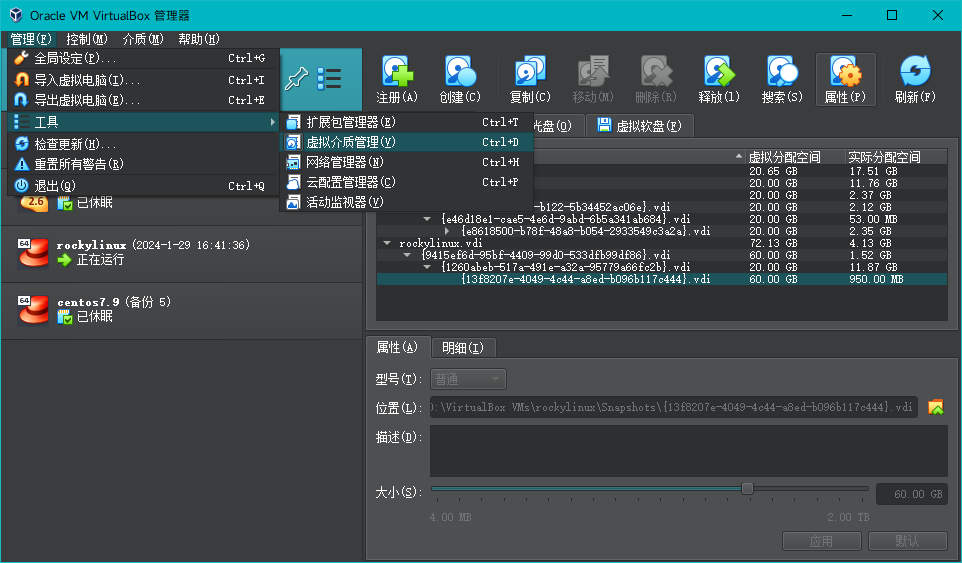

需要选择最后一个，因为前几个是之前的备份快照

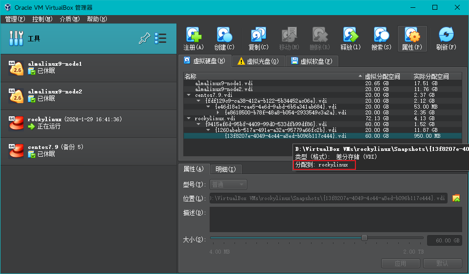

分配大小即可，只能增加不能缩小

查看现有分区大小

```shell
df -Th
```

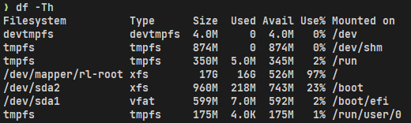

查看扩容后磁盘大小

```shell
lsblk
```

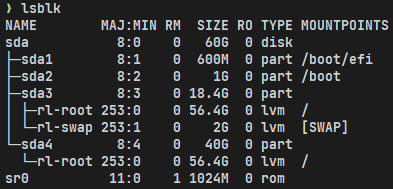

创建分区

```shell
fdisk /dev/sda
```

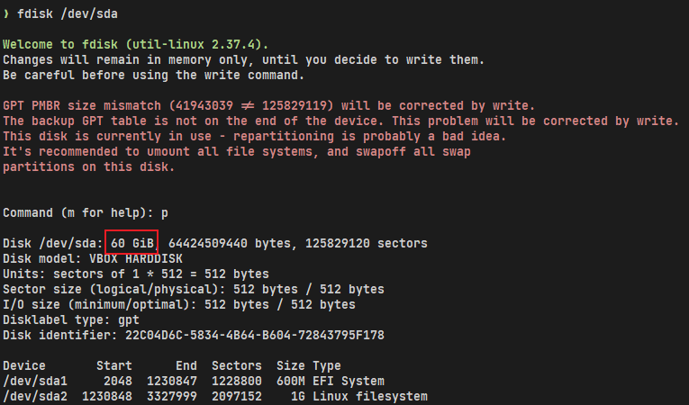

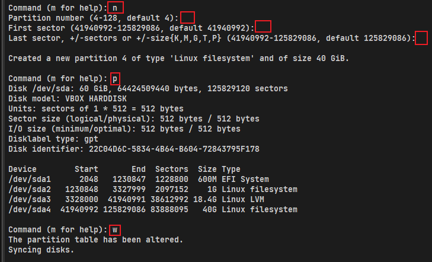

刷新分区并创建物理卷

```shell
partprobe /dev/sda
pvcreate /dev/sda4
```

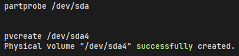

查看卷组名称，以及卷组使用情况

```shell
vgdisplay
```

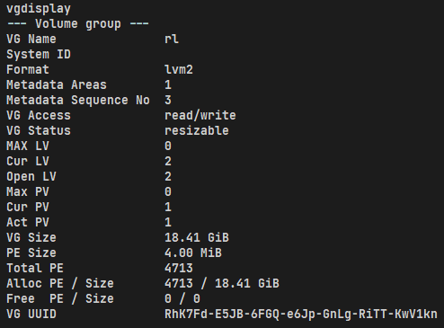

将物理卷扩展到卷组

```shell
vgextend rl /dev/sda4
```

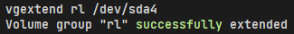

查看当前逻辑卷的空间状态

```shell
lvdisplay
```

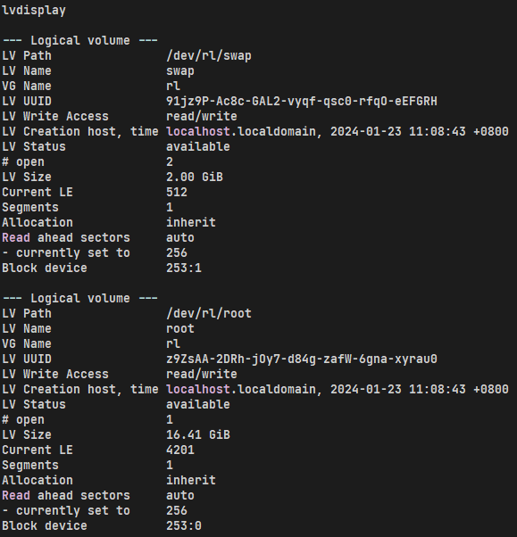

将卷组中的空闲空间扩展到根分区逻辑卷

```shell
lvextend -l +100%FREE /dev/rl/root
```

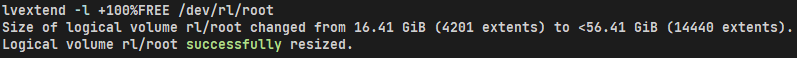

刷新根分区

```shell
xfs_growfs /dev/rl/root
```

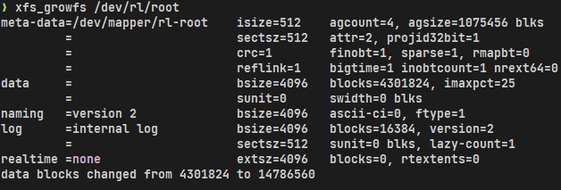

扩容成功

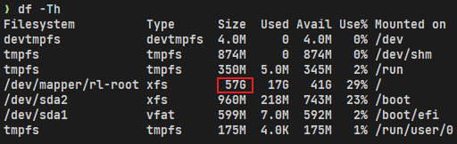

## 转换分区格式

### Microsoft 基本数据 -> Linux 文件系统

```shell
fdisk -l
...
Disk /dev/sdb：2.18 TiB，2400476553216 字节，4688430768 个扇区
磁盘型号：DL2400MM0159
单元：扇区 / 1 * 512 = 512 字节
扇区大小(逻辑/物理)：512 字节 / 4096 字节
I/O 大小(最小/最佳)：4096 字节 / 4096 字节
磁盘标签类型：gpt
磁盘标识符：6C271C0A-2A82-416E-8A0F-A49EF6D9BA33
设备        起点       末尾       扇区  大小 类型
/dev/sdb1   2048 4688429055 4688427008  2.2T Microsoft 基本数据
...
```

通过查看都为 Microsoft 基本数据 硬盘类型，需要转换成Linux系统能够识别的 Linux 文件系统
先将 /dev/sdb 进行转换

```shell
fdisk /dev/sdb
# 输入 t 命令 代表转换分区类型
t
# 20 代表 Linux file system
20
# 输入 w 命令 代表改动由内存写入到硬盘中
```

手动挂载硬盘 

```shell
mkdir /sdb
mount -t ext3 /dev/sdb1 /sdb
```

没有报错后，可查看磁盘情况

```shell
df -Th
devtmpfs                   devtmpfs  4.0M     0  4.0M    0% /dev
tmpfs                      tmpfs      16G     0   16G    0% /dev/shm
tmpfs                      tmpfs     6.2G   19M  6.2G    1% /run
efivarfs                   efivarfs  304K  129K  171K   43% /sys/firmware/efi/efivars
/dev/mapper/almalinux-root xfs       382G   16G  367G    5% /
/dev/sda2                  xfs       960M  416M  545M   44% /boot
/dev/sda1                  vfat      200M  7.1M  193M    4% /boot/efi
tmpfs                      tmpfs     3.1G  100K  3.1G    1% /run/user/0
/dev/sdb1                  ext3      2.2T   72G  2.0T    4% /sdb
```

看到已经挂载上了，也可以访问了

系统重启后，挂载会失效，需再改动 /etc/fstab 文件，让其自动挂载

需查看要挂载的硬盘的UUID，以device方式去挂载，会导致重启后发生盘符交换问题

查看硬盘的UUID，通过 `blkid`查看

```shell
blkid /dev/sdb1
/dev/sdb1: UUID="7d592b46-68dc-41c2-bdb3-7ee410f0bb33" TYPE="ext4" PARTUUID="cc75a3e5-bbfa-4abb-a749-241183f41510"
```

然后修改 /etc/fstab 文件，添加到对应硬盘前即可

```shell
vim /etc/fstab
#
# /etc/fstab
# Created by anaconda on Fri May 16 02:20:43 2025
#
# Accessible filesystems, by reference, are maintained under '/dev/disk/'.
# See man pages fstab(5), findfs(8), mount(8) and/or blkid(8) for more info.
#
# After editing this file, run 'systemctl daemon-reload' to update systemd
# units generated from this file.
#
/dev/mapper/almalinux-root /                       xfs     defaults        0 0
UUID=d99ec15b-05d5-4311-b5c7-497945d4805d /boot                   xfs     defaults        0 0
UUID=0EAB-5879          /boot/efi               vfat    umask=0077,shortname=winnt 0 2
/dev/mapper/almalinux-swap none                    swap    defaults        0 0
# 此处追加下面硬盘信息
UUID=7d592b46-68dc-41c2-bdb3-7ee410f0bb33 /sdb ext3 defaults 0 0
```

修改 /etc/fstab 文件后，需系统重载配置，才可应用

```shell
systemctl daemon-reload
```

### ext3 升级 ext4

确认当前文件系统类型

```shell
df -Th | grep /dev/sdb1                                                                                     
/dev/sdb1         ext3   2.2T  60G 2.0T  3% /sdb
```

卸载目标分区（⚠️ 注意：不能对正在使用的根分区操作）

```shell
umount /dev/sdb1
```

检查并修复文件系统

```shell
e2fsck -f /dev/sdb1
 
e2fsck 1.46.5 (30-Dec-2021)
第 1 步：检查inode、块和大小
第 2 步：检查目录结构
第 3 步：检查目录连接性
第 4 步：检查引用计数
第 5 步：检查组概要信息
/dev/sdb1：26748/146513920 文件（15.5% 为非连续的）， 24877668/586053376 块
```

确保文件系统无错误。

将 ext3 转换为 ext4

```shell
tune2fs -O has_journal,extent,huge_file,flex_bg,uninit_bg,dir_nlink,extra_isize /dev/sdb1
tune2fs 1.46.5 (30-Dec-2021)
```

查看转换是否成功

```shell
dumpe2fs -h /dev/sdb1 | grep features
dumpe2fs 1.46.5 (30-Dec-2021)
Filesystem features:      has_journal ext_attr resize_inode dir_index filetype extent flex_bg sparse_super large_file huge_file uninit_bg dir_nlink extra_isize
Journal features:         journal_incompat_revoke
```

确认输出中包含你刚刚添加的特性，例如：

extent
huge_file
flex_bg
uninit_bg
dir_nlink
extra_isize
如果有这些关键字，说明已经成功启用了这些功能，也就是成功转换成ext4。

再次检查文件系统

```shell
e2fsck -f /dev/sdb1
```

挂载并验证文件系统类型

```shell
mount -t ext4 /dev/sdb1 /sdb
df -Th | grep /dev/sdb1
/dev/sdb1                  ext4      2.2T   60G  2.0T    3% /sdb
```

修改 /etc/fstab 文件

```shell
/dev/mapper/almalinux-root /                       xfs     defaults        0 0
UUID=d99ec15b-05d5-4311-b5c7-497945d4805d /boot                   xfs     defaults        0 0
UUID=0EAB-5879          /boot/efi               vfat    umask=0077,shortname=winnt 0 2
/dev/mapper/almalinux-swap none                    swap    defaults        0 0
/dev/sdb1 /sdb ext4 defaults 0 0
```

保存并重载配置

```shell
systemctl daemon-reload
```

### NTFS -> ext4

确认目标分区

扎到要格式化的分区名称（例如 `/dev/sda1`）。

```bash
lsblk -f
```

卸载分区

如果该分区已经挂载（MOUNTPOINT 列有路径），必须先将其卸载才能格式化。

```bash
sudo umount /dev/sda1
```

执行格式化命令

```bash
sudo mkfs.ext4 /dev/sda1
```

验证结果

```bash
lsblk -f
```

## 挂载卷

### Windows 网络共享位置

首先创建本地的挂载目录，一般在`/mnt`下

这里以 `/mnt/wdshare`为例

```shell
mkdir -p /mnt/wdshare/
```

安装`cifs-utils`

```shell
dnf install -y cifs-utils
```

进行挂载

```shell
mount -t cifs -o username=user,password=backup //192.168.0.1/备份 /mnt/wdshare/
```

以上为暂时挂载，还需要永久挂载，避免系统重启后挂载丢失

编辑`/etc/fstab`配置文件，在最后一行添加以下配置

```shell
//192.168.0.1/备份 /mnt/wdshare/ cifs username=user,password=backup 0 0
```

`:wq`保存好，使用以下命令使修改生效

```shell
sudo systemctl daemon-reload
```

一键挂载上

```shell
sudo mount -a
```

### NTFS 分区

#### 可读可写

**识别NTFS分区**

```shell
sudo parted -l
```


**创建挂载点**：使用*mkdir*命令创建一个挂载点

```shell
sudo mkdir /mnt/ntfs1
```

**安装依赖**：更新包仓库并安装*fuse*和*ntfs-3g*

```shell
sudo apt update
sudo apt install fuse -y
sudo apt install ntfs-3g -y
```

**挂载分区**：使用*mount*命令挂载分区

```shell
sudo mount -t ntfs-3g /dev/sda1 /mnt/ntfs1/
```

> 其中 /dev/sda1 就是由上述命令的 sudo parted -l 得来的，Disk /dev/sda: 1000GB ，这行标识出了 设备的路径，Disk Flags: 及下述表格的列 Number 则标识出了具体的 设备号，也可通过这个命令进行验证 `sudo blkid /dev/sda1`
>
> 
>
> 可以看到 `TYPE="ntfs"`字样

**验证挂载**：使用*df*命令检查所有文件系统的详细信息，验证分区是否成功挂载

```shell
df -Th
```


可以看到最后一行的就是刚刚挂载上的设备卷

这个只是临时挂载，还需要编辑`/etc/fstab`配置文件，防止系统重启后，还需再手动挂载

```shell
sudo vim /etc/fstab
```

在最后一行下面添加这一行

```shell
/dev/sda1 /mnt/ntfs1 fuseblk defaults 0 0
```

`:wq`保存好，使用以下命令使修改生效

```shell
sudo systemctl daemon-reload
```


## 分配Swap

查看分区大小

```shell
free -h
```

使用dd命令创建一个swap分区

```shell
dd if=/dev/zero of=/home/swap bs=1024 count=4194304
```

count的值是：size（多少M）* 1024

格式化swap分区

```shell
mkswap /home/swap
```

把格式化后的文件分区设置为swap分区

```shell
swapon /home/swap
```

swap分区自动挂载

```shell
vim /etc/fstab
# G 在文件末尾加上
/home/swap swap swap default 0 0
```

关闭Swap

```shell
swapoff /home/swap
```

### 修改swap使用率

swappiness的值的大小对如何使用swap分区是有着很大的联系的。swappiness=0的时候表示最大限度使用物理内存，然后才是 swap空间，swappiness＝100的时候表示积极的使用swap分区，并且把内存上的数据及时的搬运到swap空间里面。两个极端

查看swappiness

```shell
cat /proc/sys/vm/swappiness 
```

修改swappiness值为60

```shell
sysctl vm.swappiness=60
```

但是这只是临时性的修改，还要做一步

```shell
vim /etc/sysctl.conf 
# 编辑这行
vm.swappiness=60
# 应用更改
sysctl -p
```

## 升级内核

### centos 7.9

#### yum

查看内核版本

```shell
uname -a
```

查看CentOS的版本

```shell
cat /etc/redhat-release
```

导入一个公钥

```shell
rpm --import https://www.elrepo.org/RPM-GPG-KEY-elrepo.org
```

安装一下CentOS 7.x的ELRepo包

```shell
yum install -y https://www.elrepo.org/elrepo-release-7.el7.elrepo.noarch.rpm
```

然后执行下边命令

```shell
yum --enablerepo=elrepo-kernel install kernel-ml -y &&
sed -i s/saved/0/g /etc/default/grub &&
grub2-mkconfig -o /boot/grub2/grub.cfg 
```

重启

```shell
reboot
```

查看内核版本

```shell
uname -a
```

升级完成

## 查看系统硬件信息

### cpu

**lscpu** 查看的是cpu的统计信息

```shell
lscpu

Architecture:          x86_64
CPU op-mode(s):        32-bit, 64-bit
Byte Order:            Little Endian
CPU(s):                40
On-line CPU(s) list:   0-39
Thread(s) per core:    2
Core(s) per socket:    10
座：                 2
NUMA 节点：         2
厂商 ID：           GenuineIntel
CPU 系列：          6
型号：              85
型号名称：        Intel(R) Xeon(R) Silver 4210 CPU @ 2.20GHz
步进：              7
CPU MHz：             999.963
CPU max MHz:           3200.0000
CPU min MHz:           1000.0000
BogoMIPS：            4400.00
虚拟化：           VT-x
L1d 缓存：          32K
L1i 缓存：          32K
L2 缓存：           1024K
L3 缓存：           14080K
NUMA 节点0 CPU：    0,2,4,6,8,10,12,14,16,18,20,22,24,26,28,30,32,34,36,38
NUMA 节点1 CPU：    1,3,5,7,9,11,13,15,17,19,21,23,25,27,29,31,33,35,37,39
Flags:                 fpu vme de pse tsc msr pae mce cx8 apic sep mtrr pge mca cmov pat pse36 clflush dts acpi mmx fxsr sse sse2 ss ht tm pbe syscall nx pdpe1gb rdtscp lm constant_tsc art arch_perfmon pebs bts rep_good nopl xtopology nonstop_tsc aperfmperf eagerfpu pni pclmulqdq dtes64 monitor ds_cpl vmx smx est tm2 ssse3 sdbg fma cx16 xtpr pdcm pcid dca sse4_1 sse4_2 x2apic movbe popcnt tsc_deadline_timer aes xsave avx f16c rdrand lahf_lm abm 3dnowprefetch epb cat_l3 cdp_l3 invpcid_single intel_ppin ssbd mba rsb_ctxsw ibrs ibpb stibp ibrs_enhanced tpr_shadow vnmi flexpriority ept vpid fsgsbase tsc_adjust bmi1 hle avx2 smep bmi2 erms invpcid rtm cqm mpx rdt_a avx512f avx512dq rdseed adx smap clflushopt clwb intel_pt avx512cd avx512bw avx512vl xsaveopt xsavec xgetbv1 cqm_llc cqm_occup_llc cqm_mbm_total cqm_mbm_local dtherm ida arat pln pts pku ospke avx512_vnni md_clear spec_ctrl intel_stibp flush_l1d arch_capabilities

```

**cat /proc/cpuinfo** 可以知道每个cpu信息，如每个cpu的型号，主频等

```shell
cat /proc/cpuinfo

processor       : 0
vendor_id       : GenuineIntel
cpu family      : 6
model           : 85
model name      : Intel(R) Xeon(R) Silver 4210 CPU @ 2.20GHz
stepping        : 7
microcode       : 0x5003303
cpu MHz         : 999.963
cache size      : 14080 KB
physical id     : 0
siblings        : 20
core id         : 0
cpu cores       : 10
apicid          : 0
initial apicid  : 0
fpu             : yes
fpu_exception   : yes
cpuid level     : 22
wp              : yes
flags           : fpu vme de pse tsc msr pae mce cx8 apic sep mtrr pge mca cmov pat pse36 clflush dts acpi mmx fxsr sse sse2 ss ht tm pbe syscall nx pdpe1gb rdtscp lm constant_tsc art arch_perfmon pebs bts rep_good nopl xtopology nonstop_tsc aperfmperf eagerfpu pni pclmulqdq dtes64 monitor ds_cpl vmx smx est tm2 ssse3 sdbg fma cx16 xtpr pdcm pcid dca sse4_1 sse4_2 x2apic movbe popcnt tsc_deadline_timer aes xsave avx f16c rdrand lahf_lm abm 3dnowprefetch epb cat_l3 cdp_l3 invpcid_single intel_ppin ssbd mba rsb_ctxsw ibrs ibpb stibp ibrs_enhanced tpr_shadow vnmi flexpriority ept vpid fsgsbase tsc_adjust bmi1 hle avx2 smep bmi2 erms invpcid rtm cqm mpx rdt_a avx512f avx512dq rdseed adx smap clflushopt clwb intel_pt avx512cd avx512bw avx512vl xsaveopt xsavec xgetbv1 cqm_llc cqm_occup_llc cqm_mbm_total cqm_mbm_local dtherm ida arat pln pts pku ospke avx512_vnni md_clear spec_ctrl intel_stibp flush_l1d arch_capabilities
bogomips        : 4400.00
clflush size    : 64
cache_alignment : 64
address sizes   : 46 bits physical, 48 bits virtual
power management:
```

### 内存

概要查看内存情况

这里的单位是mb

```shell
free -m

              total        used        free      shared  buff/cache   available
Mem:          31595       14770        3182         253       13643       16150
Swap:         65535           0       65535

```

查看内存详细使用

```shell
cat /proc/meminfo

MemTotal:       32354112 kB
MemFree:         3377564 kB
MemAvailable:   16657484 kB
Buffers:          725916 kB
Cached:         12127832 kB
SwapCached:            0 kB
Active:         21031256 kB
Inactive:        5694748 kB
Active(anon):   13934208 kB
Inactive(anon):   197192 kB
Active(file):    7097048 kB
Inactive(file):  5497556 kB
Unevictable:           0 kB
Mlocked:               0 kB
SwapTotal:      67108860 kB
SwapFree:       67108860 kB
Dirty:               332 kB
Writeback:             0 kB
AnonPages:      13894944 kB
Mapped:           697472 kB
Shmem:            259160 kB
Slab:            1464576 kB
SReclaimable:    1117812 kB
SUnreclaim:       346764 kB
KernelStack:       47280 kB
PageTables:        95304 kB
NFS_Unstable:          0 kB
Bounce:                0 kB
WritebackTmp:          0 kB
CommitLimit:    83285916 kB
Committed_AS:   30011360 kB
VmallocTotal:   34359738367 kB
VmallocUsed:      499568 kB
VmallocChunk:   34342115324 kB
Percpu:           165376 kB
HardwareCorrupted:     0 kB
AnonHugePages:   9009152 kB
CmaTotal:              0 kB
CmaFree:               0 kB
HugePages_Total:       0
HugePages_Free:        0
HugePages_Rsvd:        0
HugePages_Surp:        0
Hugepagesize:       2048 kB
DirectMap4k:      510976 kB
DirectMap2M:    11681792 kB
DirectMap1G:    23068672 kB

```

### 硬盘

查看硬盘和分区分布

```shell
lsblk

NAME   MAJ:MIN RM   SIZE RO TYPE MOUNTPOINT
sda      8:0    0 447.1G  0 disk
├─sda1   8:1    0   200M  0 part /boot/efi
├─sda2   8:2    0     1G  0 part /boot
├─sda3   8:3    0   380G  0 part /
└─sda4   8:4    0    64G  0 part [SWAP]
sdb      8:16   0   2.2T  0 disk
└─sdb1   8:17   0   2.2T  0 part /test
sdc      8:32   0   2.2T  0 disk
└─sdc1   8:33   0   2.2T  0 part /test1
sdd      8:48   0   2.2T  0 disk
└─sdd1   8:49   0   2.2T  0 part /test2

```

查看硬盘和分区的详细信息

```shell
fdisk -l

磁盘 /dev/sda：480.1 GB, 480103981056 字节，937703088 个扇区
Units = 扇区 of 1 * 512 = 512 bytes
扇区大小(逻辑/物理)：512 字节 / 4096 字节
I/O 大小(最小/最佳)：4096 字节 / 4096 字节
磁盘标签类型：gpt
Disk identifier: F6E9395D-610B-4BB3-B289-8F6A96811113


#         Start          End    Size  Type            Name
 1         2048       411647    200M  EFI System      EFI System Partition
 2       411648      2508799      1G  Microsoft basic
 3      2508800    799426559    380G  Microsoft basic
 4    799426560    933644287     64G  Linux swap
```

### 网卡

查看网卡硬件信息

```shell
lspci | grep -i 'eth'

04:00.0 Ethernet controller: Broadcom Inc. and subsidiaries NetXtreme BCM5720 2-port Gigabit Ethernet PCIe
04:00.1 Ethernet controller: Broadcom Inc. and subsidiaries NetXtreme BCM5720 2-port Gigabit Ethernet PCIe

```

查看系统的所有网络接口

```shell
ifconfig -a

docker0: flags=4163<UP,BROADCAST,RUNNING,MULTICAST>  mtu 1500
        inet 172.17.0.1  netmask 255.255.0.0  broadcast 172.17.255.255
        inet6 fe80::42:66ff:fefe:52a2  prefixlen 64  scopeid 0x20<link>
        ether 02:42:66:fe:52:a2  txqueuelen 0  (Ethernet)
        RX packets 533213  bytes 84136530 (80.2 MiB)
        RX errors 0  dropped 0  overruns 0  frame 0
        TX packets 451394  bytes 255184964 (243.3 MiB)
        TX errors 0  dropped 0 overruns 0  carrier 0  collisions 0

em1: flags=4163<UP,BROADCAST,RUNNING,MULTICAST>  mtu 1500
        inet 192.168.6.20  netmask 255.255.255.0  broadcast 192.168.6.255
        inet6 fe80::bcee:f071:9cb6:5895  prefixlen 64  scopeid 0x20<link>
        ether 2c:ea:7f:a9:fc:76  txqueuelen 1000  (Ethernet)
        RX packets 4188110  bytes 589201250 (561.9 MiB)
        RX errors 0  dropped 245827  overruns 0  frame 0
        TX packets 3750302  bytes 3040465610 (2.8 GiB)
        TX errors 0  dropped 0 overruns 0  carrier 0  collisions 0
        device interrupt 17

em2: flags=4099<UP,BROADCAST,MULTICAST>  mtu 1500
        ether 2c:ea:7f:a9:fc:77  txqueuelen 1000  (Ethernet)
        RX packets 0  bytes 0 (0.0 B)
        RX errors 0  dropped 0  overruns 0  frame 0
        TX packets 0  bytes 0 (0.0 B)
        TX errors 0  dropped 0 overruns 0  carrier 0  collisions 0
        device interrupt 18

lo: flags=73<UP,LOOPBACK,RUNNING>  mtu 65536
        inet 127.0.0.1  netmask 255.0.0.0
        inet6 ::1  prefixlen 128  scopeid 0x10<host>
        loop  txqueuelen 1000  (Local Loopback)
        RX packets 57812  bytes 1222825457 (1.1 GiB)
        RX errors 0  dropped 0  overruns 0  frame 0
        TX packets 57812  bytes 1222825457 (1.1 GiB)
        TX errors 0  dropped 0 overruns 0  carrier 0  collisions 0

veth466b258: flags=4163<UP,BROADCAST,RUNNING,MULTICAST>  mtu 1500
        inet6 fe80::f416:2bff:feda:768a  prefixlen 64  scopeid 0x20<link>
        ether f6:16:2b:da:76:8a  txqueuelen 0  (Ethernet)
        RX packets 82533  bytes 24308568 (23.1 MiB)
        RX errors 0  dropped 0  overruns 0  frame 0
        TX packets 164361  bytes 88237154 (84.1 MiB)
        TX errors 0  dropped 0 overruns 0  carrier 0  collisions 0

veth52ce7e6: flags=4163<UP,BROADCAST,RUNNING,MULTICAST>  mtu 1500
        inet6 fe80::4806:98ff:fe5f:bb2d  prefixlen 64  scopeid 0x20<link>
        ether 4a:06:98:5f:bb:2d  txqueuelen 0  (Ethernet)
        RX packets 450680  bytes 67292944 (64.1 MiB)
        RX errors 0  dropped 0  overruns 0  frame 0
        TX packets 287123  bytes 166954717 (159.2 MiB)
        TX errors 0  dropped 0 overruns 0  carrier 0  collisions 0

veth675fcbf: flags=4163<UP,BROADCAST,RUNNING,MULTICAST>  mtu 1500
        inet6 fe80::f4ac:10ff:fef5:5d60  prefixlen 64  scopeid 0x20<link>
        ether f6:ac:10:f5:5d:60  txqueuelen 0  (Ethernet)
        RX packets 0  bytes 0 (0.0 B)
        RX errors 0  dropped 0  overruns 0  frame 0
        TX packets 107  bytes 9629 (9.4 KiB)
        TX errors 0  dropped 0 overruns 0  carrier 0  collisions 0

virbr0: flags=4099<UP,BROADCAST,MULTICAST>  mtu 1500
        inet 192.168.122.1  netmask 255.255.255.0  broadcast 192.168.122.255
        ether 52:54:00:a4:7b:fe  txqueuelen 1000  (Ethernet)
        RX packets 0  bytes 0 (0.0 B)
        RX errors 0  dropped 0  overruns 0  frame 0
        TX packets 0  bytes 0 (0.0 B)
        TX errors 0  dropped 0 overruns 0  carrier 0  collisions 0

virbr0-nic: flags=4098<BROADCAST,MULTICAST>  mtu 1500
        ether 52:54:00:a4:7b:fe  txqueuelen 1000  (Ethernet)
        RX packets 0  bytes 0 (0.0 B)
        RX errors 0  dropped 0  overruns 0  frame 0
        TX packets 0  bytes 0 (0.0 B)
        TX errors 0  dropped 0 overruns 0  carrier 0  collisions 0

```

或者是

```shell
ip link show

1: lo: <LOOPBACK,UP,LOWER_UP> mtu 65536 qdisc noqueue state UNKNOWN mode DEFAULT group default qlen 1000
    link/loopback 00:00:00:00:00:00 brd 00:00:00:00:00:00
2: em1: <BROADCAST,MULTICAST,UP,LOWER_UP> mtu 1500 qdisc mq state UP mode DEFAULT group default qlen 1000
    link/ether 2c:ea:7f:a9:fc:76 brd ff:ff:ff:ff:ff:ff
3: em2: <NO-CARRIER,BROADCAST,MULTICAST,UP> mtu 1500 qdisc mq state DOWN mode DEFAULT group default qlen 1000
    link/ether 2c:ea:7f:a9:fc:77 brd ff:ff:ff:ff:ff:ff
4: docker0: <BROADCAST,MULTICAST,UP,LOWER_UP> mtu 1500 qdisc noqueue state UP mode DEFAULT group default
    link/ether 02:42:66:fe:52:a2 brd ff:ff:ff:ff:ff:ff
6: veth466b258@if5: <BROADCAST,MULTICAST,UP,LOWER_UP> mtu 1500 qdisc noqueue master docker0 state UP mode DEFAULT group default
    link/ether f6:16:2b:da:76:8a brd ff:ff:ff:ff:ff:ff link-netnsid 1
10: veth675fcbf@if9: <BROADCAST,MULTICAST,UP,LOWER_UP> mtu 1500 qdisc noqueue master docker0 state UP mode DEFAULT group default
    link/ether f6:ac:10:f5:5d:60 brd ff:ff:ff:ff:ff:ff link-netnsid 0
11: virbr0: <NO-CARRIER,BROADCAST,MULTICAST,UP> mtu 1500 qdisc noqueue state DOWN mode DEFAULT group default qlen 1000
    link/ether 52:54:00:a4:7b:fe brd ff:ff:ff:ff:ff:ff
12: virbr0-nic: <BROADCAST,MULTICAST> mtu 1500 qdisc pfifo_fast master virbr0 state DOWN mode DEFAULT group default qlen 1000
    link/ether 52:54:00:a4:7b:fe brd ff:ff:ff:ff:ff:ff
14: veth52ce7e6@if13: <BROADCAST,MULTICAST,UP,LOWER_UP> mtu 1500 qdisc noqueue master docker0 state UP mode DEFAULT group default
    link/ether 4a:06:98:5f:bb:2d brd ff:ff:ff:ff:ff:ff link-netnsid 2

```

或者

```shell
cat /proc/net/dev

Inter-|   Receive                                                |  Transmit
 face |bytes    packets errs drop fifo frame compressed multicast|bytes    packets errs drop fifo colls carrier compressed
veth466b258: 24315353   82556    0    0    0     0          0         0 88261902  164407    0    0    0     0       0          0
    lo: 1222873114   57968    0    0    0     0          0         0 1222873114   57968    0    0    0     0       0          0
virbr0-nic:       0       0    0    0    0     0          0         0        0       0    0    0    0     0       0          0
virbr0:       0       0    0    0    0     0          0         0        0       0    0    0    0     0       0          0
veth675fcbf:       0       0    0    0    0     0          0         0     9629     107    0    0    0     0       0          0
   em1: 589404500 4189635    0 245895    0     0          0    966587 3040611778 3751409    0    0    0     0       0          0
   em2:       0       0    0    0    0     0          0         0        0       0    0    0    0     0       0          0
veth52ce7e6: 67310666  450811    0    0    0     0          0         0 167000201  287207    0    0    0     0       0          0
docker0: 84158881  533367    0    0    0     0          0         0 255255196  451524    0    0    0     0       0          0

```

如果要查看某个网络接口的详细信息，例如em1的详细参数和指标

```shell
ethtool em1

Settings for em1:
        Supported ports: [ TP ]
        Supported link modes:   10baseT/Half 10baseT/Full
                                100baseT/Half 100baseT/Full
                                1000baseT/Half 1000baseT/Full
        Supported pause frame use: No
        Supports auto-negotiation: Yes
        Supported FEC modes: Not reported
        Advertised link modes:  10baseT/Half 10baseT/Full
                                100baseT/Half 100baseT/Full
                                1000baseT/Half 1000baseT/Full
        Advertised pause frame use: Symmetric
        Advertised auto-negotiation: Yes
        Advertised FEC modes: Not reported
        Link partner advertised link modes:  10baseT/Half 10baseT/Full
                                             100baseT/Half 100baseT/Full
        Link partner advertised pause frame use: Symmetric Receive-only
        Link partner advertised auto-negotiation: Yes
        Link partner advertised FEC modes: Not reported
        Speed: 100Mb/s
        Duplex: Full
        Port: Twisted Pair
        PHYAD: 1
        Transceiver: internal
        Auto-negotiation: on
        MDI-X: off
        Supports Wake-on: g
        Wake-on: d
        Current message level: 0x000000ff (255)
                               drv probe link timer ifdown ifup rx_err tx_err
        Link detected: yes

```

### pci

查看pci信息，即主板所有硬件槽信息

```shell
lspci

00:00.0 Host bridge: Intel Corporation Sky Lake-E DMI3 Registers (rev 07)
00:05.0 System peripheral: Intel Corporation Sky Lake-E MM/Vt-d Configuration Registers (rev 07)
00:05.2 System peripheral: Intel Corporation Sky Lake-E RAS (rev 07)
00:05.4 PIC: Intel Corporation Sky Lake-E IOAPIC (rev 07)
00:08.0 System peripheral: Intel Corporation Sky Lake-E Ubox Registers (rev 07)
00:08.1 Performance counters: Intel Corporation Sky Lake-E Ubox Registers (rev 07)
00:08.2 System peripheral: Intel Corporation Sky Lake-E Ubox Registers (rev 07)
00:11.0 Unassigned class [ff00]: Intel Corporation C620 Series Chipset Family MROM 0 (rev 09)
00:11.5 SATA controller: Intel Corporation C620 Series Chipset Family SSATA Controller [AHCI mode] (rev 09)
00:14.0 USB controller: Intel Corporation C620 Series Chipset Family USB 3.0 xHCI Controller (rev 09)
00:14.2 Signal processing controller: Intel Corporation C620 Series Chipset Family Thermal Subsystem (rev 09)
00:16.0 Communication controller: Intel Corporation C620 Series Chipset Family MEI Controller #1 (rev 09)
00:16.1 Communication controller: Intel Corporation C620 Series Chipset Family MEI Controller #2 (rev 09)
00:16.4 Communication controller: Intel Corporation C620 Series Chipset Family MEI Controller #3 (rev 09)
00:17.0 SATA controller: Intel Corporation C620 Series Chipset Family SATA Controller [AHCI mode] (rev 09)
00:1c.0 PCI bridge: Intel Corporation C620 Series Chipset Family PCI Express Root Port #1 (rev f9)
00:1c.4 PCI bridge: Intel Corporation C620 Series Chipset Family PCI Express Root Port #5 (rev f9)
00:1c.5 PCI bridge: Intel Corporation C620 Series Chipset Family PCI Express Root Port #6 (rev f9)
00:1f.0 ISA bridge: Intel Corporation C621 Series Chipset LPC/eSPI Controller (rev 09)
00:1f.2 Memory controller: Intel Corporation C620 Series Chipset Family Power Management Controller (rev 09)
00:1f.4 SMBus: Intel Corporation C620 Series Chipset Family SMBus (rev 09)
00:1f.5 Serial bus controller [0c80]: Intel Corporation C620 Series Chipset Family SPI Controller (rev 09)
02:00.0 PCI bridge: PLDA PCI Express Bridge (rev 02)
03:00.0 VGA compatible controller: Matrox Electronics Systems Ltd. Integrated Matrox G200eW3 Graphics Controller (rev 04)
04:00.0 Ethernet controller: Broadcom Inc. and subsidiaries NetXtreme BCM5720 2-port Gigabit Ethernet PCIe
04:00.1 Ethernet controller: Broadcom Inc. and subsidiaries NetXtreme BCM5720 2-port Gigabit Ethernet PCIe
17:02.0 PCI bridge: Intel Corporation Sky Lake-E PCI Express Root Port C (rev 07)
17:05.0 System peripheral: Intel Corporation Sky Lake-E VT-d (rev 07)
17:05.2 System peripheral: Intel Corporation Sky Lake-E RAS Configuration Registers (rev 07)
17:05.4 PIC: Intel Corporation Sky Lake-E IOxAPIC Configuration Registers (rev 07)
17:08.0 System peripheral: Intel Corporation Sky Lake-E CHA Registers (rev 07)
17:08.1 System peripheral: Intel Corporation Sky Lake-E CHA Registers (rev 07)
17:08.2 System peripheral: Intel Corporation Sky Lake-E CHA Registers (rev 07)
17:08.3 System peripheral: Intel Corporation Sky Lake-E CHA Registers (rev 07)
17:08.4 System peripheral: Intel Corporation Sky Lake-E CHA Registers (rev 07)
17:08.5 System peripheral: Intel Corporation Sky Lake-E CHA Registers (rev 07)
17:08.6 System peripheral: Intel Corporation Sky Lake-E CHA Registers (rev 07)
17:08.7 System peripheral: Intel Corporation Sky Lake-E CHA Registers (rev 07)
17:09.0 System peripheral: Intel Corporation Sky Lake-E CHA Registers (rev 07)
17:09.1 System peripheral: Intel Corporation Sky Lake-E CHA Registers (rev 07)
17:0e.0 System peripheral: Intel Corporation Sky Lake-E CHA Registers (rev 07)
17:0e.1 System peripheral: Intel Corporation Sky Lake-E CHA Registers (rev 07)
17:0e.2 System peripheral: Intel Corporation Sky Lake-E CHA Registers (rev 07)
17:0e.3 System peripheral: Intel Corporation Sky Lake-E CHA Registers (rev 07)
17:0e.4 System peripheral: Intel Corporation Sky Lake-E CHA Registers (rev 07)
17:0e.5 System peripheral: Intel Corporation Sky Lake-E CHA Registers (rev 07)
17:0e.6 System peripheral: Intel Corporation Sky Lake-E CHA Registers (rev 07)
17:0e.7 System peripheral: Intel Corporation Sky Lake-E CHA Registers (rev 07)
17:0f.0 System peripheral: Intel Corporation Sky Lake-E CHA Registers (rev 07)
17:0f.1 System peripheral: Intel Corporation Sky Lake-E CHA Registers (rev 07)
17:1d.0 System peripheral: Intel Corporation Sky Lake-E CHA Registers (rev 07)
17:1d.1 System peripheral: Intel Corporation Sky Lake-E CHA Registers (rev 07)
17:1d.2 System peripheral: Intel Corporation Sky Lake-E CHA Registers (rev 07)
17:1d.3 System peripheral: Intel Corporation Sky Lake-E CHA Registers (rev 07)
17:1e.0 System peripheral: Intel Corporation Sky Lake-E PCU Registers (rev 07)
17:1e.1 System peripheral: Intel Corporation Sky Lake-E PCU Registers (rev 07)
17:1e.2 System peripheral: Intel Corporation Sky Lake-E PCU Registers (rev 07)
17:1e.3 System peripheral: Intel Corporation Sky Lake-E PCU Registers (rev 07)
17:1e.4 System peripheral: Intel Corporation Sky Lake-E PCU Registers (rev 07)
17:1e.5 System peripheral: Intel Corporation Sky Lake-E PCU Registers (rev 07)
17:1e.6 System peripheral: Intel Corporation Sky Lake-E PCU Registers (rev 07)
18:00.0 RAID bus controller: Broadcom / LSI MegaRAID SAS-3 3108 [Invader] (rev 02)
3a:05.0 System peripheral: Intel Corporation Sky Lake-E VT-d (rev 07)
3a:05.2 System peripheral: Intel Corporation Sky Lake-E RAS Configuration Registers (rev 07)
3a:05.4 PIC: Intel Corporation Sky Lake-E IOxAPIC Configuration Registers (rev 07)
3a:08.0 System peripheral: Intel Corporation Sky Lake-E Integrated Memory Controller (rev 07)
3a:09.0 System peripheral: Intel Corporation Sky Lake-E Integrated Memory Controller (rev 07)
3a:0a.0 System peripheral: Intel Corporation Sky Lake-E Integrated Memory Controller (rev 07)
3a:0a.1 System peripheral: Intel Corporation Sky Lake-E Integrated Memory Controller (rev 07)
3a:0a.2 System peripheral: Intel Corporation Sky Lake-E Integrated Memory Controller (rev 07)
3a:0a.3 System peripheral: Intel Corporation Sky Lake-E Integrated Memory Controller (rev 07)
3a:0a.4 System peripheral: Intel Corporation Sky Lake-E Integrated Memory Controller (rev 07)
3a:0a.5 System peripheral: Intel Corporation Sky Lake-E LM Channel 1 (rev 07)
3a:0a.6 System peripheral: Intel Corporation Sky Lake-E LMS Channel 1 (rev 07)
3a:0a.7 System peripheral: Intel Corporation Sky Lake-E LMDP Channel 1 (rev 07)
3a:0b.0 System peripheral: Intel Corporation Sky Lake-E DECS Channel 2 (rev 07)
3a:0b.1 System peripheral: Intel Corporation Sky Lake-E LM Channel 2 (rev 07)
3a:0b.2 System peripheral: Intel Corporation Sky Lake-E LMS Channel 2 (rev 07)
3a:0b.3 System peripheral: Intel Corporation Sky Lake-E LMDP Channel 2 (rev 07)
3a:0c.0 System peripheral: Intel Corporation Sky Lake-E Integrated Memory Controller (rev 07)
3a:0c.1 System peripheral: Intel Corporation Sky Lake-E Integrated Memory Controller (rev 07)
3a:0c.2 System peripheral: Intel Corporation Sky Lake-E Integrated Memory Controller (rev 07)
3a:0c.3 System peripheral: Intel Corporation Sky Lake-E Integrated Memory Controller (rev 07)
3a:0c.4 System peripheral: Intel Corporation Sky Lake-E Integrated Memory Controller (rev 07)
3a:0c.5 System peripheral: Intel Corporation Sky Lake-E LM Channel 1 (rev 07)
3a:0c.6 System peripheral: Intel Corporation Sky Lake-E LMS Channel 1 (rev 07)
3a:0c.7 System peripheral: Intel Corporation Sky Lake-E LMDP Channel 1 (rev 07)
3a:0d.0 System peripheral: Intel Corporation Sky Lake-E DECS Channel 2 (rev 07)
3a:0d.1 System peripheral: Intel Corporation Sky Lake-E LM Channel 2 (rev 07)
3a:0d.2 System peripheral: Intel Corporation Sky Lake-E LMS Channel 2 (rev 07)
3a:0d.3 System peripheral: Intel Corporation Sky Lake-E LMDP Channel 2 (rev 07)
5d:05.0 System peripheral: Intel Corporation Sky Lake-E VT-d (rev 07)
5d:05.2 System peripheral: Intel Corporation Sky Lake-E RAS Configuration Registers (rev 07)
5d:05.4 PIC: Intel Corporation Sky Lake-E IOxAPIC Configuration Registers (rev 07)
5d:0e.0 Performance counters: Intel Corporation Sky Lake-E KTI 0 (rev 07)
5d:0e.1 System peripheral: Intel Corporation Sky Lake-E UPI Registers (rev 07)
5d:0f.0 Performance counters: Intel Corporation Sky Lake-E KTI 0 (rev 07)
5d:0f.1 System peripheral: Intel Corporation Sky Lake-E UPI Registers (rev 07)
5d:12.0 Performance counters: Intel Corporation Sky Lake-E M3KTI Registers (rev 07)
5d:12.1 Performance counters: Intel Corporation Sky Lake-E M3KTI Registers (rev 07)
5d:12.2 System peripheral: Intel Corporation Sky Lake-E M3KTI Registers (rev 07)
5d:15.0 System peripheral: Intel Corporation Sky Lake-E M2PCI Registers (rev 07)
5d:15.1 Performance counters: Intel Corporation Sky Lake-E DDRIO Registers (rev 07)
5d:16.0 System peripheral: Intel Corporation Sky Lake-E M2PCI Registers (rev 07)
5d:16.1 Performance counters: Intel Corporation Sky Lake-E DDRIO Registers (rev 07)
5d:16.4 System peripheral: Intel Corporation Sky Lake-E M2PCI Registers (rev 07)
5d:16.5 Performance counters: Intel Corporation Sky Lake-E DDRIO Registers (rev 07)
80:05.0 System peripheral: Intel Corporation Sky Lake-E MM/Vt-d Configuration Registers (rev 07)
80:05.2 System peripheral: Intel Corporation Sky Lake-E RAS (rev 07)
80:05.4 PIC: Intel Corporation Sky Lake-E IOAPIC (rev 07)
80:08.0 System peripheral: Intel Corporation Sky Lake-E Ubox Registers (rev 07)
80:08.1 Performance counters: Intel Corporation Sky Lake-E Ubox Registers (rev 07)
80:08.2 System peripheral: Intel Corporation Sky Lake-E Ubox Registers (rev 07)
85:05.0 System peripheral: Intel Corporation Sky Lake-E VT-d (rev 07)
85:05.2 System peripheral: Intel Corporation Sky Lake-E RAS Configuration Registers (rev 07)
85:05.4 PIC: Intel Corporation Sky Lake-E IOxAPIC Configuration Registers (rev 07)
85:08.0 System peripheral: Intel Corporation Sky Lake-E CHA Registers (rev 07)
85:08.1 System peripheral: Intel Corporation Sky Lake-E CHA Registers (rev 07)
85:08.2 System peripheral: Intel Corporation Sky Lake-E CHA Registers (rev 07)
85:08.3 System peripheral: Intel Corporation Sky Lake-E CHA Registers (rev 07)
85:08.4 System peripheral: Intel Corporation Sky Lake-E CHA Registers (rev 07)
85:08.5 System peripheral: Intel Corporation Sky Lake-E CHA Registers (rev 07)
85:08.6 System peripheral: Intel Corporation Sky Lake-E CHA Registers (rev 07)
85:08.7 System peripheral: Intel Corporation Sky Lake-E CHA Registers (rev 07)
85:09.0 System peripheral: Intel Corporation Sky Lake-E CHA Registers (rev 07)
85:09.1 System peripheral: Intel Corporation Sky Lake-E CHA Registers (rev 07)
85:0e.0 System peripheral: Intel Corporation Sky Lake-E CHA Registers (rev 07)
85:0e.1 System peripheral: Intel Corporation Sky Lake-E CHA Registers (rev 07)
85:0e.2 System peripheral: Intel Corporation Sky Lake-E CHA Registers (rev 07)
85:0e.3 System peripheral: Intel Corporation Sky Lake-E CHA Registers (rev 07)
85:0e.4 System peripheral: Intel Corporation Sky Lake-E CHA Registers (rev 07)
85:0e.5 System peripheral: Intel Corporation Sky Lake-E CHA Registers (rev 07)
85:0e.6 System peripheral: Intel Corporation Sky Lake-E CHA Registers (rev 07)
85:0e.7 System peripheral: Intel Corporation Sky Lake-E CHA Registers (rev 07)
85:0f.0 System peripheral: Intel Corporation Sky Lake-E CHA Registers (rev 07)
85:0f.1 System peripheral: Intel Corporation Sky Lake-E CHA Registers (rev 07)
85:1d.0 System peripheral: Intel Corporation Sky Lake-E CHA Registers (rev 07)
85:1d.1 System peripheral: Intel Corporation Sky Lake-E CHA Registers (rev 07)
85:1d.2 System peripheral: Intel Corporation Sky Lake-E CHA Registers (rev 07)
85:1d.3 System peripheral: Intel Corporation Sky Lake-E CHA Registers (rev 07)
85:1e.0 System peripheral: Intel Corporation Sky Lake-E PCU Registers (rev 07)
85:1e.1 System peripheral: Intel Corporation Sky Lake-E PCU Registers (rev 07)
85:1e.2 System peripheral: Intel Corporation Sky Lake-E PCU Registers (rev 07)
85:1e.3 System peripheral: Intel Corporation Sky Lake-E PCU Registers (rev 07)
85:1e.4 System peripheral: Intel Corporation Sky Lake-E PCU Registers (rev 07)
85:1e.5 System peripheral: Intel Corporation Sky Lake-E PCU Registers (rev 07)
85:1e.6 System peripheral: Intel Corporation Sky Lake-E PCU Registers (rev 07)
ae:05.0 System peripheral: Intel Corporation Sky Lake-E VT-d (rev 07)
ae:05.2 System peripheral: Intel Corporation Sky Lake-E RAS Configuration Registers (rev 07)
ae:05.4 PIC: Intel Corporation Sky Lake-E IOxAPIC Configuration Registers (rev 07)
ae:08.0 System peripheral: Intel Corporation Sky Lake-E Integrated Memory Controller (rev 07)
ae:09.0 System peripheral: Intel Corporation Sky Lake-E Integrated Memory Controller (rev 07)
ae:0a.0 System peripheral: Intel Corporation Sky Lake-E Integrated Memory Controller (rev 07)
ae:0a.1 System peripheral: Intel Corporation Sky Lake-E Integrated Memory Controller (rev 07)
ae:0a.2 System peripheral: Intel Corporation Sky Lake-E Integrated Memory Controller (rev 07)
ae:0a.3 System peripheral: Intel Corporation Sky Lake-E Integrated Memory Controller (rev 07)
ae:0a.4 System peripheral: Intel Corporation Sky Lake-E Integrated Memory Controller (rev 07)
ae:0a.5 System peripheral: Intel Corporation Sky Lake-E LM Channel 1 (rev 07)
ae:0a.6 System peripheral: Intel Corporation Sky Lake-E LMS Channel 1 (rev 07)
ae:0a.7 System peripheral: Intel Corporation Sky Lake-E LMDP Channel 1 (rev 07)
ae:0b.0 System peripheral: Intel Corporation Sky Lake-E DECS Channel 2 (rev 07)
ae:0b.1 System peripheral: Intel Corporation Sky Lake-E LM Channel 2 (rev 07)
ae:0b.2 System peripheral: Intel Corporation Sky Lake-E LMS Channel 2 (rev 07)
ae:0b.3 System peripheral: Intel Corporation Sky Lake-E LMDP Channel 2 (rev 07)
ae:0c.0 System peripheral: Intel Corporation Sky Lake-E Integrated Memory Controller (rev 07)
ae:0c.1 System peripheral: Intel Corporation Sky Lake-E Integrated Memory Controller (rev 07)
ae:0c.2 System peripheral: Intel Corporation Sky Lake-E Integrated Memory Controller (rev 07)
ae:0c.3 System peripheral: Intel Corporation Sky Lake-E Integrated Memory Controller (rev 07)
ae:0c.4 System peripheral: Intel Corporation Sky Lake-E Integrated Memory Controller (rev 07)
ae:0c.5 System peripheral: Intel Corporation Sky Lake-E LM Channel 1 (rev 07)
ae:0c.6 System peripheral: Intel Corporation Sky Lake-E LMS Channel 1 (rev 07)
ae:0c.7 System peripheral: Intel Corporation Sky Lake-E LMDP Channel 1 (rev 07)
ae:0d.0 System peripheral: Intel Corporation Sky Lake-E DECS Channel 2 (rev 07)
ae:0d.1 System peripheral: Intel Corporation Sky Lake-E LM Channel 2 (rev 07)
ae:0d.2 System peripheral: Intel Corporation Sky Lake-E LMS Channel 2 (rev 07)
ae:0d.3 System peripheral: Intel Corporation Sky Lake-E LMDP Channel 2 (rev 07)
d7:05.0 System peripheral: Intel Corporation Sky Lake-E VT-d (rev 07)
d7:05.2 System peripheral: Intel Corporation Sky Lake-E RAS Configuration Registers (rev 07)
d7:05.4 PIC: Intel Corporation Sky Lake-E IOxAPIC Configuration Registers (rev 07)
d7:0e.0 Performance counters: Intel Corporation Sky Lake-E KTI 0 (rev 07)
d7:0e.1 System peripheral: Intel Corporation Sky Lake-E UPI Registers (rev 07)
d7:0f.0 Performance counters: Intel Corporation Sky Lake-E KTI 0 (rev 07)
d7:0f.1 System peripheral: Intel Corporation Sky Lake-E UPI Registers (rev 07)
d7:12.0 Performance counters: Intel Corporation Sky Lake-E M3KTI Registers (rev 07)
d7:12.1 Performance counters: Intel Corporation Sky Lake-E M3KTI Registers (rev 07)
d7:12.2 System peripheral: Intel Corporation Sky Lake-E M3KTI Registers (rev 07)
d7:15.0 System peripheral: Intel Corporation Sky Lake-E M2PCI Registers (rev 07)
d7:15.1 Performance counters: Intel Corporation Sky Lake-E DDRIO Registers (rev 07)
d7:16.0 System peripheral: Intel Corporation Sky Lake-E M2PCI Registers (rev 07)
d7:16.1 Performance counters: Intel Corporation Sky Lake-E DDRIO Registers (rev 07)
d7:16.4 System peripheral: Intel Corporation Sky Lake-E M2PCI Registers (rev 07)
d7:16.5 Performance counters: Intel Corporation Sky Lake-E DDRIO Registers (rev 07)

```

查看更信息的信息

```shell
lspci -v 或者 lspci -vv
```

如果要查看设备树

```shell
lspci -t
```

### usb

查看usb信息

```shell
lsusb

Bus 002 Device 001: ID 1d6b:0003 Linux Foundation 3.0 root hub
Bus 001 Device 004: ID 1604:10c0 Tascam Dell Integrated Hub
Bus 001 Device 003: ID 1604:10c0 Tascam Dell Integrated Hub
Bus 001 Device 002: ID 1604:10c0 Tascam Dell Integrated Hub
Bus 001 Device 001: ID 1d6b:0002 Linux Foundation 2.0 root hub

```

lsusb -t 查看系统中的usb拓扑

```she
lsusb -t

/:  Bus 02.Port 1: Dev 1, Class=root_hub, Driver=xhci_hcd/10p, 5000M
/:  Bus 01.Port 1: Dev 1, Class=root_hub, Driver=xhci_hcd/16p, 480M
    |__ Port 14: Dev 2, If 0, Class=Hub, Driver=hub/4p, 480M
        |__ Port 1: Dev 3, If 0, Class=Hub, Driver=hub/4p, 480M
        |__ Port 4: Dev 4, If 0, Class=Hub, Driver=hub/4p, 480M

```

lsusb -v 查看系统中usb设备的详细信息

```shell
lsusb -v
```

## 安装新字体

### 查看已安装的字体

```shell
fc-list
```

### 下载字体文件

```shell
git clone https://gitee.com/mirrors/nerd-fonts.git --depth 1
```

### 导航到 `/usr/share/fonts` 目录

如果没有，就创建一个

```shell
cd /usr/share/fonts
#or
sudo mkdir /usr/share/fonts
```

### 复制字体

使用以下命令将下载好的字体文件（ttf、otf 等）复制到新创建的 `fonts` 目录中：

```shell
sudo cp -r ~/nerd-fonts/patched-fonts/Hack /usr/share/fonts
```

### 更新字体缓存

```shell
sudo fc-cache -f -v
```

### 为特定用户安装字体

#### 导航到`.fonts`目录

如果没有，就创建一个

```shell
mkdir ~/.fonts
```

#### 复制字体

使用以下命令将下载好的字体文件（ttf、otf等）复制到新创建的 `.fonts` 目录中：

```shell
cp -r ~/nerd-fonts/patched-fonts/Hack ~/.fonts
```

#### 更新字体缓存

为用户特定的字体更新字体缓存：

```shell
fc-cache -f -v
```

字体安装完成后，同样可以通过 `fc-list` 命令验证新字体是否成功安装。

## Windows Linux子系统

### WSL2

打开 Windows Terminal PowerShell

#### 安装

进入控制面板中的 程序和功能 页面

用组合键 Win + R 启动运行窗口 `appwiz.cpl` 回车

启用或关闭 Windows 功能，勾选适用于 Linux 的 Windows 子系统


也可解决安装发行版时的报错问题

由于未安装所需的特性，无法启动操作。
错误代码: Wsl/InstallDistro/Service/RegisterDistro/CreateVm/HCS/HCS_E_SERVICE_NOT_AVAILABLE

```powershell
wsl --install
```

微软官方文档 [安装 WSL | Microsoft Docs](https://docs.microsoft.com/zh-cn/windows/wsl/install)

默认安装Ubuntu 20.04 LTS版

更改默认安装的Linux发行版

```powershell
wsl --install -d <Distribution Name>
```

/mnt目录下是Windows系统的挂载盘，可直接访问Windows磁盘文件

#### 迁移

```powershell
wsl --manage Ubuntu-24.04 --move d:\ubuntu
```

#### 导出

**查看当前 WSL 分发版**

```powershell
wsl -l
```

输出示例：

```powershell
适用于 Linux 的 Windows 子系统分发:
archlinux (默认值)
```

**停止运行中的 WSL**

```powershell
wsl --terminate archlinux
```

**导出镜像**

使用 *wsl --export* 命令将分发版导出为 *.tar* 文件：

```powershell
wsl --export archlinux E:\Backup\archlinux.tar
```

#### 导入


#### 通过FinalShell连接WSL2

##### 方式1

1. 需要先删除ssh，再安装ssh

```shell
apt-get remove --purge openssh-server #先删ssh
apt-get install openssh-server #再安装ssh
rm /etc/ssh/ssh_config
service ssh --full-restart #重启ssh服务
```

2. 修改配置文件

```shell
vim /etc/ssh/sshd_config

Port 6666 # 指定连接端口 6666
ListenAddress 0.0.0.0 # 指定连接的IP
PasswordAuthentication yes # 开启密码认证
PermitRootLogin yes # 开启root用户登录

```

3. 重启ssh（每次重启wsl都要执行该语句）

```shell
service ssh --full-restart
```

4. 重新生成host key

```shell
dpkg-reconfigure openssh-serve
```

FinalShell就可以连接WSL2了

##### 方式2

（1）查看wsl的地址

- 安装`ifconfig`工具

```
apt install net-tools
```

- 查看IP地址，红框位置为wsl地址

```
ifconfig
```


（2）将端口转发到wsl，在Power Shell下执行命令，将[IP]和[PORT] 替换为wsl的IP（对应图片中红框标注的）和端口（对应sshd中设置）。

```
netsh interface portproxy add v4tov4 listenaddress=0.0.0.0 listenport=2222 connectaddress=[IP] connectport=[PORT]
```

#### 启用systemctl

进入当前发行版

编辑 /etc/wsl.conf

```shell
vim /etc/wsl.conf
# 内容如下
[boot]
systemd=true
```

重启WSL

```powershell
wsl --shutdown
```

#### 取消密码复杂度及长度限制

```shel
vim /etc/pam.d/system-auth
password requisite pam_pwquality.so try_first_pass local_users_only retry=3 authtok_type= ​​minlen=6 ucredit=1 lcredit=1 ocredit=1 dcredit=1​​
```

如下图：


#### WSL玄学bug之SSH连接找不到nvidia-smi

本地正常，但是通过SSH连接WSL，执行nvidia-smi找不到

##### 解决方式

在.bashrc中加入

```shell
export PATH=/usr/lib/wsl/lib:$PATH
```

> 参考：[https://github.com/microsoft/WSL/issues/8794](https://github.com/microsoft/WSL/issues/8794)

## 安装 7zip

```shell
# 更新系统数据库
sudo dnf update -y
# 启用 Epel repository
sudo dnf install epel-release
# 安装 7-Zip
sudo dnf install p7zip p7zip-plugins
# 检验是否安装上
7z

# 使用
# 创建压缩文件 命令中的选项a用于压缩
7z a data.7z data.txt
# 显示每个存档文件的详细信息列表
7z l data.7z
# 解压缩
# 注意 -o 用来指定解压缩文件存放目录，-o 后是没有空格的,直接接目录
7z x data.7z -r -o./data
```


## 安装 Nginx

```shell
tar -zxvf nginx-1.21.4.tar.gz 
cd nginx-1.21.4/
./configure
make
make install
```

AlmaLinux 下安装

```shell
# 确保软件是最新的
sudo dnf clean all
sudo dnf update
sudo dnf groupinstall "Development Tools"
# 安装
sudo dnf install nginx

sudo systemctl restart nginx
sudo systemctl status nginx
sudo systemctl enable nginx

sudo firewall-cmd --permanent --add-service=http
sudo firewall-cmd --permanent --add-service=https
sudo firewall-cmd --reload
```

- `/etc/nginx`: 包含所有 Nginx 配置文件的主目录。
- `/etc/nginx/nginx.conf`: 主要的 Nginx 配置文件。
- `/etc/nginx/sites-available`：定义各个网站的目录。请记住，Nginx 不会使用在此目录中找到的配置文件，除非它们链接到该目录。`/etc/nginx/sites-enabled`
- `/etc/nginx/sites-enabled`: Nginx 积极服务的网站列表。
- `/var/log/nginx`: Nginx日志目录

## 安装 Redis

### dnf 方式

在安装Redis之前，运行下面的命令来重建软件包缓存并获得最新版本的软件包信息。

```shell
sudo dnf makecache
```

现在，运行下面的dnf命令来安装Redis。在提示时输入y，然后按ENTER键继续。

```shell
sudo dnf install redis
```

Redis安装完毕后，运行下面的systemctl命令，启动并启用Redis服务。

```shell
sudo systemctl start redis
sudo systemctl enable redis
```

最后，使用下面的命令验证Redis的服务状态。

```shell
sudo systemctl is-enabled redis
sudo systemctl status redis
redis-server
```

下面的输出确认Redis正在运行并被启用，这意味着它将在系统启动时自动运行。

### source 方式

```shell
wget https://download.redis.io/releases/redis-6.2.14.tar.gz?_gl=1*5gj06y*_gcl_au*NjUxNzAyNzkwLjE3MjQwNDc0OTc.

tar -zxvf redis-6.2.14.tar.gz
cd redis-6.2.14.tar.gz
# 编译并且安装，默认安装在/usr/local/bin/
make && make install
# 编译并且指定安装目录
make && make PREFIX=/test/www/server/redis-6.2.14 install
# 测试
make test
```


### 配置Redis

使用下面的vim编辑器命令打开Redis配置文件"/etc/redis.conf"。

```
sudo vim /etc/redis.conf
```

### Redis-CLI

```shell
redis-cli
auth <password>

```

## 安装.Net 6 SDK

```shell
sudo rpm -Uvh https://packages.microsoft.com/config/centos/7/packages-microsoft-prod.rpm
sudo yum install dotnet-sdk-6.0
dotnet --info
```

## 安装Node.js

从官网下载Node.js安装包

地址：[Download | Node.js (nodejs.org)](https://nodejs.org/en/download/)


上传

```shell
# 解压
tar -xvf node-v18.12.1-linux-x64.tar.xz
# 重命名为nodejs
mv node-v18.12.1-linux-x64 nodejs
# 移动到指定目录
mv nodejs /usr/local
# 软链接方式让npm和node命令全局生效
ln -s /usr/local/nodejs/bin/npm /usr/local/bin/
ln -s /usr/local/nodejs/bin/node /usr/local/bin/
# or 加入环境变量
vim /etc/profile
# 加入下面行
export PATH=$PATH:/usr/local/nodejs/bin
# 查看nodejs是否安装成功
node -v
npm -v
# 如果报错
wget https://ftp.gnu.org/gnu/glibc/glibc-2.17.tar.gz
tar -zxvf glibc-2.17.tar.gz
cd glibc-2.17
mkdir build
cd build

../configure --prefix=/usr --disable-profile --enable-add-ons --with-headers=/usr/include --with-binutils=/usr/bin #安装 make && make install

docker run -itd --name nodejs -v /usr/local/bin/npm:/usr/local/bin/npm n
```

### AlmaLinux 安装

```shell
dnf update -y
dnf install nodejs -y
```

### 编译好的包安装(Prebuilt Binaries)

```shell
tar -xf node-v16.20.2-linux-x64.tar.xz
mv node-v16.20.2-linux-x64 /var/lib
ln -s /var/lib/node-v16.20.2-linux-x64/bin/node /usr/bin/node
ln -s /var/lib/node-v16.20.2-linux-x64/bin/npm /usr/bin/npm
ln -s /var/lib/node-v16.20.2-linux-x64/bin/npx /usr/bin/npx
```

## 安装宝塔面板


## 安装 Neofetch

```shell
dnf install epel-release
dnf install neofetch
neofetch
```

## 安装 Fastfetch

```bash
dnf update -y
wget https://github.com/fastfetch-cli/fastfetch/releases/download/2.49.0/fastfetch-linux-amd64.rpm -O fastfetch.rpm
dnf install -y fastfetch.rpm
```


## 安装 Screenfetch

```shell
dnf install git
git clone https://github.com/KittyKatt/screenFetch.git
cp screenFetch/screenfetch-dev /usr/bin/screenfetch
chmod +x /usr/bin/screenfetch
screenfetch
```

## 安装 Edge 和 Chrome

### Edge

更新源

```shell
sudo dnf update -y
#sudo dnf install dnf-utils -y
```

添加Edge源

```shell
sudo dnf config-manager --add-repo https://packages.microsoft.com/yumrepos/edgexxxxxxxxxx2 1sudo dnf confsudo dnf config-manager --add-repo https://packages.microsoft.com/yumrepos/edge2
```

再次更新源

```shell
sudo dnf update -y
```

安装Edge

```shell
sudo dnf install microsoft-edge-stable -y
```

### Chrome

下载chrome安装文件

```shell
wget https://dl.google.com/linux/direct/google-chrome-stable_current_x86_64.rpm
```

安装chrome

```shell
sudo dnf install ./google-chrome-stable_current_x86_64.rpm -y
```

## 安装 Supervisor

### 安装

```shell
sudo dnf update -y
sudo dnf install epel-release -y
sudo dnf install supervisor -y
```

### 配置

```shell
sudo vim /etc/supervisord.conf
# 开启web服务管理界面
# 修改port中的ip为0.0.0.0，以允许任何ip访问
# 修改用户名密码
# 去掉行首的 ; 以使配置生效
[inet_http_server]         ; inet (TCP) server disabled by default
port=0.0.0.0:9001        ; (ip_address:port specifier, *:port for all iface)
username=user              ; (default is no username (open server))
password=123               ; (default is no password (open server))
# 修改包含子配置文件，文件类型为.conf，默认为.ini
[include]
files = supervisord.d/*.conf
```

### 常用命令

```shell
# 启动 supervisord
sudo systemctl start supervisord
# 开机启动 supervisord
sudo systemctl enable supervisord
# 检查是否开机启动 supervisord
sudo systemctl is-enable supervisord
# 检查 supervisord 状态
sudo systemctl status supervisord
# 更新新的配置到supervisord（不会重启原来已运行的程序）
sudo supervisorctl update
# 载入所有配置文件，并按新的配置启动、管理所有进程（会重启原来已运行的程序）
sudo supervisorctl reload
# 启动某个进程
sudo supervisorctl start xxx
# 重启某个进程
sudo supervisorctl restart xxx
# 停止某个进程(xxx)，xxx为[program:theprogramname]里配置的值
sudo supervisorctl stop xxx
# 重启所有属于名为groupworker这个分组的进程(start,restart同理)
sudo supervisorctl restart groupworker
# 停止全部进程
sudo supervisorctl stop all
# 查看服务状态
sudo supervisorctl status
```

### 程序配置

```conf
[program:ckadminnetcore]
command=dotnet CK.Admin.WebApi.dll --urls http://[*]:8888
directory=/root/www/ckadminnetcore/publish
environment=ASPNETCORE_ENVIRONMENT=Production
user=root
autostart=true
autorestart=true
stderr_logfile=/var/log/ckadminnetcore/err.log
stdout_logfile=/var/log/ckadminnetcore/out.log
stopasgroup=true
```

## 安装 FastGithub

```shell
wget https://gitee.com/chcrazy/FastGithub/releases/download/2.1.4/fastgithub_linux-x64.zip
dnf install -y libicu
# 配置系统代理
# 配置系统环境变量
vim /etc/profile

# 尾行加上
export http_proxy="http://127.0.0.1:38457"
export https_proxy="http://127.0.0.1:38457"

# 生效
source /etc/profile

unzip fastgithub_linux-x64.zip
cd fastgithub_linux-x64
./fastgithub
```

## 安装 ohmyzsh

### 安装zsh

```shell
dnf install -y zsh
```

### 脚本安装

| **Method**                                       | **Command**                                                  |
| ------------------------------------------------ | ------------------------------------------------------------ |
| **curl**                                         | `sh -c "$(curl -fsSL https://install.ohmyz.sh/)"`            |
| **wget**                                         | `sh -c "$(wget -O- https://install.ohmyz.sh/)"`              |
| **fetch**                                        | `sh -c "$(fetch -o - https://install.ohmyz.sh/)"`            |
| 国内curl[镜像](https://gitee.com/pocmon/ohmyzsh) | `sh -c "$(curl -fsSL https://gitee.com/pocmon/ohmyzsh/raw/master/tools/install.sh)"` |
| 国内wget[镜像](https://gitee.com/pocmon/ohmyzsh) | `sh -c "$(wget -O- https://gitee.com/pocmon/ohmyzsh/raw/master/tools/install.sh)"` |

注意：同意使用 Oh-my-zsh 的配置模板覆盖已有的 `.zshrc`。


### 从`.bashrc`中迁移配置（可选）

如果之前在使用`bash`时自定义了一些环境变量、别名等，那么在切换到`zsh`后，你需要手动迁移这些自定义配置。

```shell
# 查看bash配置文件，并手动复制自定义配置 
cat ~/.bashrc 
# 编辑zsh配置文件，并粘贴自定义配置 
vim ~/.zshrc 
# 启动新的zsh配置 
source ~/.zshrc
```

`root`用户在执行`sudo su`命令后，再运行上述代码查看、手动复制、粘贴自定义配置。

### 配置

```shell
vim ~/.zshrc

# 修改主题
# ZSH_THEME='robbyrussell'
ZSH_THEME='agnoster'

source ~/.zshrc
```

### 切换为默认shell

```shell
dnf install util-linux-user -y
chsh -s /bin/zsh

#查看默认Shell
echo $SHELL
```

### 主题

#### Powerlevel10K

根据 [What’s the best theme for Oh My Zsh?](https://www.slant.co/topics/7553/~theme-for-oh-my-zsh) 中的排名，以及自定义化、美观程度，强烈建议使用 [powerlevel10k](https://github.com/romkatv/powerlevel10k) 主题。

```shell
git clone --depth=1 https://github.com/romkatv/powerlevel10k.git ${ZSH_CUSTOM:-$HOME/.oh-my-zsh/custom}/themes/powerlevel10k

# 中国用户可以使用 gitee.com 上的官方镜像加速下载
git clone --depth=1 https://gitee.com/romkatv/powerlevel10k.git ${ZSH_CUSTOM:-$HOME/.oh-my-zsh/custom}/themes/powerlevel10k
```

在 `~/.zshrc` 设置 `ZSH_THEME="powerlevel10k/powerlevel10k"`。接下来，终端会自动引导你配置 `powerlevel10k`，若已配置可输入`p10k configure`重新进行配置引导。

若是安装的AlmaLinux minimal系统，需先通过`dnf`安装 `"Development Tools"`，再执行`source ~/.zshrc`

```bash
dnf groupinstall "Development Tools" -y
```

#### robbyrussell

显示路径每一级的首字母和最后一级目录的全名

默认主题只显示路径最后一级名字，其他的一些主题可能显示完整路径，但那太长了。我只发现主题 fishy 是这样显示的，这也和 fish 命令行相同。

配置

```shell
vim ~/.oh-my-zsh/themes/robbyrussell.zsh-theme
```

添加一个函数

```shell
_fishy_collapsed_wd() {
        local i pwd
        pwd=("${(s:/:)PWD/#$HOME/~}")
        if (( $#pwd > 1 )); then
                for i in {1..$(($#pwd-1))}; do
                        if [[ "$pwd[$i]" = .* ]]; then
                                pwd[$i]="${${pwd[$i]}[1,2]}"
                        else
                                pwd[$i]="${${pwd[$i]}[1]}"
                        fi
                done
        fi
        echo "${(j:/:)pwd}"
}
```

在 PROMPT 那一行，把表示目录的 `%c` （其他主题可能是 `%C`，`%~` ，`%2` 等）改成 `$(_fishy_collapsed_wd)`，重启 zsh 即可。

显示用户

在 PROMPT 前适当加上 `%{$fg_bold[blue]%}${USER}` 即可。左边的是在设置颜色。

显示上一条命令返回值

这个默认主题，当返回值为 0 时箭头为绿色，非 0 时为红色，我想让他非 0 时显示返回值。

解决方案：PROMPT 适当位置加上 `%?`，记得不要写成 `$?` 因为后者只显示第一个数字（好像是这样，我没仔细查过）。

最终配置

```shell
if [ `id -u` -eq 0 ];then
        PROMPT="%(?:%{$fg_bold[red]%}root %{$fg_bold[green]%}➜ :%{$fg_bold[red]%}root %{$fg_bold[red]%}%? ➜ )"
else
        PROMPT="%(?:%{$fg_bold[blue]%}${USER} %{$fg_bold[green]%}➜ :%{$fg_bold[blue]%}${USER} %{$fg_bold[red]%}%? ➜ )"
fi

_fishy_collapsed_wd() {
        local i pwd
        pwd=("${(s:/:)PWD/#$HOME/~}")
        if (( $#pwd > 1 )); then
                for i in {1..$(($#pwd-1))}; do
                        if [[ "$pwd[$i]" = .* ]]; then
                                pwd[$i]="${${pwd[$i]}[1,2]}"
                        else
                                pwd[$i]="${${pwd[$i]}[1]}"
                        fi
                done
        fi
        echo "${(j:/:)pwd}"
}
PROMPT+=' %{$fg[yellow]%}$(_fishy_collapsed_wd)%{$reset_color%} $(git_prompt_info)'


ZSH_THEME_GIT_PROMPT_PREFIX="%{$fg[blue]%}git:(%{$fg[yellow]%}"
ZSH_THEME_GIT_PROMPT_SUFFIX="%{$reset_color%} "
ZSH_THEME_GIT_PROMPT_DIRTY="%{$fg[blue]%}) %{$fg[yellow]%}✗"
ZSH_THEME_GIT_PROMPT_CLEAN="%{$fg[blue]%})"
```

### 插件

> `oh-my-zsh` 已经内置了 `git` 插件，内置插件可以在 `～/.oh-my-zsh/plugins` 中查看，下面介绍一下我常用的插件，更多插件可以在 [awesome-zsh-plugins](https://github.com/unixorn/awesome-zsh-plugins) 里查看。

#### zsh -autosuggestions

[zsh-autosuggestions](https://github.com/zsh-users/zsh-autosuggestions) 是一个命令提示插件，当你输入命令时，会自动推测你可能需要输入的命令，按下右键可以快速采用建议。


安装方式：把插件下载到本地的 `~/.oh-my-zsh/custom/plugins` 目录。

```shell
git clone https://github.com/zsh-users/zsh-autosuggestions ${ZSH_CUSTOM:-~/.oh-my-zsh/custom}/plugins/zsh-autosuggestions

# 中国用户可以使用下面任意一个加速下载
# 加速1
git clone https://github.moeyy.xyz/https://github.com/zsh-users/zsh-autosuggestions ${ZSH_CUSTOM:-~/.oh-my-zsh/custom}/plugins/zsh-autosuggestions
# 加速2
git clone https://gh.xmly.dev/https://github.com/zsh-users/zsh-autosuggestions ${ZSH_CUSTOM:-~/.oh-my-zsh/custom}/plugins/zsh-autosuggestions
# 加速3
git clone https://gh.api.99988866.xyz/https://github.com/zsh-users/zsh-autosuggestions ${ZSH_CUSTOM:-~/.oh-my-zsh/custom}/plugins/zsh-autosuggestions
```

#### zsh-syntax-highlighting

[zsh-syntax-highlighting](https://github.com/zsh-users/zsh-syntax-highlighting) 是一个命令语法校验插件，在输入命令的过程中，若指令不合法，则指令显示为红色，若指令合法就会显示为绿色。


安装方式：把插件下载到本地的 `~/.oh-my-zsh/custom/plugins` 目录。

```shell
git clone https://github.com/zsh-users/zsh-syntax-highlighting.git ${ZSH_CUSTOM:-~/.oh-my-zsh/custom}/plugins/zsh-syntax-highlighting

# 中国用户可以使用下面任意一个加速下载
# 加速1
git clone https://github.moeyy.xyz/https://github.com/zsh-users/zsh-syntax-highlighting.git ${ZSH_CUSTOM:-~/.oh-my-zsh/custom}/plugins/zsh-syntax-highlighting
# 加速2
git clone https://gh.xmly.dev/https://github.com/zsh-users/zsh-syntax-highlighting.git ${ZSH_CUSTOM:-~/.oh-my-zsh/custom}/plugins/zsh-syntax-highlighting
# 加速3
git clone https://gh.api.99988866.xyz/https://github.com/zsh-users/zsh-syntax-highlighting.git ${ZSH_CUSTOM:-~/.oh-my-zsh/custom}/plugins/zsh-syntax-highlighting
```

#### z

`oh-my-zsh` 内置了 `z` 插件。`z` 是一个文件夹快捷跳转插件，对于曾经跳转过的目录，只需要输入最终目标文件夹名称，就可以快速跳转，避免再输入长串路径，提高切换文件夹的效率。


#### extract

`oh-my-zsh` 内置了 `extract` 插件。`extract` 用于解压任何压缩文件，不必根据压缩文件的后缀名来记忆压缩软件。使用 `x` 命令即可解压文件。


#### web-search

oh-my-zsh 内置了 `web-search` 插件。`web-search` 能让我们在命令行中使用搜索引擎进行搜索。使用`搜索引擎关键字+搜索内容` 即可自动打开浏览器进行搜索。效果如下：


### 启用插件

修改`~/.zshrc`中插件列表为：

```shell
plugins=(git zsh-autosuggestions zsh-syntax-highlighting z extract web-search)
```

开启新的 Shell 或执行 `source ~/.zshrc`，就可以开始体验插件。

### 卸载

```shell
uninstall_oh_my_zsh
Are you sure you want to remove Oh My Zsh? [y/N]  Y
```

### 手动更新

```shell
upgrade_oh_my_zsh
```

### 安装Nerd Fonts

```shell
unzip nerd-fonts.zip

```

运行install.sh提示/usr/bin/env: ‘bash\r’: No such file or directory

```shell
vim install.sh

:set ff
# 可以看到fileformat=dos

:set ff=unix
:set ff
# 可以看到fileformat=unix 即保存成功
:wq
```


## 安装 ElasticSearch

```shell
cd /etc/yum.repos.d 
vim elasticsearch.repo

[elasticsearch]
name=Elasticsearch repository for 8.x packages
baseurl=https://artifacts.elastic.co/packages/8.x/yum
gpgcheck=1
gpgkey=https://artifacts.elastic.co/GPG-KEY-elasticsearch
enabled=0
autorefresh=1
type=rpm-md

dnf install --enablerepo=elasticsearch elasticsearch -y
```

## 安装 Rsync

```shell
dnf install rsync -y
```

### 配置

```shell
vim /etc/rsyncd.conf

# /etc/rsyncd: configuration file for rsync daemon mode

# See rsyncd.conf man page for more options.

# configuration example:

uid = root
gid = root
ignore errors
hosts allow = 10.0.3.0/24
secrets file = /etc/rsyncd.secrets
# use chroot = yes
# max connections = 4
# pid file = /var/run/rsyncd.pid
# exclude = lost+found/
# transfer logging = yes
# timeout = 900
# ignore nonreadable = yes
# dont compress   = *.gz *.tgz *.zip *.z *.Z *.rpm *.deb *.bz2

# [ftp]
#        path = /home/ftp
#        comment = ftp export area
# 同步模块名称
[syncwspswwwroot]
# 服务器同步的路径
path = /root/wwwroot
log file = /var/log/rsync.log
# 只读模式 不允许客户端向同步路径进行同步上传文件
read only = yes

[mysql_bakup]
path = /root/mysql_bakup
read only = yes
```

### 命令


## 安装 Jenkins

安装 Java

Jenkins 需要 Java JRE v11 或 v17。 因此，使用以下命令安装 Java：

```shell
sudo dnf install java-17-openjdk
```

验证 Java 版本：

```shell
java -version
```

现在我们将 Jenkins 存储库添加到您的 AlmaLinux/Rocky Linux。 首先，添加创建存储库：

```shell
wget -O /etc/yum.repos.d/jenkins.repo https://pkg.jenkins.io/redhat-stable/jenkins.repo
```

接下来，将 Jenkins 密钥导入系统：

```shell
rpm --import https://pkg.jenkins.io/redhat-stable/jenkins.io-2023.key
```

然后，使用以下命令安装 Jenkins：

```shell
sudo dnf makecache
sudo dnf install fontconfig
sudo dnf install jenkins
```

安装完成后，通过执行以下命令启动并验证 Jenkins 的状态：

```shell
sudo systemctl start jenkins
sudo systemctl status jenkins
```


```shell
[MIRROR] jenkins-2.440.1-1.1.noarch.rpm: Curl error (60): SSL peer certificate or SSH remote key was not OK for https://mirrors.tuna.tsinghua.edu.cn/jenkins/redhat-stable/jenkins-2.440.1-1.1.noarch.rpm [SSL certificate problem: certificate is not yet valid]
```

### 修改端口

修改为想要的端口

```shell
# 进入目录
cd /usr/lib/systemd/system
vim jenkins.service
# 或者
vim /usr/lib/systemd/system/jenkins.service

# Port to listen on for HTTP requests. Set to -1 to disable.
# To be able to listen on privileged ports (port numbers less than 1024),
# add the CAP_NET_BIND_SERVICE capability to the AmbientCapabilities
# directive below.
Environment="JENKINS_PORT=16060"

# 重新加载配置文件
systemctl daemon-reload

```

### 修改用户及用户组

修改为root

```shell
# 进入目录
cd /usr/lib/systemd/system
vim jenkins.service
# 或者
vim /usr/lib/systemd/system/jenkins.service


# Unix account that runs the Jenkins daemon
# Be careful when you change this, as you need to update the permissions of
# $JENKINS_HOME, $JENKINS_LOG, and (if you have already run Jenkins)
# $JENKINS_WEBROOT.
User=root
Group=root

# 重新加载配置文件
systemctl daemon-reload
```

### 解决Jenkins部分汉化、汉化不全有效办法

添加 -Duser.language=C.UTF-8

```shell
# 进入目录
cd /usr/lib/systemd/system
vim jenkins.service
# 或者
vim /usr/lib/systemd/system/jenkins.service

# Arguments for the Jenkins JVM
Environment="JAVA_OPTS=-Djava.awt.headless=true -Duser.language=C.UTF-8"

# 重新加载配置文件
systemctl daemon-reload
```

### 解决 Jenkins 无法拉取TLS 1.0的老旧SVN项目

主要是Java JDK禁用了TLS 1.0协议，需修改`java.security`配置文件进行开启

首先找到启动Jenkins的Java JDK的目录，找到`conf/`

使用`vim`进行编辑查看，可以看到如下有 TLSv1, TLSv1.1，3DES_EDE_CBC，编辑将其删除

```yaml
# Example:
#   jdk.tls.disabledAlgorithms=MD5, SSLv3, DSA, RSA keySize < 2048, \
#       rsa_pkcs1_sha1, secp224r1
jdk.tls.disabledAlgorithms=SSLv3, TLSv1, TLSv1.1, DTLSv1.0, RC4, DES, \
    MD5withRSA, DH keySize < 1024, EC keySize < 224, 3DES_EDE_CBC, anon, NULL, \
    ECDH

```

`:wq`保存即可。

### 升级

#### AlmaLinux

升级前请先备份上述 `jenkins.service` 配置文件

```bash
cp -r /usr/lib/systemd/system/jenkins.service /usr/lib/systemd/system/jenkins.service.bak
```

使用dnf包管理器进行升级

```bash
dnf upgrade jenkins
```

## 安装 Certbot

**Certbot** 是由 **Electronic Frontier Foundation (EFF)** 提供的一个开源命令行工具，用于自动化从 Let’s Encrypt 获取和管理 SSL 证书。Certbot 会自动为你处理证书申请、安装和续期等过程。，用于自动化整个 SSL 证书的管理流程。它可以做以下几件事：

- **申请证书**：使用 ACME 协议从 Let’s Encrypt 获取证书。
- **验证域名所有权**：通过 HTTP-01 或 DNS-01 验证确保你拥有该域名。
- **安装证书**：将证书自动安装到你的 Web 服务器，并配置相关的加密参数。
- **续期证书**：定期自动续期证书，避免证书过期。

Certbot 的核心工作是通过 **ACME 协议**（自动证书管理环境）与 Let’s Encrypt 通信。ACME 是一套标准协议，用于自动化证书申请、验证和安装的过程。Certbot 使用 ACME 协议与 Let’s Encrypt 进行通信，确保你的网站能够通过安全的 HTTPS 连接。

推荐使用 Linux 的 snap 包管理工具安装Certbot

首先需要安装 snap 包管理工具

> [Installing snap on Rocky Linux | Snapcraft documentation参考官网](https://snapcraft.io/docs/installing-snap-on-rocky)

### AlmaLinux 安装 snapd

AlmaLinux OS的快照包可以在Enterprise Linux Extra Packages（EPEL）存储库中找到。使用以下命令将EPEL存储库添加到AlmaLinux OS系统：

```shell
dnf install epel-release
dnf upgrade
```

将EPEL存储库添加到AlmaLinux OS安装中后，只需安装Snapd包（以root/或sudo身份）：

```shell
dnf install snapd
```

安装后，需要启用管理主快照通信插座的systemd单元：

```shell
systemctl enable --now snapd.socket
```

要启用经典snap支持，请输入以下内容以在`/var/lib/snapd/snap`和`/snap`之间创建符号链接：

```shell
ln -s /var/lib/snapd/snap /snap
```

退出并再次重新登录或重新启动系统以确保快照的路径正确更新。
Snap现已安装完毕，即可运行！

支持snap后可以使用如下命令安装Certbot

```shell
snap install --classic certbot
```

创建一个符号链接，确保可以执行certbot命令（相当于快捷方式）

```shell
ln -s /snap/bin/certbot /usr/bin/certbot
```

## 安装 frp

### 配置服务端 (frps) 为服务

在公网服务器上部署服务端

创建 Systemd 服务文件

```bash
sudo vim /etc/systemd/system/frps.service
```

写入配置内容

```toml
[Unit]
# 服务描述
Description=FRP Server Daemon
# 在网络服务启动后才启动
After=network.target syslog.target
Wants=network.target

[Service]
Type=simple
# 启动命令：请修改为你的 frps 和配置文件实际路径
ExecStart=/usr/local/frp/frps -c /usr/local/frp/frps.toml
# 退出后自动重启
Restart=on-failure
RestartSec=5s

[Install]
WantedBy=multi-user.target
```

启动并设置开机自启

```bash
# 重载 systemd 配置
sudo systemctl daemon-reload

# 启动 frps 服务
sudo systemctl start frps

# 设置开机自启
sudo systemctl enable frps

# 查看运行状态
sudo systemctl status frps
```

### 配置客户端 (frpc) 为服务

在内网机器上部署客户端

创建 Systemd 服务文件

```bash
sudo vim /etc/systemd/system/frpc.service
```

写入配置内容

```toml
[Unit]
Description=FRP Client Daemon
After=network.target syslog.target
Wants=network.target

[Service]
Type=simple
# 启动命令：请修改为你的 frpc 和配置文件实际路径
ExecStart=/usr/local/frp/frpc -c /usr/local/frp/frpc.toml
# 这里的 restart 非常重要，防止因为断网导致客户端停止运行
Restart=on-failure
RestartSec=5s

[Install]
WantedBy=multi-user.target
```

启动并设置开机自启

```bash
# 重载 systemd 配置
sudo systemctl daemon-reload

# 启动 frpc 服务
sudo systemctl start frpc

# 设置开机自启
sudo systemctl enable frpc

# 查看运行状态
sudo systemctl status frpc
```

