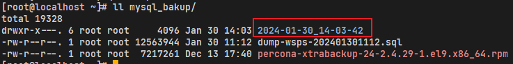
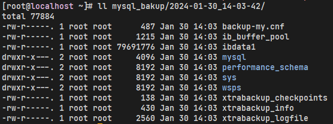
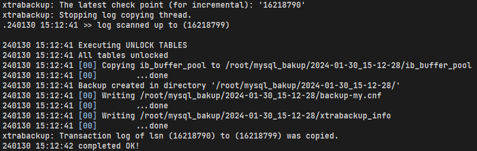
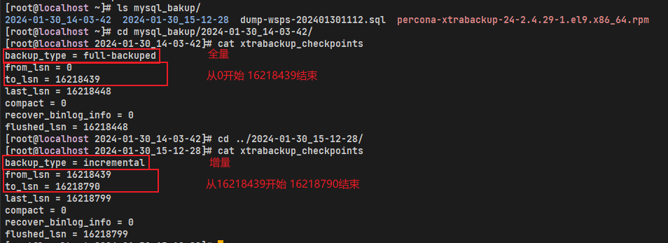
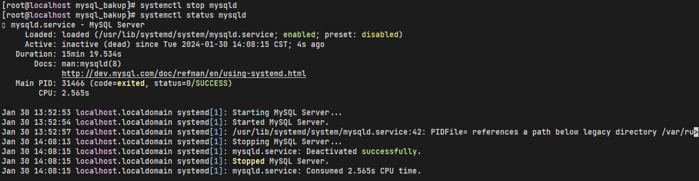
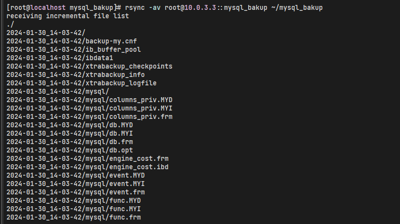
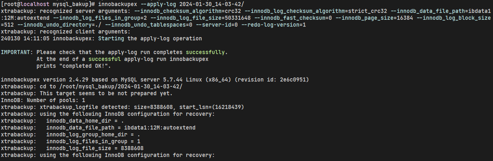
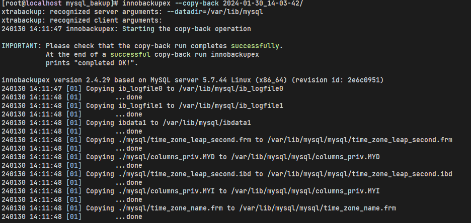
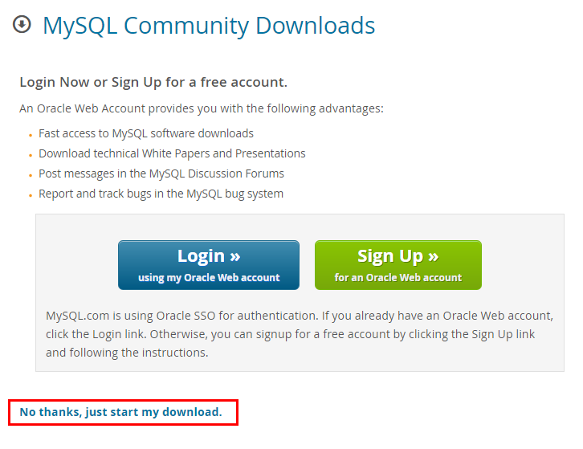

# mysqldump备份数据库

## 备份实例下的所有库

```shell
mysqldump -uroot -p -A > all.sql
```

## 备份单个指定数据库

```shell
mysqldump -uroot -p test > test.sql
```

## 备份多个指定数据库

```shell
mysqldump -uroot -p test1 test2 > test12.sql
```

## 备份指定数据库中的单个表

```shell
mysqldump -uroot -p test user > test.user.sql
```

## 备份指定数据库中的多个表

```shell
mysqldump -uroot -p test user role > test.ur.sql
```

## 备份数据库表结构只包含DDL语句

```shell
# --no-data 或 -d
mysqldump -uroot -p test --no-data > test.sql
```

## 备份数据库带库名

```shell
mysqldump -uroot -p -B test > test.sql
```

# Xtrabackup备份数据库

## 安装

### wget方式

1. 安装qpress rpm包。
   ```shell
   wget https://repo.percona.com/yum/release/7/RPMS/x86_64/qpress-11-1.el9.x86_64.rpm
   rpm -ivh qpress-11-1.el9.x86_64.rpm
   ```
   
2. 安装Percona XtraBackup

   - MySQL 5.6、5.7，以下载并安装Percona XtraBackup 2.4.9为例
     ```shell
     wget https://downloads.percona.com/downloads/Percona-XtraBackup-2.4/Percona-XtraBackup-2.4.29/binary/redhat/9/x86_64/percona-xtrabackup-24-2.4.29-1.el9.x86_64.rpm
     
     rpm -ivh percona-xtrabackup-24-2.4.29-1.el9.x86_64.rpm
     
     warning: percona-xtrabackup-24-2.4.29-1.el9.x86_64.rpm: Header V4 RSA/SHA256 Signature, key ID 8507efa5: NOKEY
     error: Failed dependencies:
             libatomic.so.1()(64bit) is needed by percona-xtrabackup-24-2.4.29-1.el9.x86_64
             libev.so.4()(64bit) is needed by percona-xtrabackup-24-2.4.29-1.el9.x86_64
             perl(DBD::mysql) is needed by percona-xtrabackup-24-2.4.29-1.el9.x86_64
             rsync is needed by percona-xtrabackup-24-2.4.29-1.el9.x86_64
     
     dnf install libatomic -y
     dnf install libev -y
     dnf install -y rsync
     dnf install perl-DBD-MySQL
     
     ```
     
   - MySQL 8.0，以下载并安装Percona XtraBackup 8.0为例
     ```shell
     wget https://downloads.percona.com/downloads/Percona-XtraBackup-8.0/Percona-XtraBackup-8.0.32-26/binary/redhat/7/x86_64/percona-xtrabackup-80-8.0.32-26.1.el7.x86_64.rpm
     
     rpm -ivh percona-xtrabackup-80-8.0.32-26.1.el7.x86_64.rpm --nodeps --force
     ```

## 备份

#### 全量备份

```shell
innobackupex --user=root --password=123456 --host=127.0.0.1 ~/mysql_bakup/

#语法解释说明：
#--user=root 指定备份用户
#--password=123456  指定备份用户密码
#--host　　指定主机
#~/mysql_bakup/　　指定备份目录
```

执行命令后。可看到备份时间的文件夹



文件夹内容如下



#### 差异备份

首先需要全量备份一次

```shell
innobackupex --user=root --password=123456 --host=127.0.0.1 ~/mysql_bakup/
```

然后按照全量备份生成的备份目录为基础

```shell
innobackupex --user=root --password=123456 --host=127.0.0.1 --incremental ~/mysql_bakup/ --incremental-basedir=~/mysql_bakup/2024-01-30_14-03-42/
```



差异备份需要使用参数--incremental指定需要备份到哪个目录，使用incremental-dir指定全备目录

查看备份数据



## 恢复

#### 全量备份恢复

```shell
# 停止目标服务器上的mysql
systemctl stop mysqld
```



同步服务器上的备份文件至本地

```shell
# 同步服务器上的备份文件夹至本地
rsync -av root@10.0.3.3::mysql_bakup ~/mysql_bakup
```



创建本地数据目录备份

```shell
cp -r /var/lib/mysql /var/lib/mysqlbakup
```

合并数据日志，使数据文件处于一致性的状态

```shell
innobackupex --apply-log ~/mysql_bakup/2024-01-30_14-03-42/ 
```



删除数据目录

```shell
rm -rf /var/lib/mysql
```

进行数据恢复

```shell
innobackupex --copy-back 2024-01-30_14-03-42/
```



赋予权限

```shell
chown mysql:mysql /var/lib/mysql -R
```

临时关闭SELinux

```she
setenforce 0
```

永久关闭SELinux

#### 差异备份恢复

```shell
# 停止目标服务器上的mysql
systemctl stop mysqld
```


删除数据目录

```shell
rm -rf /var/lib/mysql
```

合并全备数据目录，确保数据的一致性

```shell
innobackupex --apply-log --redo-only ~/mysql_bakup/2024-01-30_14-03-42/
```

将差异备份数据合并到全备数据目录当中

```shell
innobackupex --apply-log --redo-only ~/mysql_bakup/2024-01-30_14-03-42/ --incremental-dir=~/mysql_bakup/2024-01-30_15-12-28/
```

恢复数据

```shell
innobackupex --copy-back ~/mysql_bakup/2024-01-30_14-03-42/
```

赋予权限

```shell
chown mysql:mysql /var/lib/mysql -R
```

临时关闭SELinux

```she
setenforce 0
```

永久关闭SELinux

# Windows 下安装 绿色版

先下载[MySQL :: Download MySQL Community Server](https://dev.mysql.com/downloads/mysql/)


1. 解压下载好的压缩包
   

2. 解压后得到
   

3. 新建一个 `my.ini`文件
   

4. 解压后的mysql根目录下没有my.ini文件，自己去网上找一份就可或者使用我在后面给出的代码。.ini文件会在初始化mysql中用到
   ```ini
   # For advice on how to change settings please see
   # http=//dev.mysql.com/doc/refman/5.7/en/server-configuration-defaults.html
   # *** DO NOT EDIT THIS FILE. It's a template which will be copied to the
   # *** default location during install, and will be replaced if you
   # *** upgrade to a newer version of MySQL.
   
   [client]
    port = 3306
    default-character-set = utf8
   
   [mysqld]
    
   # Remove leading # and set to the amount of RAM for the most important data
   # cache in MySQL. Start at 70% of total RAM for dedicated server, else 10%.
   # innodb_buffer_pool_size = 128M
    
   # Remove leading # to turn on a very important data integrity option= logging
   # changes to the binary log between backups.
   # log_bin
   port = 3306 
   # These are commonly set, remove the # and set as required.
   basedir="D:\app\mysql-5.7.43-winx64"
   datadir="D:\app\mysql-5.7.43-winx64\data"
   # server_id = .....
   character_set_server = utf8
    
   # Remove leading # to set options mainly useful for reporting servers.
   # The server defaults are faster for transactions and fast SELECTs.
   # Adjust sizes as needed, experiment to find the optimal values.
   # join_buffer_size = 128M
   # sort_buffer_size = 2M
   # read_rnd_buffer_size = 2M 
    
   sql_mode=NO_ENGINE_SUBSTITUTION,STRICT_TRANS_TABLES
   
   ```

5. 修改ini配置文件中的安装目录和数据存放目录修改为mysql文件的路径

6. \#设置mysql的安装目录
   basedir=D:\app\mysql-5.7.43-winx64
   \#设置mysql数据库的数据的存放目录
   datadir=D:\app\mysql-5.7.43-winx64\data

7. 打开cmd，初始化数据库
   ```powershell
   mysqld --initialize 
   ```

8. 初始化完成后，mysqld根目录下会自动新增data文件夹
   

9. 打开data文件夹，找到.err后缀文本打开
   

10. 找到文件password位置，红色框中为数据库初始化密码，后续修改初始化密码使用
    ```err
    2023-10-07T04:37:02.330654Z 1 [Note] A temporary password is generated for root@localhost: (iw?Mw:Vs7n&
    ```

11. 安装数据库
    ```powershell
    mysqld --install <服务名>
    ```

12. 启动服务
    ```powershell
    net start mysql
    ```

13. 关闭服务
    ```powershell
    net stop mysql
    ```

14. 修改初始密码

    - 登录
      ```powershell
      mysql -uroot -p'你的初始密码，步骤4中红框里的字符'
      ```

    - 修改密码为 123456
      ```mysql
       ALTER USER 'root'@'localhost' IDENTIFIED WITH mysql_native_password BY 'root';
      ```

15. 服务卸载
    ```powershell
    net stop mysql
    mysqld --remove
    ```

# Linux 安装MySQL

## 安装

1. 在浏览器下载Linux系统的MySQL客户端安装包。建议您下载的MySQL客户端版本高于已创建的GaussDB(for MySQL)实例中数据库版本。
    在下载页面找到对应版本[链接](https://dev.mysql.com/downloads/file/?id=496982)，以mysql-community-client-8.0.21-1.el6.x86_64为例，打开页面后，即可下载安装包。
    

2. 将安装包上传到ECS。

3. 执行以下命令安装MySQL客户端。
   rpm -ivh mysql-community-client-8.0.21-1.el6.x86_64.rpm

   > - 如果安装过程中报conflicts，可增加replacefiles参数重新安装，如下：
   >
   >   rpm -ivh --replacefiles mysql-community-client-8.0.21-1.el6.x86_64.rpm
   >
   > - 如果安装过程中提示需要安装依赖包，可增加nodeps参数重新安装，如下：
   >
   >   rpm -ivh --nodeps mysql-community-client-8.0.21-1.el6.x86_64.rpm

## 连接

1. **mysql -h** <*host*> **-P** *<port>* **-u** <*userName*> **-p**
   示例：

   mysql -h 192.168.0.16 -P 3306 -u root -p

   参数说明

   | 参数         | 说明                         |
   | ------------ | ---------------------------- |
   | <*host*>     | 获取的读写内网地址。         |
   | *<port>*     | 获取的数据库端口，默认3306。 |
   | <*userName*> | 管理员帐号root。             |

2. 出现如下提示时，输入数据库帐号对应的密码。
   ```mysql
   Enter password:
   ```

3. 报错mysql: error while loading shared libraries: libssl.so.10: cannot open shared object file: No such file or directory

   下载rpm包:
   https://mirrors.aliyun.com/centos/8/AppStream/x86_64/os/Packages/compat-openssl10-1.0.2o-3.el8.x86_64.rpm
   安装rpm包:

   ```shell
   rpm -i compat-openssl10-1.0.2o-3.el8.x86_64.rpm 
   错误：依赖检测失败：
   	make 被 compat-openssl10-1:1.0.2o-3.el8.x86_64 需要
   rpm -i compat-openssl10-1.0.2o-3.el8.x86_64.rpm --nodeps --force
   
   mysql: error while loading shared libraries: libncurses.so.5: cannot open shared object file: No such file or directory
   cp /usr/lib64/libncurses.so.6 /usr/lib64/libncurses.so.5
   
   mysql: error while loading shared libraries: libtinfo.so.5: cannot open shared object file: No such file or directory
   cp /usr/lib64/libtinfo.so.6 /usr/lib64/libtinfo.so.5
   ```
   
   

# Linux 卸载MySQL

## 二进制方式

```shell
rpm -qa | grep -i mysql

# 如下所示
mysql-community-release-el7-5.noarch
mysql-community-libs-5.6.51-2.el7.x86_64
mysql-community-client-5.6.51-2.el7.x86_64
mysql-community-server-5.6.51-2.el7.x86_64
mysql-community-common-5.6.51-2.el7.x86_64

systemctl stop mysqld

rpm -ev mysql-community-release-el7-5.noarch
rpm -ev mysql-community-libs-5.6.51-2.el7.x86_64
rpm -ev mysql-community-client-5.6.51-2.el7.x86_64
rpm -ev mysql-community-server-5.6.51-2.el7.x86_64
rpm -ev mysql-community-common-5.6.51-2.el7.x86_64

find / -name mysql

# 如下所示
/var/lib/mysql
/var/lib/mysql/mysql
/usr/local/mysql
/usr/lib64/mysql
/usr/share/mysql
/usr/bin/mysql
/etc/logrotate.d/mysql
/etc/selinux/targeted/active/modules/100/mysql

rm -rf /var/lib/mysql
rm -rf /var/lib/mysql/mysql
rm -rf /usr/local/mysql
rm -rf /usr/lib64/mysql
rm -rf /usr/share/mysql
rm -rf /usr/bin/mysql
rm -rf /etc/logrotate.d/mysql
rm -rf /etc/selinux/targeted/active/modules/100/mysql

rm -rf /etc/my.cnf

rpm -qa | grep -i mysql
```


# MySQL 客户端

执行脚本

```mysql
source <脚本绝对路径>
```

# 用户和权限

## 用户各项权限

```mysql
CREATE USER 'username'@'%' IDENTIFIED BY 'password';
GRANT Usage ON *.* TO 'username'@'%';
GRANT Alter ON database.* TO 'username'@'%';
GRANT Create ON database.* TO 'username'@'%';
GRANT Create view ON database.* TO 'username'@'%';
GRANT Delete ON database.* TO 'username'@'%';
GRANT Drop ON database.* TO 'username'@'%';
GRANT Index ON database.* TO 'username'@'%';
GRANT Insert ON database.* TO 'username'@'%';
GRANT References ON database.* TO 'username'@'%';
GRANT Select ON database.* TO 'username'@'%';
GRANT Show view ON database.* TO 'username'@'%';
GRANT Update ON database.* TO 'username'@'%';
GRANT PROCESS ON *.* TO 'username'@'%';
```

## 创建管理员用户

```mysql
create user 'zhaoyan'@'%' identified by 'zhaoyan@123';
grant all on *.* to 'zhaoyan'@'%' with grant option;
flush privileges;
```

## 限制只能本地登录root

```mysql
mysql -uroot -p
use mysql;
select * from user where user = 'root';
update user set host = '127.0.0.1' where user = 'root' and host = '%';
flush privileges;
```

## 修改root密码

```mysql
alter user 'root'@'localhost' IDENTIFIED BY '123456';
```

## 允许远程登录

```mysql
grant all privileges  on *.* to root@'%' identified by "123456";
```

## 忘记密码重置

### Windows

1. 首先停止服务
   使用管理员用户打开CMD

   ```cmd
   net stop MYSQL
   ```

   >  MYSQL为MySQL数据库服务名称

2. 将MySQL  数据目录 C:\ProgramData\MySQL\MySQL Server 5.7 下的Data目录复制到 程序目录 C:\Program Files\MySQL\MySQL Server 5.7 下

3. 进入MySQL bin目录

   ```cmd
   cd "C:\Program Files\MySQL\MySQL Server 5.7\bin"
   mysqld --skip-grant-tables
   ```

   > --skip-grant-tables 的意思是启动 MySQL 服务的时候跳过权限表认证

4. 重新打开一个cmd窗口，输入 mysql 回车
   ```cmd
   cd "C:\Program Files\MySQL\MySQL Server 5.7\bin"
   mysql
   ```

5. 连接权限数据库：use mysql

6. 修改数据库连接密码
   ```cmd
   update user set authentication_string =password('123456') where user='root';
   flush privileges;
   exit;
   ```

7. 修改root 密码后，需要执行下面的语句和新修改的密码。不然开启 mysql 时会出错
   ```cmd
   mysqladmin -u root -p shutdown
   ```

8. 将程序目录 C:\Program Files\MySQL\MySQL Server 5.7 下的Data文件夹下复制到数据目录 C:\ProgramData\MySQL\MySQL Server 5.7 下

9. 重启 mysql

   ```cmd
   net start mysql
   ```

# 存储过程和函数

## 函数

创建函数要加上**DELIMITER $$**、**$$ DELIMITER**

MySQL 8 还需要执行

```mysql
-- 查看该参数，默认为0
select @@log_bin_trust_function_creators;
-- 设置为1
set GLOBAL log_bin_trust_function_creators=1;
```

# 信息数据库（information_schema）

## 查看某数据库中所有表的行数

```mysql
select table_name,table_rows from information_schema.tables 
where TABLE_SCHEMA = 'qyqdb' 
order by table_rows desc; 
```

# 主从搭建

## 主节点配置

1. 修改/etc/my.cnf文件，并重启服务
   ```conf
   [mysqld]
   server-id=10     #服务器id (主从必须不一样)
   log-bin=/var/lib/mysql/master10-bin   #打开日志(主机需要打开)
    
   binlog-ignore-db=mysql    #不给从机同步的库(多个写多行)
   binlog-ignore-db=information_schema
   binlog-ignore-db=performance_schema
   binlog-ignore-db=sys
   ```

   注意：log-bin等存储路径的配置，其父路径的属主和组必须是是mysql，且一般权限设置为777。

   ​       如果更改了mysql的存储目录，建议参考默认配置的目录，将新目录的属主和权限也做相应更改

2. 创建从节点访问用户（mysql上执行）
   ```mysql
   CREATE USER 'slave'@'10.181.110.11' IDENTIFIED BY 'slave.8888';
   GRANT REPLICATION SLAVE ON *.* TO 'slave'@'10.181.110.11';
   select user,host from mysql.user;
   ```

3. 查看主节点状态（mysql上执行）

   ```mysql
   systemctl restart mysql    #重启服务
   show master status
   ```

## 从节点配置

1. 修改/etc/my.cnf文件，并重启服务
   ```conf
   server-id=11
   relay-log=relay-bin
   read-only=1
   replicate-ignore-db=mysql               # 不复制的库
   replicate-ignore-db=information_schema  
   replicate-ignore-db=performance_schema
   replicate-ignore-db=sys
   ```

2. 从库关联主库（mysql上执行）

   ```mysql
   CHANGE MASTER TO MASTER_HOST='10.0.2.3',
   MASTER_USER='slave',
   MASTER_PASSWORD='slave.123456',
   MASTER_LOG_FILE='master10-bin.000001',
   MASTER_LOG_POS=154;
   ```

3. 检查状态（mysql上执行）

   ```mysql
   start slave;
   show slave status\G
   ```

   注意：# master_log_file 和 master_log_pos值为主库上面执行show master status得到

   如果 Slave_IO_Running 和 Slave_SQL_Running 都为 Yes，说明配置成功

   \# 如果又更改了其他配置，重启服务后导致上面两个参数出现NO，可以重新执行步骤 2

## 同步故障

### Slave_SQL_Running:No

**原因是主机和从机里的数据不一致**

### Slave_IO_Running:Connecting

**是因为从机使用你配置的主机信息没有登陆到主机里面！修改(从机里面)**

```mysql
stop slave;
change master to master_host="192.168.106.133",master_port=3307,master_user="rep",master_password="123456",master_log_file="master.000001",master_log_pos=745;
start slave;
```

### Slave_IO_Running:No

就是server-id 没有配置成功的原因，需要重新修改配置文件，复制配置文件到容器里面，然后重启就ok

# 二进制日志文件(binlog)

## 查看是否开启

```mysql
SHOW VARIABLES LIKE 'log_bin';
```

## 配置

```mysql
[mysqld]
# 开启binlog
log_bin=ON
# binlog日志的基本文件名
#log_bin_basename=/var/lib/mysql/mysql-bin
# binlog文件的索引文件, 管理所有binlog文件
#log_bin_index=/var/lib/mysql/mysql-bin.index
# 配置serverid
server-id=1
# 设置日志三种格式: STATEMENT、ROW、MIXED。
binlog_format=mixed
# 设置binlog清理时间
expire_logs_days=15
# binlog每个日志文件大小
max_binlog_size=100m
# binlog缓存大小
binlog_cache_size=4m
# 最大binlog缓存大小
max_binlog_cache_size=512m
```


# MyCat 2

## 安装

首先去**Gitee**代码仓库**clone**源码

```shell
git clone https://gitee.com/MycatOne/Mycat2.git
```

打开项目，注意jdk版本需要用**oracle jdk1.8**，否则没有**javafx**包

Maven下载依赖

修改父级`pom.xml`文件中的`<repository>`标签,http后加s

```xml
<repository>
      <id>mvnrepository</id>
      <name>mvnrepository</name>
      <url>https://www.mvnrepository.com/</url>
</repository>
```

执行`maven clean install -DskipTests`

编译后的包位于根目录下的`mycat2\target\mycat2-1.22-release-jar-with-dependencies.jar`

修改根目录下的`start.bat`批处理文件

```bat
"C:\Program Files\Java\jre1.8.0_202\bin\java" -Dfile.encoding=UTF-8 -DMYCAT_HOME=C:\Users\user\Downloads\Mycat2-v1.22-2020-6-25\mycat2\src\main\resources  -jar C:\Users\user\Downloads\Mycat2-v1.22-2020-6-25\mycat2\target\mycat2-1.22-release-jar-with-dependencies.jar

@REM java -Dfile.encoding=UTF-8 -DMYCAT_HOME=D:\newgit\f\mycat2\src\main\resources -jar 
@REM D:\newgit\f\mycat2\target\mycat2-0.5-SNAPSHOP-20200110152640-single.jar
```

根据项目目录进行修改

## 配置

配置目录为根目录下的`mycat2\src\main\resources`

### datasources

```json
{
  "dbType": "mysql",
  "idleTimeout": 60000,
  "initSqls": [],
  "initSqlsGetConnection": true,
  "instanceType": "READ_WRITE",
  "maxCon": 1000,
  "maxConnectTimeout": 30000,
  "maxRetryCount": 5,
  "minCon": 1,
  "name": "prototypeDs",
  "password": "123456",
  "type": "JDBC",
  "url": "jdbc:mysql://localhost3306?useUnicode=true&serverTimezone=Asia/Shanghai&characterEncoding=UTF-8",
  "user": "root",
  "weight": 0
}
```

## 启动

运行根目录下的`start.bat`

## 命令

### 查看连接源

```mysql
/*+ mycat:showDataSources{} */
```

### 添加数据源

```mysql
/*+ mycat:createDataSource{
	"dbType":"mysql",
	"idleTimeout":60000,
	"initSqls":[],
	"initSqlsGetConnection":true,
	"instanceType":"READ_WRITE",
	"maxCon":1000,
	"maxConnectTimeout":3000,
	"maxRetryCount":5,
	"minCon":1,
	"name":"ds0",
	"password":"123456",
	"type":"JDBC",
	"url":"jdbc:mysql://192.168.6.158:3306?useUnicode=true&serverTimezone=UTC&characterEncoding=UTF-8",
	"user":"root",
	"weight":0
} */;
```

### 查看集群

```mysql
/*+ mycat:showClusters{} */
```

### 添加集群

```mysql
/*+ mycat:createCluster{
	"clusterType":"MASTER_SLAVE",
	"heartbeat":{
		"heartbeatTimeout":1000,
		"maxRetry":3,
		"minSwitchTimeInterval":300,
		"slaveThreshold":0
	},
	"masters":[
		"ds0" //主节点
	],
	"maxCon":2000,
	"name":"c0",
	"readBalanceType":"BALANCE_ALL",
	"switchType":"SWITCH"
} */;
```

### 创建库

```mysql
/*+ mycat:createSchema{
	"customTables":{},
	"globalTables":{},
	"normalTables":{},
	"schemaName":"xxf_sharding",
	"shardingTables":{}
} */;
```

### 创建表

```mysql
/*+ mycat:createTable{
  "schemaName":"xxf_sharding",
	"tableName":"xxf_user",
  "shardingTable":{
		"createTableSQL":"CREATE TABLE `xxf_user` (
			`id` BIGINT(20) NOT NULL COMMENT '用户ID',
			`user_name` VARCHAR(30) NULL DEFAULT NULL COMMENT '用户姓名',
			`email` VARCHAR(50) NULL DEFAULT NULL COMMENT '用户邮箱',
			`phone` VARCHAR(11) NULL DEFAULT NULL COMMENT '手机号码',
			`sex` CHAR(1) NULL DEFAULT NULL COMMENT '用户性别',
			PRIMARY KEY (`id`) USING BTREE
		) COMMENT='笑小枫-用户信息表' COLLATE='utf8_general_ci' ENGINE=InnoDB;",
  
		"function":{
				"properties":{
					"mappingFormat": "c${targetIndex}/xxf_sharding/xxf_user_${tableIndex}",
					"dbNum":2, //分库数量
					"tableNum":3, //分表数量
					"tableMethod":"mod_hash(id)", //分表分片函数
					"storeNum":2, //实际存储节点数量
					"dbMethod":"mod_hash(id)" //分库分片函数
					}
		 },
		 "partition":{
		}
	}
} */;
```

## 分库分表

### 原理

一个数据库由很多表的构成，每个表对应着不同的业务，垂直切分是指按照业务将表进行分布到不同的数据库上面，这样也就将数据或者说压力分担到不同的库上面

### 垂直切分：分库

系统被拆分为用户、订单、支付多个模块，部署在不同机器上。
分库的原则：由于跨库不能关联查询，所以有紧密关联的表应当放在一个数据库中，相互没有关联的表可以分不到不同的数据库。

### 水平切分：分表


### 常用的分片规则

1. 分片算法简介
   Mycat2支持常用的（自动）HASH型分片算法也兼容1.6的内置的(cobar)分片算法。
   HASH型分片算法默认要求集群名字以c为前缀，数字为后缀，`c0就是分片表第一个节点，c1就是第二个节点`，该命名规则允许用户手动改变。

2. mycat2与1.X版本区别
   mycat2的hash型分片算法多基于MOD_HASH，对应Java的%取余运算。
   mycat2的hash型分片算法对于值的处理，总是把分片值转换到列属性的数据类型再做计算。
   mycat2的hash型分片算法适用于等价条件查询。

3. 分片规则与适用性

4. | 分片算法    | 描述           | 分库 | 分表 | 数值类型                               |
   | ----------- | -------------- | ---- | ---- | -------------------------------------- |
   | MOD_HASH    | 取模哈希       | 是   | 是   | 数值，字符串                           |
   | UNI_HASH    | 取模哈希       | 是   | 是   | 数值，字符串                           |
   | RIGHT_SHIFT | 右移哈希       | 是   | 是   | 数值                                   |
   | RANGE_HASH  | 两字段其一取模 | 是   | 是   | 数值，字符串                           |
   | YYYYMM      | 按年月哈希     | 是   | 是   | DATE，DATETIME                         |
   | YYYYDD      | 按年月哈希     | 是   | 是   | DATE，DATETIME                         |
   | YYYYWEEK    | 按年周哈希     | 是   | 是   | DATE，DATETIME                         |
   | HASH        | 取模哈希       | 是   | 是   | 数值，字符串，如果不是，则转换成字符串 |
   | MM          | 按月哈希       | 否   | 是   | DATE，DATETIME                         |
   | DD          | 按日期哈希     | 否   | 是   | DATE，DATETIME                         |
   | MMDD        | 按月日哈希     | 是   | 是   | DATE，DATETIME                         |
   | WEEK        | 按周哈希       | 否   | 是   | DATE，DATETIME                         |
   | STR_HASH    | 字符串哈希     | 是   | 是   | 字符串                                 |

#### 常用分片规则简介

##### MOD_HASH

[数据分片]hash形式的分片算法。如果分片键是字符串，会将字符串hash转换为数值类型。

1. 分库键和分表键相同：
- 分表下标：分片值%(分库数量*分表数量)
- 分库下标：分表下表/分库数量
2. 分库键和分表键相同：
- 分表下标：分片值%分表数量
- 分库下标：分片值%分库数量

##### RIGHT_SHIFT

[数据分片]hash形式的分片算法。仅支持数值类型。
分片值右移两位，按分片数量取余。

##### YYYYMM

[数值分片]hash形式的分片算法。仅用于分库。
(YYYY*12+MM)%分库数量，MM为1–12。

##### MMDD

仅用于分表。仅DATE、DATETIME类型。
一年之中第几天%分表数。tbpartitions不能超过366。

# MySQL 查询语句

## 查询语句中字段别名取表中的comment

在 MySQL 中，字段的 comment 并不存储在数据行里，而是放在 **information_schema.COLUMNS** 中。
因此可以通过把 **column_comment** 查出来，再拼成 **SELECT 语句的别名**，实现“用表中字段的 comment 做别名”的效果。

一次性查出某张表所有列，并把 comment 作为别名：

```mysql
-- 示例：表名 mydb.mytable
SELECT CONCAT(
         'SELECT ',
         GROUP_CONCAT(
           CONCAT('`', COLUMN_NAME, '` AS `', REPLACE(COLUMN_COMMENT, '`', ''), '`')
           ORDER BY ORDINAL_POSITION
         ),
         ' FROM mytable;'
       ) AS sql_text
FROM   information_schema.COLUMNS
WHERE  TABLE_SCHEMA = 'mydb'
  AND  TABLE_NAME   = 'mytable';
```

执行后得到一条 SQL，例如：

```mysql
SELECT id AS 主键, name AS 用户名, age AS 年龄 FROM mytable;
```

**拼 SQL 时丢列**
上一段拼接脚本里 `GROUP_CONCAT` 有 **长度限制**（默认 1024 字节）。
如果表列很多，会被截断导致看起来“少字段”。
解决方法：

```mysql
SET SESSION group_concat_max_len = 1000000;  -- 临时放大
```

