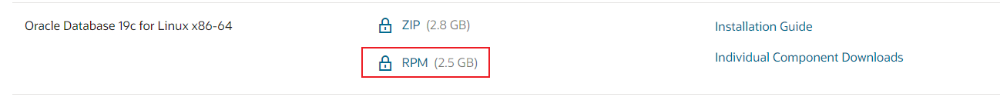
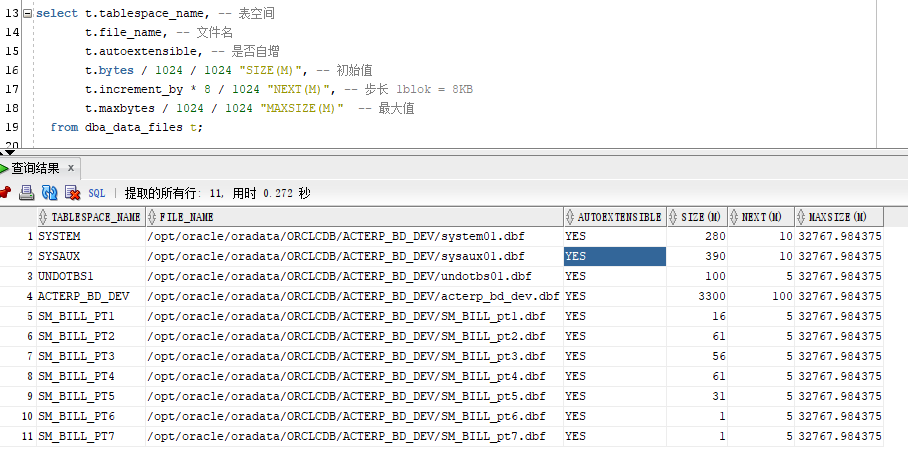

# Oracle Database

## 安装Oracle 19c

### Linux下安装

#### rpm方式

从Oracle官网下载安装包 Linux x86-64  RPM

https://www.oracle.com/database/technologies/oracle-database-software-downloads.html



安装帮助文档

https://docs.oracle.com/en/database/oracle/oracle-database/19/ladbi/preface.html#GUID-071A6B76-11E3-4421-963E-41DA6F2EF07A

下载 `preinstall` 下载地址

https://yum.oracle.com/repo/OracleLinux/OL7/latest/x86_64/index.html，浏览器搜索-19c

或者

```shell
curl -o oracle-database-preinstall-19c-1.0-1.el7.x86_64.rpm https://yum.oracle.com/repo/OracleLinux/OL7/latest/x86_64/getPackage/oracle-database-preinstall-19c-1.0-1.el7.x86_64.rpm
```

安装，首先执行

```shell
yum localinstall -y oracle-database-preinstall-19c-1.0-1.el7.x86_64.rpm
```

会提示缺少依赖

可以去RPM源网站下载

http://www.rpmfind.net/linux/rpm2html/search.php?query=compat-libcap1(x86-64)

安装

```shell
rpm -ivh compat-libcap1-1.10-7.el7.x86_64.rpm
```

再次执行

```shell
yum localinstall -y oracle-database-preinstall-19c-1.0-3.el7.x86_64.rpm 
```

安装数据库

```shell
yum localinstall -y oracle-database-ee-19c-1.0-1.x86_64.rpm
```

配置数据库

```shell
/etc/init.d/oracledb_ORCLCDB-19c configure
```

过程较长，等待即可

可能会JDK报错

```shell
yum install libnsl
```

配置完成后设置当前用户下的环境变量

```shell
vim /etc/profile.d/oracle19c.sh

export  ORACLE_HOME=/opt/oracle/product/19c/dbhome_1
export  PATH=$PATH:/opt/oracle/product/19c/dbhome_1/bin
export  ORACLE_SID=ORCLCDB

# 保存退出，执行
source /etc/profile.d
```
验证安装是否正确

```shell
passwd oracle

su oracle

sqlplus / as sysdba

# 提示
SQL*Plus: Release 19.0.0.0.0 - Production on Mon Oct 17 12:25:27 2022
Version 19.3.0.0.0

Copyright (c) 1982, 2019, Oracle.  All rights reserved.

Connected to an idle instance.
```

启动监听


#### Docker方式

安装Docker

```shell
sudo wget -qO- https://get.docker.com/ | bash
docker --version
systemctl start docker
systemctl status docker
systemctl enable docker
```

拉取镜像 `quay.io/maksymbilenko/oracle-12c`

```shell
docker pull quay.io/maksymbilenko/oracle-12c
```

如果有本地镜像则使用

```shell
docker build -t quay.io/maksymbilenko/oracle-12c .
```

构建容器

```shell
# 首先创建本地目录
mkdir /oracle/data
# 授予权限
chmod -R 777 /oracle/data
docker run --name o12c -d -p 8080:8080 -p 1521:1521 -v /oracle/data:/u01/app/oracle quay.io/maksymbilenko/oracle-12c
# 查看日志
docker logs -f # 字符串ID
```


安装完成

数据库连接信息

```yaml
hostname: localhost
port: 1521
sid: xe
service name: xe
username: system
password: oracle
```

进入容器修改账号密码设置

```shell
# 查看所有容器信息
docker ps -a 
docker exec -it [containerID] /bin/bash
# 切换成oracle用户
su oracle
# 进入sqlplus
$ORACLE_HOME/bin/sqlplus / as sysdba

SQL*Plus: Release 12.1.0.2.0 Production on Sun Aug 1 03:15:37 2021

Copyright (c) 1982, 2014, Oracle.  All rights reserved.


Connected to:
Oracle Database 12c Standard Edition Release 12.1.0.2.0 - 64bit Production

# 设置密码有效期为无限制
SQL> ALTER PROFILE DEFAULT LIMIT PASSWORD_LIFE_TIME UNLIMITED;

Profile altered.

SQL> alter user SYSTEM account unlock;

User altered.

# 创建一个账号为act_test的用户密码设置为test
SQL> create user act_test identified by test;

User created.
# 为这个用户赋予管理员的权限
SQL> grant dba to act_test;

Grant succeeded.

# ctrl + p + q 退出容器（注意不要exit退出，防止容器直接关闭了）
```


### Windows下安装


## Oracle SQL Developer

### 设置自动提示

工具栏 -> 工具 -> 首选项 -> 代码编辑器 -> 完成设置 


### 设置代码模板

工具栏 -> 工具 -> 首选项 -> 代码编辑器 -> 代码模板


### 同时打开多个表

工具栏 -> 工具 -> 首选项 -> 数据库 ->对象查看器


## SQL PLUS

### 解决乱码

```shell
sqlplus / as sysdba

col parameter for a30
col value for a25
select * from nls_database_parameters;

PARAMETER                      VALUE
------------------------------ -------------------------
NLS_RDBMS_VERSION              19.0.0.0.0
NLS_NCHAR_CONV_EXCP            FALSE
NLS_LENGTH_SEMANTICS           BYTE
NLS_COMP                       BINARY
NLS_DUAL_CURRENCY              $
NLS_TIMESTAMP_TZ_FORMAT        DD-MON-RR HH.MI.SSXFF AM
                               TZR

NLS_TIME_TZ_FORMAT             HH.MI.SSXFF AM TZR
NLS_TIMESTAMP_FORMAT           DD-MON-RR HH.MI.SSXFF AM
NLS_TIME_FORMAT                HH.MI.SSXFF AM

PARAMETER                      VALUE
------------------------------ -------------------------
NLS_SORT                       BINARY
NLS_DATE_LANGUAGE              AMERICAN
NLS_DATE_FORMAT                DD-MON-RR
NLS_CALENDAR                   GREGORIAN
NLS_NUMERIC_CHARACTERS         .,
NLS_NCHAR_CHARACTERSET         AL16UTF16
NLS_CHARACTERSET               AL32UTF8
NLS_ISO_CURRENCY               AMERICA
NLS_CURRENCY                   $
NLS_TERRITORY                  AMERICA
NLS_LANGUAGE                   AMERICAN

```

`NLS_LANG`的组成规则为 `NLS_LANGUAGE_NLS_TERRITORY.NLS_CHARACTERSET`

```shell
vim ~/.bash_profile

export NLS_LANG="AMERICAN_AMERICA.AL32UTF8"
```


### 解决控制台输错命令删除

使用`Ctrl + backspace`代替`backspace`

### 登录

#### 使用操作系统认证

适用于以管理员身份登录数据库：

```bash
sqlplus / as sysdba
```

- */* 表示操作系统认证。
- *as sysdba* 用于以管理员权限登录。

#### 使用用户名和密码登录

通过提供用户名、密码和数据库连接信息：

```bash
sqlplus username/password@hostname:port/SID
```

**示例：**

```bash
sqlplus scott/tiger@192.168.1.100:1521/orcl
```

- *hostname* 是数据库主机名或 IP 地址。
- *port* 是监听端口，默认是 *1521*。
- *SID* 是数据库实例名。

如果已配置 TNS，则可以简化为：

```bash
sqlplus username/password@TNSNAME
```

#### 无日志模式登录

先启动 SQL*Plus，再手动连接数据库：

```bash
sqlplus /nolog
```

然后使用以下命令连接：

```bash
conn username/password@hostname:port/SID
```

**优点：** 避免直接暴露用户名和密码。

#### 直接交互式登录

直接输入 *sqlplus*，按提示输入用户名和密码：

```bash
sqlplus
```

**示例：**

```
请输入用户名: scott
输入口令: tiger
```


```shell
# 以oracle账号登录
su oracle
$ORACLE_HOME/bin/sqlplus / as sysdba
```

### 修改sys密码

```shell
sqlplus /nolog
conn as sysdba
alter user sys identified by 123456;
```


## CDB 和 PDB


- CDB :容器数据库，名称为 CDB$ROOT。其作用就是系统数据库，sys账号等以及Common User(公共用户)都保存在里面。同时它可以管理PDB数据库

- PDB ：可插拔的数据库。用户可以在PDB自建数据库
  - Oracle安装成功后有个默认的pdb数据库（在安装Oracle的时候自己设定）
  - PDB中自带有PDB$SEED，属于PDB的模板数据库，自己创建数据库的时候以此库为模板，非常类似 SQL Server 中的 model 数据库

命令：如何查看当前的位置是CDB还是PDB使用sys登录，输入命令：

```she
create pluggable database pdb1 admin user pdb1 identified by 1 file_name_convert=('/opt/oracle/oradata/ORCLCDB/pdbseed','/opt/oracle/oradata/ORCLCDB/pdb1');    -- 创建PDB，其中pdb1是我创建的可插接式数据库，pdb1是创建的用户，1是密码。file_name_convert是对应目录

show con_name;  -- 查看当前所在容器位置

show pdbs;      -- 查看所有的PDB

alter pluggable database pdb1 open; -- 打开 pdb1 pdb

alter pluggable database pdb1 close immediate; -- 立刻关闭 pdb1

alter pluggable database all open; -- 打开 所有 pdb

alter session set container=cdb$root; -- pdb切换到cdb

alter session set container=pdb1; -- cdb切换到pdb1

-- 查看 cdb、pdb 信息
select name , cdb from v$database;

select name,con_id from v$services;

select name,con_id,open_mode from v$pdbs;
```

由于安装Oracle的时候设定PDB数据库为schooldb，故查询到两个PDB数据库

## 表空间

### 概述

1. 表空间
   1. 表空间是一个逻辑的概念，真正存放数据的是数据文件(data files)
   2. 1 个数据库 = N 个表空间(N >= 1)
      1 个表空间 = N 个数据文件(dbf)（N >= 1）
      -- 1个数据文件(dbf) 只能属于 1 个表空间
2. 建立表空间的作用
   1. 控制数据库占用 '磁盘空间' 的大小
   2. 不同类型的数据存储到不同的位置，有利于提高 'I/O' 性能，同时有利于备份和恢复等操作

### 相关视图

```sql
-- 数据文件
select * from dba_data_files;
select * from dba_temp_files;
-- 表空间
select * from dba_tablespaces;
select * from dba_free_space;
-- 权限
select distinct t.privilege
  from dba_sys_privs t
 where t.privilege like '%TABLESPACE%';
 
 select t.tablespace_name, -- 表空间
       t.file_name, -- 文件名
       t.autoextensible, -- 是否自增
       t.bytes / 1024 / 1024 "SIZE(M)", -- 初始值
       t.increment_by * 8 / 1024 "NEXT(M)", -- 步长 1blok = 8KB 
       t.maxbytes / 1024 / 1024 "MAXSIZE(M)"  -- 最大值
  from dba_data_files t;
```



### 语法

```sql
-- 表空间类型及名称，默认不指定类型（永久）
create [temporary | undo] tablespace "TBS" 
-- 数据文件的位置及大小
datafile 'D:\Oracle\TBS.dbf' size 10m
-- 是否自动扩展，默认 'off'
[autoextend off] | [autoextend on next n maxsize m]  
-- 是否产生日志，默认 'logging'
[logging | nologging]
-- 段空间自动管理，默认 'auto' 推荐
[segment space management auto]        
-- 表空间管理方式，dictionary | local(默认，推荐)              
[extent management local [uniform size n]]
```

- **创建一个永久表空间 “TBS01”，其大小为 10MB**

  ```sql
  create tablespace "TBS01"
  datafile 'D:\Oracle\TBS01.dbf' size 10m;
  -- 1.路径必须存在，否则报错！
  -- 2.表空间名称默认大写，除非用引号注明，如 "tbs" 则为小写
  ```
  
- **创建一个自增表空间 “TBS02”，其大小为 10MB，每次扩展 1MB，最大扩展到 20MB**

  ```sql
  create tablespace "TBS02"
  datafile 'D:\Oracle\TBS02.dbf' size 10m
  autoextend on next 1m maxsize 20m;
  ```

- **每个用户都有一个默认临时表空间，在创建用户时如果没指定将使用oracle 数据库设置的默认临时表空间，查询方法是:**

  ```sql
  select property_name,property_value from database_properties where property_value=‘TEMP’
  ```

### 新建

```sql
CREATE TABLESPACE ACTERP_BD_DEV
    LOGGING
    DATAFILE 
        '/u01/app/oracle/oradata/orcl/acterp_bd_dev.dbf' SIZE 2048m AUTOEXTEND ON NEXT 50m MAXSIZE 20480m 
        EXTENT MANAGEMENT LOCAL;
-- 临时表空间        
CREATE TEMPORARY TABLESPACE ACTERP_BD_DEV_TEMP
    TEMPFILE 
        '/u01/app/oracle/oradata/orcl/acterp_bd_dev_temp.dbf' SIZE 2048m AUTOEXTEND ON NEXT 50m MAXSIZE 20480m 
        EXTENT MANAGEMENT LOCAL;
```

### 查询

```sql
-- 查询表空间及对应数据文件
select tablespace_name,file_id,bytes/1024/1024,file_name from dba_data_files order by file_id;
```


### 修改

```sql
-- 1 修改数据文件的大小为 20M
alter database datafile 'D:\Oracle\TBS01.dbf' 
resize 20m;

-- 2 修改数据文件为自动扩展，最大值为 1G
alter database datafile 'D:\Oracle\TBS01.dbf' 
autoextend on next 20m maxsize 1g;

-- 3 新增数据文件
alter tablespace "TBS01"
add datafile 'D:\Oracle\TBS01_1.dbf'
size 200m;

```

### 删除

```sql

drop user acterp_pre cascade;

drop tablespace acterp_pre including contents and datafiles cascade constraint;

drop tablespace acterp_pre_temp including contents and datafiles cascade constraint;
```


## 用户

### 操作

#### cdb

##### 新建

```sql
CREATE TABLESPACE ACT_DEV 
    DATAFILE 
        '/opt/oracle/oradata/ORCLCDB/act_dev.dbf' SIZE 100M AUTOEXTEND ON NEXT 100M MAXSIZE UNLIMITED LOGGING EXTENT MANAGEMENT LOCAL SEGMENT SPACE MANAGEMENT AUTO;

create user C##act_dev identified by 123456 default tablespace ACT_DEV;

grant dba,connect to C##act_dev;

commit;
```

##### 删除

```sql
drop user pdb1 cascade;
#cascade 删除pdb1这个用户的同时，级联删除 pdb1 用户下的所有数据对象，如table等
```

修改用户密码

```sql
alter user pdb1 identified by 1;
```


#### pdb

```sql
# 首先切换到pdb
alter session set container=ORCLPDB1; -- cdb切换到ORCLPDB1
# 创建用户名为 pdb1 密码为 1 的用户
create user pdb1 identified by 1;

grant create session to pdb1;
grant create table to pdb1;
grant create tablespace to pdb1;
grant create view to pdb1;
grant connect,resource to pdb1;

grant dba to pdb1;
```


#### non-cdb

```sql
-- 查看表空间及数据文件使用
select tablespace_name,file_id,bytes/1024/1024 || 'm' as file_size,file_name from dba_data_files order by file_id;

CREATE TABLESPACE ACTERP_PRE
    LOGGING
    DATAFILE 
        'D:\APP\ORACLE\ORADATA\ORCL\acterp_pre.dbf' SIZE 2048m AUTOEXTEND ON NEXT 50m MAXSIZE 20480m 
        EXTENT MANAGEMENT LOCAL;
        
CREATE TEMPORARY TABLESPACE ACTERP_PRE_TEMP
    TEMPFILE 
        'D:\APP\ORACLE\ORADATA\ORCL\acterp_pre_temp.dbf' SIZE 2048m AUTOEXTEND ON NEXT 50m MAXSIZE 20480m 
        EXTENT MANAGEMENT LOCAL;
        
create user acterp_pre identified by 1 default tablespace ACTERP_PRE temporary tablespace ACTERP_PRE_TEMP;

grant create session to acterp_pre;
grant create table to acterp_pre;
grant create tablespace to acterp_pre;
grant create view to acterp_pre;
grant connect,resource to acterp_pre;

grant dba to acterp_pre;

commit;
```


## 语法

### 新建表空间

```sql
CREATE TABLESPACE ACT_DEV 
    DATAFILE 
        '\oracle\data\oradata\xe\FILE_SPECIFICATION1.dbf' SIZE 52428800 AUTOEXTEND ON NEXT 52428800 MAXSIZE 2147483648 
    
    EXTENT MANAGEMENT LOCAL;
```

### 解除占用

```sql
select l.session_id,o.owner,o.object_name
from v$locked_object l,dba_objects o
where l.object_id=o.object_id;

SELECT sid, serial#, username, osuser FROM v$session where sid = sid;

alter system kill session 'sid,serial#';
```

### 修改表

```sql
-- 表重命名
ALTER TABLE BOOK 
RENAME TO BIND_PHONE_NUMBER;
-- 添加表字段Column
ALTER TABLE BIND_PHONE_NUMBER 
ADD (USERNAME VARCHAR2(20) );
-- 修改表字段Column名
ALTER TABLE BIND_PHONE_NUMBER RENAME COLUMN NAME TO APPNAME;
```

### 使用关键字做完表名，列名

使用双引号""形式，如"INDEX"

### 删除表数据

```sql
TRUNCATE TABLE 表名
-- or
DELETE FROM 表名
```

### 从其他表中复制数据到插入一张表中

```sql
-- 标准语法
INSERT INTO table2
SELECT * FROM table1;
-- 多表插入到一张表 示例,ID为GUID,
-- 需要注意的是如果指定插入到哪些列中，不是根据后面SELECT的列的别名来插入，而是通过列的顺序插入，语句后可接WHERE条件
INSERT INTO table1(ID,NAME,TEXT) SELECT SYS_GUID(), t2.NAME, t3.TEXT FROM DUAL, TABLE2 t2, TABLE3 t3;

```

### directory目录

```sql
-- 查询directory目录
select * from dba_directories;
-- 创建或者修改 directory目录
create or replace directory dum_date_dir as  '/home/oracle/datatmp'
-- 赋权 directory目录
ant read,write on directory dumpdir to username;
-- 删除directory目录
drop directory DIRENAME;

```


## 数据泵

10g开始引入了数据泵(Data Dump)技术，可以快速将数据库元数据和数据快速移动到另一个oracle数据库中

### 导入 impdp

```shell
impdp acterp_bd_dev/1@ORCLCDB REMAP_SCHEMA = acterp_bd_dev:acterp_bd_dev table_exists_action = replace directory=data_pump_dir dumpfile=acterp_bd_dev.dmp logfile=impdp_acterp_bd_dev.log
```

如果是`non-cdb`需去掉`@SID`

## 内连接与外连接

### 内连接

合并具有同一列的两个以上的表的行，结果集中不包含一个表与另一个表不匹配的行

语法：

```sql
SELECT 字段列表
FROM A表 INNER JOIN B表
ON 关联条件
WHERE 条件;
```

类似于：

```sql
方式一
SELECT e.employee_id, e.last_name, e.department_id,
d.department_id, d.location_id
FROM employees e JOIN departments d
ON (e.department_id = d.department_id);

方式二：
SELECT employee_id,department_name
FROM employees e,departments d
WHERE e.`department_id` = d.department_id;
```

这种查询方式，它会把所有的符合where条件的字段查询出来。但是有这样一种情况，就是两张表的数据有的不存在某种关系。

缺点：如果我们想要把不满足条件的数据也查询出来，内连接就做不到。

于是引入外连接。

### 外连接

查询多表时一般要求中出现：查询所有的数据时，就一定会用到外连接。

两个表在连接过程中除了返回满足连接条件的行以外还返回左（或右）表中不满足条件的行，这种连接称为左（或右）外连接。没有匹配的行时，结果表中相应的列为空(NULL)。

#### 满外连接

`FULL JOIN`

`LEFT JOIN UNION RIGHT JOIN`

#### 左外连接

语法：

```sql
SELECT 字段列表
FROM A表 LEFT JOIN B表
ON 关联条件
WHERE 条件;
```

类似于：

```sql
SELECT e.last_name, e.department_id, d.department_name
FROM employees e
LEFT OUTER JOIN departments d
ON (e.department_id = d.department_id) ;
```

`employees`表中的数据会全部显示出来

#### 右外连接

语法：

```sql
SELECT 字段列表
FROM A表 RIGHT JOIN B表
ON 关联条件
WHERE 条件;
```

类似于：

```sql
SELECT e.last_name, e.department_id, d.department_name
FROM employees e
RIGHT OUTER JOIN departments d
ON (e.department_id = d.department_id) ;
```

`departments`表中的数据会全部显示出来

### UNION的使用

·语法：

```sql
SELECT column,... FROM table1
UNION [ALL]
SELECT column,... FROM table2
```

UNION 操作符返回两个查询的结果集的并集，去除重复记录。

UNION ALL操作符返回两个查询的结果集的并集。对于两个结果集的重复部分，不去重。

## Oracle 函数

### NVL()


```sql
SELECT a.OSPREQID,a.OSPREQNO FROM T_OSP_REQ a,T_OSP_REQDETAIL b WHERE a.OSPREQID = b.OSPREQID AND b.OSPNO IN (SELECT OSPNP FROM T_BPM_OSP WHERE OSPNO IN ('OSP202302280002')) AND NVL(DATASTATUS, ' ')<>'撤销'
```

如果**DATASTATUS**为**NULL**，则返回**'  '**，否则返回**DATASTATUS**

官方解释

The Oracle NVL () function allows you to **replace null** with a more meaningful alternative in the results of a query. The following shows the syntax of the NVL () function: The NVL () function accepts two arguments. If e1 evaluates to null, then NVL () function returns e2. If e1 evaluates to non-null, the NVL () function returns e1.

Oracle NVL()函数允许您在查询结果中用更有意义的替代项替换NULL。下面显示了NVL()函数的语法：NVL()函数接受两个参数。如果e1的计算结果为空，则NVL()函数返回e2。如果e1的计算结果为非空，则nvl()函数返回e1。

### DECODE()

用法 DECODE(表达式, 条件1,返回值1,条件2,返回值2)

```sql
SELECT DECODE(AMOUNT, 0, NULL, AMOUNT) FROM T_PO_ORDERDETAIL;
```

如果**AMOUNT**等于**0**，则返回**NULL**，否则返回**AMOUNT**

```sql
SELECT DECODE(AMOUNT, 0, NULL, 1, 1, AMOUNT) FROM T_PO_ORDERDETAIL;
```

如果**AMOUNT**等于**0**，则返回**NULL**，否则如果AMOUNT等于1，则返回1，否则返回**AMOUNT**

### DECODE替换NVL

在Oracle中，DECODE函数通常可以替换使用NVL函数。DECODE函数可以在字段值满足多个条件时返回不同的结果值，语法如下：

```
DECODE(expr, search, result, default)
```

其中，expr是要进行条件判断的表达式，search是需要匹配的条件值，result是匹配成功后返回的结果值，default是在没有匹配成功时返回的默认值。

使用DECODE函数来替换NVL函数的示例如下：

使用NVL函数处理NULL值：

```
SELECT NVL(name, '未知') AS name FROM user;
```

使用DECODE函数替换NVL函数：

```
SELECT DECODE(name, NULL, '未知', name) AS name FROM user;
```

以上语句中，使用DECODE函数将name参数的NULL值替换为“未知”字符串。当name不为NULL时，返回它本身的值。

### LTRIM

ltrim(char[,set])

去掉字符串 char 左侧包含在 set 中的任何字符，直到第一个不在 set 中出现的字符为止

### RTRIM

rtrim(char[,set])

去掉字符串 char 右侧包含在 set 中的任何字符，直到第一个不在 set 中出现的字符为止

```sql
SELECT ltrim('abcd','a') lefttrim, rtrim('abcde','e') righttrim FROM dual;

LEFTTRIM RIGHTTRIM
-------- ---------
bcd	 abcd
```


## 特性

### Row Movement

ROW MOVEMENT特性最初是在8i时引入的，其目的是提高分区表的灵活性——允许更新Partition Key。这一特性默认是关闭，只是在使用到一些特殊功能时会要求打开。除了之前提到的更新Partition Key，还有2个要求打开的ROW MOVEMENT的功能就是flushback table和Shrink Segment。

先看Flashback Table。这一功能能帮助我们及时回滚一些误操作，防止数据意外丢失。在使用该功能之前，必须先打开ROW MOVEMENT，否则就会抛ORA-08189错误。我们看以下例子，可以说明在使用Flashback Table功能时，ROW MOVEMENT产生了什么作用：

当开启ROW MOVEMENT后，表被顺利的flashback了，数据被找回。此时，再比较flashback前后记录的ROWID，大多数记录的物理位置都变化。这个过程的内部操作， 可以通过对Flashback Table做SQL Trace来进一步观察。

通过Trace，我们不难发现，Flashback Table实际是通过Flashback Query将表中数据进行了一次删除、插入操作，因此ROWID会发生变化。


在更新记录中的Partition Key时，可能会导致该记录超出当前所在分区的范围，需要将其转移到其他对应分区上，因此要求开启ROW MOVEMENT。

这一操作产生影响的特殊之处在于这是个DML操作，是和online transaction密切相关。对于这样一个UPDATE，实际上分为3步：先从原有分区将数据删除；将原数据转移到新分区上；更新数据。

其影响就在于以下几个方面：

- 一个UPDATE被分解为DELET、INSERT、UPDATE三个操作，增加了性能负担。其中，DELETE的查询条件与原UPDATE的查询条件相同，新的UPDATE的查询条件是基于INSERT生成的新的ROWID；

- 相应的Redo Log、Undo Log会增加；

- 如果Update语句还涉及到了Local Index的字段的话，新、旧2个分区上的Local Index都要被更新。

## 分区表

### 范围分区

```sql
create tablespace tetstbs1 datafile '/opt/oracle/oradata/ORCLCDB/tetstbs1.dbf' size 1m autoextend on next 5m maxsize unlimited;
create tablespace tetstbs2 datafile '/opt/oracle/oradata/ORCLCDB/tetstbs2.dbf' size 1m autoextend on next 5m maxsize unlimited;
create tablespace tetstbs3 datafile '/opt/oracle/oradata/ORCLCDB/tetstbs3.dbf' size 1m autoextend on next 5m maxsize unlimited;

-- 范围分区
create table pt_range_test1(
  pid   number(10),
  pname varchar2(30)
) partition by range(pid)(
-- 分区 p1 pid值小于 1000 表空间 tetstbs1
  partition p1 values less than(1000) tablespace tetstbs1,
--  分区 p2 pid值小于 2000 表空间 tetstbs2
  partition p2 values less than(2000) tablespace tetstbs2,
--  分区 p3 pid值小于 number最大值 tetstbs3
  partition p3 values less than(maxvalue) tablespace tetstbs3
) enable row movement;

insert into pt_range_test1 (pid, pname) values (1, '瑶瑶');
insert into pt_range_test1 (pid, pname) values (1500, '倩倩');
insert into pt_range_test1 (pid, pname) values (null, '优优');
commit;

select * from user_tab_partitions t;
select 'P1' 分区名, t.* from pt_range_test1 partition (p1) t union all
select 'P2' 分区名, t.* from pt_range_test1 partition (p2) t union all
select 'P3' 分区名, t.* from pt_range_test1 partition (p3) t;

select 'P1' 分区名, t.* from pt_range_test1 PARTITION (p1) t;

select t.* from pt_range_test1 PARTITION (p1) t;
select t.* FROM pt_range_test1 t;
```


### 列表分区

```sql
-- 列表分区
create table pt_list_test(
  pid   number(10),
  pname varchar2(30),
  sex   varchar2(10)
) partition by list(sex)(
  partition p1 values ('MAN', '男') tablespace tetstbs1,
  partition p2 values ('WOMAN', '女') tablespace tetstbs2,
  partition p3 values (default) tablespace tetstbs3
) enable row movement;

insert into pt_list_test (pid, pname, sex) values (1, '瑶瑶', '男');
insert into pt_list_test (pid, pname, sex) values (2, '倩倩', 'WOMAN');
insert into pt_list_test (pid, pname, sex) values (3, '优优', 'GOD');
insert into pt_list_test (pid, pname, sex) VALUES (4, '雨雨', '女');
insert into pt_list_test (pid, pname, sex) VALUES (5, '闫闫', 'MAN');
commit;

update pt_list_test set sex = '男' where pid = 1; 
update pt_list_test set sex = '女' where pid = 1;

select 'p1' 分区名, t.*, rowid from pt_list_test PARTITION (p1) t UNION all
select 'p2' 分区名, t.*, rowid from pt_list_test PARTITION (p2) t UNION all
select 'p3' 分区名, t.*, rowid from pt_list_test PARTITION (p3) t;
```


### 哈希分区

```shell
create tablespace tetstbs4 datafile '/opt/oracle/oradata/ORCLCDB/tetstbs4.dbf' size 1m autoextend on next 5m maxsize unlimited;
-- 哈希分区
create table pt_hash_test(
  pid   number(10),
  pname varchar2(30)
) partition by hash(pid)(
  partition p1 tablespace tetstbs1,
  partition p2 tablespace tetstbs2,
  partition p3 tablespace tetstbs3,
  partition p4 tablespace tetstbs4
);
-- 简写
create table pt_hash_test2(
  pid   number(10),
  pname varchar2(30)
) partition by hash(pid) 
  partitions 4 store in (tetstbs1, tetstbs2, tetstbs3, tetstbs4);

insert into pt_hash_test (pid, pname) values (1, '瑶瑶');
insert into pt_hash_test (pid, pname) values (1500, '倩倩');
insert into pt_hash_test (pid, pname) values (null, '优优');
insert into pt_hash_test (pid, pname) values (2000, '闫闫');
commit;

select * from user_tab_partitions t;
select 'P1' 分区名, t.* from pt_hash_test partition (p1) t union all
select 'P2' 分区名, t.* from pt_hash_test partition (p2) t union all
select 'P3' 分区名, t.* from pt_hash_test partition (p3) t UNION all
SELECT 'p4' 分区名, t.* from pt_hash_test PARTITION (p4) t;

select 'P1' 分区名, t.* from pt_hash_test PARTITION (p1) t;

select t.* from pt_hash_test PARTITION (p1) t;
select t.* FROM pt_hash_test t;
```


### 组合分区

#### 范围列表

```sql
create table pt_range_list_test(
   pid         number(10),
   pname       varchar2(30),
   sex         varchar2(10),
   create_date date
) partition by range(create_date) 
  subpartition by list(sex)(
    partition p1 values less than(to_date('2020-01-01', 'YYYY-MM-DD')) tablespace tetstbs1(
      subpartition sub1p1 values('MAN') tablespace tetstbs1,
      subpartition sub2p1 values('WOMAN') tablespace tetstbs1,
      subpartition sub3p1 values(default) tablespace tetstbs1
    ),
    partition p2 values less than(to_date('2021-01-01', 'YYYY-MM-DD')) tablespace tetstbs2(
      subpartition sub1p2 values('MAN') tablespace tetstbs2,
      subpartition sub2p2 values('WOMAN') tablespace tetstbs2,
      subpartition sub3p2 values(default) tablespace tetstbs2
    ),
    partition p3 values less than(maxvalue) tablespace tetstbs3(
      subpartition sub1p3 values('MAN') tablespace tetstbs3,
      subpartition sub2p3 values('WOMAN') tablespace tetstbs3,
      subpartition sub3p3 values(default) tablespace tetstbs3
    )
  ) enable row movement;

insert into pt_range_list_test (pid, pname, sex, create_date) values(1, '瑶瑶', 'WOMAN', to_date('2019-02-02', 'YYYY-MM-DD'));
insert into pt_range_list_test (pid, pname, sex, create_date) values(2, '闫闫', 'MAN', to_date('2020-06-21', 'YYYY-MM-DD'));
insert into pt_range_list_test (pid, pname, sex, create_date) values(3, '雨雨', 'WOMAN', TO_DATE('2022-04-03', 'YYYY-MM-DD'));
commit;
delete from pt_range_list_test where pid = 1;
select 'p1' 分区名, t.* from pt_range_list_test PARTITION (p1) t UNION all
select 'p2' 分区名, t.* from pt_range_list_test PARTITION (p2) t UNION all
select 'p3' 分区名, t.* from pt_range_list_test PARTITION (p3) t;
```


### 自动分区

在Oracle Database 12.2 之前，如果使用列表分区，当插入的数据超过了分区列表值设定，则会抛出异常；而如果存在大量的列表值需要定义，则可能需要一一设置。

在12.2引入的新特性中 - Auto-List Partitioning 可以针对新的列表值，进行自动的分区创建，从而减少了维护的复杂性。

```sql
drop table enmotech purge;

CREATE TABLE enmotech (
  PartID	integer		not null,
  CretTm	date		not null,
  PartCD	varchar2(2)	not null
) partition by list (partcd) automatic (
  partition pBJ values ('BJ'),
  partition pCD values ('CD'),
  partition pGZ values ('GZ'),
  partition pSH values ('SH')
);

```

如果这个自动分片的分区名不符合你的命名规则，可以通过DDL语句去修改变更

```sql
alter table enmotech rename partition SYS_P290 to pKM;
```

对于已有的分区定义，可以通过关键字 automatic 和 manual 来进行分区定义的调整

```sql
alter table PEOPLE set partitioning automatic;

alter table PEOPLE set partitioning manual;
```

### 间隔分区

## SQL  优化

### 什么是解释计划？

解释计划是一个关于SQL查询语句执行过程的文本表示。它显示了Oracle数据库如何执行查询语句，并给出了每个步骤的详细信息，如表的使用方式、索引的使用情况、连接的方法等等。通过分析解释计划，我们可以了解查询语句的执行情况，找出性能瓶颈，并针对性地进行优化。

### Execute Explain Plan的使用方法

在Oracle [SQL](https://deepinout.com/sql/sql-top-tutorials/1694067222_j_sql-tutorial.html) Developer中，我们可以使用”Execute Explain Plan”来生成查询语句的解释计划。首先，我们需要打开SQL Worksheet，并输入要分析的查询语句。然后，在工具栏中选择”Explain Plan”按钮，或者使用快捷键Ctrl+E来执行解释计划。在执行过程中，Oracle数据库会为查询语句生成一个执行计划，并将其显示在输出窗口中。

下面是一个示例查询语句和其对应的解释计划：

```sql
SELECT e.employee_id, e.last_name, d.department_name
FROM employees e, departments d
WHERE e.department_id = d.department_id
AND e.salary > 5000;
```

解释计划：

|  ID  |       操作       |      名称      | 行数 | 成本 |
| :--: | :--------------: | :------------: | :--: | :--: |
|  0   | SELECT STATEMENT |                |  5   |      |
|  1   |   NESTED LOOPS   |                |  5   |  2   |
|  2   |   TABLE ACCESS   |   EMPLOYEES    |  5   |  1   |
|  3   |      INDEX       |  PK_EMPLOYEES  | 107  |  2   |
|  4   |   TABLE ACCESS   |  DEPARTMENTS   |  1   |  1   |
|  5   |      INDEX       | PK_DEPARTMENTS |  27  |  1   |

上面的解释计划使用表格的形式展示了查询语句的执行过程。每一列的含义如下：

- ID：表示一个操作的唯一标识符
- 操作：表示每个操作的名称，比如SELECT STATEMENT、NESTED LOOPS等
- 名称：表示该操作对应的表的名称或索引的名称
- 行数：表示该操作返回的结果行数
- 成本：表示执行该操作需要的成本，成本越低表示执行速度越快

解释计划的每一行表示一个操作，操作之间的关系通过ID进行连接。在上面的示例中，ID为1的操作是一个NESTED LOOPS操作，它通过对EMPLOYEES表和DEPARTMENTS表进行连接来返回满足条件的结果。ID为2和ID为4的操作分别是对EMPLOYEES表和DEPARTMENTS表进行访问的操作，而ID为3和ID为5的操作则是对EMPLOYEES表和DEPARTMENTS表的主键索引进行访问的操作。

### 解释计划中常见的操作和符号

在解释计划中，我们会经常遇到一些常见的操作和符号。下面列举了一些常见的操作和符号，并对其进行了解释：

- SELECT STATEMENT：表示整个查询语句的执行计划
- TABLE ACCESS FULL：表示对表进行全表扫描，即读取表中的所有行
- TABLE ACCESS BY INDEX ROWID：表示通过ROWID访问表，ROWID是一种唯一标识表中每行的标识符
- INDEX RANGE SCAN：表示对索引进行范围扫描，即根据索引中的值范围来获取满足条件的结果
- NESTED LOOPS：表示通过嵌套循环来执行连接操作
- HASH JOIN：表示通过散列连接来执行连接操作，通常用于连接大量数据的情况
- SORT JOIN：表示对结果进行排序后再执行连接操作

在实际情况中，我们可能会遇到更复杂的操作和符号，但通过对常见操作和符号的理解，我们可以初步了解查询语句的执行过程。

### 性能优化和解释计划

解释计划是优化SQL查询语句性能的有力工具。通过分析解释计划，我们可以找出查询语句执行过程中的瓶颈，并进行优化。下面是一些常见的优化方法：

- 对表添加索引：如果解释计划中出现了全表扫描的操作，说明查询语句没有使用到索引。在这种情况下，我们可以通过添加索引来提高查询性能。
- 优化连接操作：如果解释计划中出现了嵌套循环或Hash连接等操作，说明连接操作的性能较低。在这种情况下，我们可以考虑重新设计查询语句或调整连接顺序来提高性能。
- 避免排序操作：如果解释计划中出现了排序操作，说明查询语句需要对结果进行排序。在这种情况下，我们可以考虑调整查询语句或添加索引来避免排序操作。

通过不断优化查询语句，我们可以提高数据库的查询性能，提升应用程序的响应速度。

