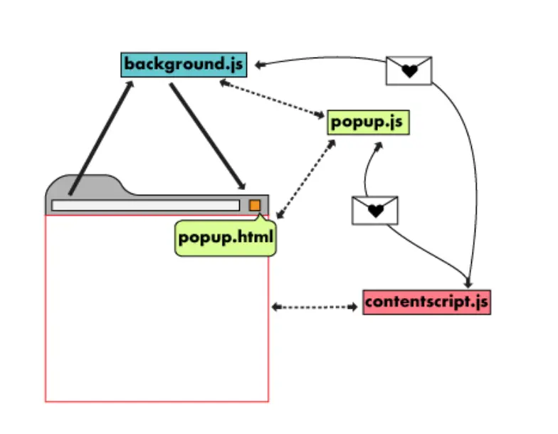
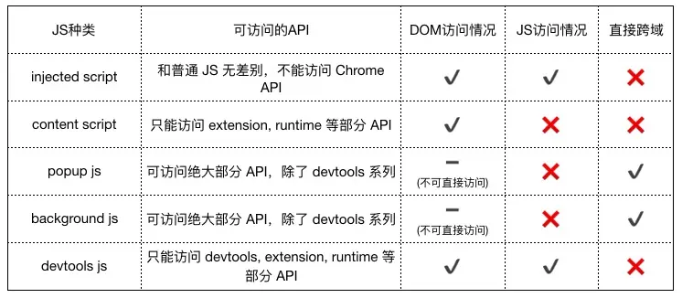

# Vue

## Vite

官方文档

https://cn.vitejs.dev

### vite.config.js配置

#### src设置@别名

```javascript
import { defineConfig } from 'vite'
import vue from '@vitejs/plugin-vue'

const { resolve } = require('path')
// https://vitejs.dev/config/
export default defineConfig({
  plugins: [vue()],
  resolve:{
    alias:{
      '@': resolve('src')
    }
  }
})
```

## vite.config.ts 引入 path 模块注意点

1. 安装`@types/node`

2. 在 `tsconfig.node.json`配置

   ```json
   "compilerOptions": {
       ...
       "allowSyntheticDefaultTmports": true
   }
   ```


## Vue CLI

### 安装

```shell
npm install -g @vue/cli
yarn global add @vue/cli
vue --version
```

### 升级

```shell
npm upadte -g @vue/cli
yarn global upgrade --latest @vue/cli
```


### 创建一个项目

```shell
vue create hello-world #创建一个名叫 hello-world 的 vue cli项目
```

### 配置全局环境变量

.env 全局默认配置文件，不论什么环境都会加载合并

.env.development 开发环境下的配置文件

.env.production 生产环境下的配置文件

属性名必须以VUE_APP_开头

.env.development

```properties
VUE_APP_URL=''
```

文件的加载

根据启动命令vue会自动加载对应的环境，vue是根据文件名进行加载的，所以上面说“不要乱起名，也无需专门控制加载哪个文件”

比如执行npm run serve命令，会自动加载.env.development文件，也有可能是npm run dev，这个得看package.json配置的是啥，具体看下面package.json配置

可通过process.env属性 （全局属性）

.env有的，.env.development也有，就会优先.env.development，.env.development没有的，.env有的，就会有.env的

### vue.config.js配置

#### src设置@别名

```javascript
module.exports = {
    chainWebpack: config => {
        config.resolve.alias
        	.set('@', resolve("src"))
    }
}
```

#### 端口设置

```javascript
module.exports = {
    devServer: {
        port: 9090
    }
}
```

#### 跨域代理

```javascript
module.exports = {
    devServer: {
        proxy: {
      '/api': {
        target: 'http://127.0.0.1:9001',
        ws: true,
        changeOrigin: true,
        pathRewrite: {
          '^/api': ''
        }
      }
    }
    }
}
```


### package.json配置

#### 环境配置

```json
{
    "scripts": {
    "start": "vue-cli-service serve --open --mode production",
    "dev": "vue-cli-service serve --open",
    "build": "vue-cli-service build",
    "build:prod": "vue-cli-service build --mode production",
    "lint": "vue-cli-service lint --fix",
    "upload": "vue-cli-service ssh",
    "test:unit": "vue-cli-service test:unit",
    "test:e2e": "vue-cli-service test:e2e --mode development"
  }
}
```

scripts中dev 说明 需要用 npm run dev 来启动开发环境

如果是serve则是 npm run serve，可以手动添加serve

```json
"scripts": {
    "start": "vue-cli-service serve --open --mode production",
    "dev": "vue-cli-service serve --open",
    "serve": "vue-cli-service serve --open",
    "build": "vue-cli-service build",
    "build:prod": "vue-cli-service build --mode production",
    "lint": "vue-cli-service lint --fix",
    "upload": "vue-cli-service ssh",
    "test:unit": "vue-cli-service test:unit",
    "test:e2e": "vue-cli-service test:e2e --mode development"
  }
```

## EditorConfig

如果使用的是Vscode，先安装插件 `EditorConfig for Visual Studio Code`


# Axios

## 安装

```shell
npm install axios
yarn add axios
```

## 创建实例

```javascript
// MyAxios.js
import axios from 'axios'
const instance = axios.create({
    baseURL: 'http://localhost:8080',
    timeout: 3000
})
export default instance
```

```javascript
// demoApi.js
import axios from '@/utils/MyAxios'
import Qs from 'qs'
export const findList = () => {
    return axios({
        url: '',
        method: 'get',
        params: {
            
        }
    })
}
export const add = (data) => {
    return axios({
        url: '',
        method: 'post',
        //axios默认contentType为application/json springmvc默认是application/x-www-form-urlencoded
        //需添加请求头
        headers: {
            'Content-Type': 'application/x-www-form-urlencoded'
        },
        //并且数据需要转换成js对象
        data: Qs.stringify(data)
    })
}
```


# TypeScript

## 基础类型

### 布尔值

```typescript
let isDone: boolean = false;
```

### 数字

```typescript
let decLiteral: number = 6;
let hexLiteral: number = 0xf00d;
let binaryLiteral: number = 0b1010;
let octalLiteral: number = 0o744;
```

### 字符串

```typescript
let name: string = "bob";
name = 'smith';
```

还可以使用*模版字符串*，它可以定义多行文本和内嵌表达式。 这种字符串是被反引号包围（ ```），并且以`${ expr }`这种形式嵌入表达式

```typescript
let name: string = `Gene`;
let age: number = 37;
let sentence: string = `Hello , my name is ${ name }.
I'll be ${ age + 1 } years old next month.`;
```

这与下面定义相同

```typescript
let sentence: string = "Hello, my name is " + name + ".\n\n" +
    "I'll be " + (age + 1) + " years old next month.";
```

### 数组

可以在元素类型后面接上`[]`,表示由此类型元素组成的一个数组：

```typescript
let list: number[] = [1, 2, 3];
```

或者

```typescript
let list: Array<number> = [1, 2, 3];
```

### 元组

元组类型允许表示一个已知元素类型和类型的数组，各元素的类型不必相同。比如，你可以定义一对值分别为`string`和`number`类型的元组。

```typescript
let x: [string, number];

x = ['hello', 10];
```

### 枚举

使用`enum`类型可以为一组数组赋予友好的名字。

```typescript
enum Color {Red, Green, Blue}
let c: Color = Color.Green;
```

默认情况下，从`0`开始为元素编号。 你也可以手动的指定成员的数值。 例如，我们将上面的例子改成从 `1`开始编号：

```typescript
enum Color {Red = 1, Green, Blue}
let c: Color = Color.Green;
```

或者，全部都采用手动赋值：

```typescript
enum Color {Red = 1, Green = 2, Blue = 4}
let c: Color = Color.Green;
```

枚举类型提供的一个便利是你可以由枚举的值得到它的名字。 例如，我们知道数值为`2`，但是不确定它映射到`Color`的哪个名字，我们可以查找相应的名字：

```typescript
enum Color {Red = 1, Green, Blue}
let colorName: string = Color[2];

console.log(colorName);  // 显示'Green'因为上面代码里它的值是2
```

### Any

不希望类型检查器对这些值进行检查而是直接让它们通过编译阶段的检查。

 那么可以使用 `any`类型来标记这些变量：

```typescript
let notSure: any = 4;
notSure = "maybe a string instead";
notSure = false; // okay, definitely a boolean
```

在对现有代码进行改写的时候，`any`类型是十分有用的，它允许你在编译时可选择地包含或移除类型检查。 你可能认为 `Object`有相似的作用，就像它在其它语言中那样。 但是 `Object`类型的变量只是允许你给它赋任意值 - 但是却不能够在它上面调用任意的方法，即便它真的有这些方法：

```typescript
let notSure: any = 4;
notSure.ifItExists(); // okay, ifItExists might exist at runtime
notSure.toFixed(); // okay, toFixed exists (but the compiler doesn't check)

let prettySure: Object = 4;
prettySure.toFixed(); // Error: Property 'toFixed' doesn't exist on type 'Object'.
```

当只知道一部分数据的类型时，`any`类型也是有用的。比如，有一个数组，它包含了不同类型的数据：

```typescript
let list: any[] = [1, true, "free"];
console.log(list[1]); // true
list[1] = 100; // 100
```

比较像元组

### Void

`void`类型与`any`类型相反，它表示没有任何类型。当一个函数没有返回值时，通常会见到其返回类型是`void`：

```typescript
function warnUser(): void {
    console.log("This is my warning message");
}
```

声明一个`void`类型的变量没有什么大用，因为你只能为它赋予`undefinded`和`null`：

```typescript
let unusable: void = undefin
```


# VueRouter

# Vuex

Vuex是一个专为Vue.js应用程序开发的**状态管理模式**。它采用集中式存储管理应用的所有组件的状态，并以相应的规则保证状态以一种可预测的方式发生变化。

状态（state）通俗说就是数据（data）。

可用于父子组件数据传值。最主要用于解决兄弟组件数据传值，以往通过将数据存储到localStorage中。

## 安装

```shell
yarn add vuex
```

## state

state相当于组件中的data，专门用来存放全局的数据

在`src`下创建 `store`文件夹

创建`index.js`文件

```javascript
import { createStore } from 'vuex';

export default createStore({
    // state相当于组件中的data，专门用来存放全局的数据
    state: {
        num: 0
    },
    //
    getters: {},
    //
    mutations: {
        increment (state) {
            state.num++
        }
    },
})
```

修改入口文件`main.js`

```javascript
import { createApp } from 'vue'
import App from './App.vue'

// 引入store
import store from '@/store'

createApp(App).use(store).mount('#app')
```

在`src`下创建`views`文件夹

创建`About.vue`

```vue
<template>
  <div>
        <h2>About 页面的 数字: {{ num }}</h2>
    </div>
</template>

<script>
export default {
    // 计算属性 
    computed: {
        num() {
            return this.$store.state.num
        }
    }
}
</script>

<style>

</style>
```

创建`Home.vue`

```vue
<template>
    <div>
        <h2>Home 页面的 数字: {{ $store.state.num }}</h2>
    </div>
    
</template>

<script>
export default {
    data() {
        return{
            
        }
    },
    
}
</script>

<style>

</style>
```

在`components`文件夹下创建`Btn.vue`

```vue
<template>
    <div>
        <button @click="changeNum">点击加1</button>
    </div>
  
</template>

<script>
export default {
    methods: {
        changeNum() {
            // 改变状态
            执行mutations下increment
            this.$store.commit('increment')
        }
    }
}
</script>

<style>

</style>
```


修改主组件`App.vue`

```vue
<script>
// This starter template is using Vue 3 <script setup> SFCs
// Check out https://v3.vuejs.org/api/sfc-script-setup.html#sfc-script-setup
import HelloWorld from './components/HelloWorld.vue'
import Home from '@/views/Home.vue'
import About from '@/views/About.vue'
import Btn from '@/components/Btn.vue'
export default {
  components: {
    Home,
    About,
    Btn
  },
  data() {
    return{

    }
  },
  methods: {

  },
  computed: {

  }

}
</script>

<template>
  <div>
    <Home></Home>
    <About></About>
    <Btn></Btn>
  </div>
  
</template>

<style>
#app {
  font-family: Avenir, Helvetica, Arial, sans-serif;
  -webkit-font-smoothing: antialiased;
  -moz-osx-font-smoothing: grayscale;
  text-align: center;
  color: #2c3e50;
  margin-top: 60px;
}
</style>

```

## getters

getters相当于组件中的computed，getters是全局的，computed是组件内部的

修改`index.js`

```javascript
// 在store(仓库)下的index.js这份文件，就是用来做状态管理的
// import Vuex from 'vuex';
import { createStore } from 'vuex';

export default createStore({
    // state相当于组件中的data，专门用来存放全局的数据
    state: {
        num: 0
    },
    // getters相当于组件中的computed，getters是全局的，computed是组件内部的
    getters: {
        getNum(state) {
            return state.num
        }
    },
    //
    mutations: {
        increment (state) {
            state.num++
        }
    },


})
```

修改`About.vue`

```vue
<template>
  <div>
        <h2>About 页面的 数字: {{ $store.getters.getNum }}</h2>
    </div>
</template>

<script>
export default {
    computed: {
        num() {
            return this.$store.state.num
        }
    }
}
</script>

<style>

</style>
```

## mutations

mutations相当于组件中的methods，但是它不能使用异步方法（定时器、axios）

修改`index.js`

```javascript
// 在store(仓库)下的index.js这份文件，就是用来做状态管理的
// import Vuex from 'vuex';
import { createStore } from 'vuex';

export default createStore({
    // state相当于组件中的data，专门用来存放全局的数据
    state: {
        num: 0
    },
    // getters相当于组件中的computed，getters是全局的，computed是组件内部的
    getters: {
        getNum(state) {
            return state.num
        }
    },
    //mutations相当于组件中的methods，但是它不能使用异步方法（定时器、axios）
    mutations: {
        increment (state, payload) {
            state.num+=payload ? payload : 1
        }
    },


})
```

修改`Btn.vue`

```vue
<template>
    <div>
        <button @click="changeNum(n)">点击加1</button>
        <br>
        <input v-model.number="n">
        {{ $store.state.num }}
    </div>
  
</template>

<script>
export default {
    data() {
        return{
            n: 2
        }
    },
    methods: {
        // 调用store中的mutations里的increment方法
        // 传参的话，使用payload
        changeNum(n) {
            console.log(n)
            this.$store.commit('increment',n)
        }
    }
}
</script>

<style>

</style>
```

## actions

actions专门用来处理异步，实际修改状态值的，依然是mutations

修改`index.js`

```javascript
// 在store(仓库)下的index.js这份文件，就是用来做状态管理的
// import Vuex from 'vuex';
import { createStore } from 'vuex';

export default createStore({
    // state相当于组件中的data，专门用来存放全局的数据
    state: {
        num: 0
    },
    // getters相当于组件中的computed，getters是全局的，computed是组件内部的
    getters: {
        getNum(state) {
            return state.num
        }
    },
    //mutations相当于组件中的methods，但是它不能使用异步方法（定时器、axios）
    mutations: {
        increase (state, payload) {
            state.num += payload ? payload : 1
        },
        clear (state) {
            state.num = 0
        },
        decrease (state, payload) {
            if (state.num === 0) {
                state.num = 0
            } else {
                state.num -= payload ? payload : 1
            }
        }
    },
    // actions专门用来处理异步，实际修改状态值的，依然是mutations
    actions: {
        decreaseAync (context, num) {
            context.commit('decrease', num)
            
        }
    }

})
```

修改`Btn.vue`

```vue
<template>
    <div>
        <button @click="changeNum(n)">点击加1</button>
        <button @click="subNum(n)">点击减1</button>
        <button @click="clearNum">清空</button>
        <br>
        <input v-model.number="n">
    </div>
  
</template>

<script>
export default {
    data() {
        return{
            n: 1
        }
    },
    methods: {
        // 调用store中的mutations里的increment方法
        // 传参的话，使用payload
        changeNum(n) {
            this.$store.commit('increase', n)
        },
        clearNum() {
            this.$store.commit('clear')
        },
        subNum(n) {
            this.$store.dispatch('decreaseAync', n)
        }
    }
}
</script>

<style>

</style>
```

# Pug.js

Pug（之前称为Jade）是一种简洁而灵活的模板引擎，用于构建HTML。Pug使用缩进和标记替代了常见的HTML标记，这使得它更易于阅读和编写。它也提供了一些功能，如变量、循环和条件语句等，可以帮助开发人员更轻松地构建动态的网页。

## 特性

### 属性

如果一个标签有多个属性，可使用 分行 或 逗号

```less
// 1
el-button(v-if="ifShow" type="size" size="small" @click="doClidk") 点击
// 2
el-button(v-if="ifShow",type="size",size="small",@click="doClidk") 点击
// 3
el-button(v-if="ifShow"
          type="size"
  	  size="small"
  	  @click="doClick") 点击
```

### 注释

- 单行

```xml
// 一些内容
p foo
p bar

<!-- 一些内容 -->
<p>foo</p>
<p>bar</p>
```

- 不输出注释

```less
//- 这行不会出现在结果中
p foo
p bar

<p>foo</p>
<p>bar</p>
```

- 块注释

```xml
body
  //
    一堆
    文字
    进行中

<body>
<!-- 一堆
     文字
     进行中 -->
</body>
```


## Vue 2集成Pug.js

Vue CLI安装Pug.js

```shell
npm i -D pug pug-html-loader pug-plain-loader
```

vue.config.js配置

```javascript
// vue.config.js
module.exports = {
  chainWebpack: config => {
    config.module.rule('pug')
      .test(/\.pug$/)
      .use('pug-html-loader')
      .loader('pug-html-loader')
      .end()
  }
}
```

使用前

```vue
<template>
	<div class="app-container">
        <!-- 搜索栏 -->
        <el-form :model="queryParams" ref="queryForm" size="small" :inline="true" v-show="showSearch">
            <el-form-item label="昵称">
                <el-input
                          v-model="queryParams.nickName"
                          placeholder="请输入用户昵称"
                          clearable
                          style="..."
                          @keyup.enter.native="handleQuery"
                          />
    </el-form-item>
            <el-form-item label="状态" prop="status">
                <el-select
                           v-model="queryParams.status"
                           placeholder="请选择状态"
                           clearable
                           style="..."
                           >
                    <el-option
                               v-for="dict in dict.type.sys_normal_disable"
                               :key="dict.value"
                               :label="dict.label"
                               :value="dict.value"
                               />
    </el-select>
    </el-form-item>
            <el-form-item>
                <el-button type="primary" icon="el-icon-search" size="mini" @click="handleQuery">搜索</el-button>
                <el-button icon="el-icon-refresh" size="mini" @click="resetQuery">重置</el-button>
    </el-form-item>
    </el-form>

        <!-- 工具栏按钮 -->
        <el-row :gutter="10" class="mb8">
            <el-col :span="1.5">
                <el-button
                           type="primary"
                           plain
                           icon="el-icon-plus"
                           size="mini"
                           @click="handleAdd"
                           >新增</el-button>
    </el-col>
            <el-col :span="1.5">
                <el-button
                           type="success"
                           plain
                           icon="el-icon-edit"
                           size="mini"
                           :disabled="single"
                           @click="handleUpdate"
                           >修改</el-button>
    </el-col>
            <el-col :span="1.5">
                <el-button
                           type="danger"
                           plain
                           icon="el-icon-delete"
                           size="mini"
                           :disabled="multiple"
                           @click="handleDelete"
                           >删除</el-button>
    </el-col>
            <el-col :span="1.5">
                <el-button
                           type="warning"
                           plain
                           icon="el-icon-download"
                           size="mini"
                           @click="handleExport"
                           >导出</el-button>
    </el-col>
    </el-row>

        <!-- 表格 -->
        <el-table v-loading="loading" :data="list" @selection-change="handleSelectionChange">
            <el-table-column type="selection" width="55" align="center" />
            <el-table-column prop="userId" v-if="false"></el-table-column>
            <el-table-column label="用户昵称" align="center" prop="nickName" />
            <el-table-column label="用户头像" align="center" prop="pic" />
            <el-table-column label="状态" align="center" prop="status">
                <template slot-scope="scope">
                    <dict-tag :options="dict.type.sys_normal_disable" :value="scope.row.status" />
</template>
</el-table-column>
<el-table-column label="注册时间" align="center" prop="userRegtime"></el-table-column>
<el-table-column label="操作" align="center" class-name="small-padding fixed-width">
    <el-button
               size="mini"
               type="text"
               icon="el-icon-edit"
               @click="handleUpdate(scope.row)"
               v-hasPermi="['system:dict:edit']"
               >修改</el-button>
    <el-button
               size="mini"
               type="text"
               icon="el-icon-delete"
               @click="handleDelete(scope.row)"
               v-hasPermi="['system:dict:remove']"
               >删除</el-button>
</el-table-column>
</el-table>

<pagination
            v-show="total>0"
            :total="total"
            :page.sync="queryParams.pageNum"
            :limit.sync="queryParams.pageSize"
            @pagination="getList"
            />

<el-dialog :title="title" :visible.sync="open" width="500px" append-to-body>
    <el-form ref="form" :model="form" :rules="rules" label-width="80px">
        <el-form-item label="用户头像" prop="pic">
            <!-- <el-input v-model="form.pic" placeholder="请输入" /> -->
        </el-form-item>
        <el-form-item label="用户昵称" prop="nickName">
            <el-input v-model="form.nickName" placeholder="请输入用户昵称" />
        </el-form-item>
        <el-form-item label="状态" size="mini" prop="status">
            <el-radio
                      v-for="dict in dict.type.sys_normal_disable"
                      :key="dict.value"
                      :label="dict.value"
                      >{{ dict.label }}</el-radio>
        </el-form-item>
    </el-form>
    <div slot="footer" class="dialog-footer">
        <el-button type="primary" @click="submitForm">确 定</el-button>
        <el-button @click="cancel">取 消</el-button>
    </div>
</el-dialog>
</div>
</template>
```


使用后

```less
<template lang="pug">
  .app-container
    // 搜索栏
    el-form(:model="queryParams" ref="queryForm" size="small" :inline="true" v-show="showSearch")
      el-form-item(label="昵称")
        el-input(
          v-model="queryParams.nickName"
          placeholder="请输入用户昵称"
          clearable
          style="..."
          @keyup.enter.native="handleQuery"
        )
      el-form-item(label="状态" prop="status")
        el-select(
          v-model="queryParams.status"
          placeholder="请选择状态"
          clearable
          style="..."
        )
          el-option(
            v-for="dict in dict.type.sys_normal_disable"
            :key="dict.value"
            :label="dict.label"
            :value="dict.value"
          )
      el-form-item
        el-button(type="primary" icon="el-icon-search" size="mini" @click="handleQuery") 搜索
        el-button(icon="el-icon-refresh" size="mini" @click="resetQuery") 重置

    // 工具栏按钮
    el-row.mb8(:gutter="10")
      el-col(:span="1.5")
        el-button(
          type="primary"
          plain
          icon="el-icon-plus"
          size="mini"
          @click="handleAdd"
        ) 新增
      el-col(:span="1.5")
        el-button(
          type="success"
          plain
          icon="el-icon-edit"
          size="mini"
          :disabled="single"
          @click="handleUpdate"
        ) 修改
      el-col(:span="1.5")
        el-button(
          type="danger"
          plain
          icon="el-icon-delete"
          size="mini"
          :disabled="multiple"
          @click="handleDelete"
        ) 删除
      el-col(:span="1.5")
        el-button(
          type="warning"
          plain
          icon="el-icon-download"
          size="mini"
          @click="handleExport"
        ) 导出

    // 表格
    el-table(v-loading="loading" :data="list" @selection-change="handleSelectionChange")
      el-table-column(type="selection" width="55" align="center")
      el-table-column(prop="userId" v-if="false")
      el-table-column(label="用户昵称" align="center" prop="nickName")
      el-table-column(label="用户头像" align="center" prop="pic")
      el-table-column(label="状态" align="center" prop="status")
        template(slot-scope="scope")
          dict-tag(:options="dict.type.sys_normal_disable" :value="scope.row.status")
      el-table-column(label="注册时间" align="center" prop="userRegtime")
      el-table-column(label="操作" align="center" class-name="small-padding fixed-width")
        el-button(
          size="mini"
          type="text"
          icon="el-icon-edit"
          @click="handleUpdate(scope.row)"
          v-hasPermi="['system:dict:edit']"
        ) 修改
        el-button(
          size="mini"
          type="text"
          icon="el-icon-delete"
          @click="handleDelete(scope.row)"
          v-hasPermi="['system:dict:remove']"
        ) 删除

    pagination(
      v-show="total>0"
      :total="total"
      :page.sync="queryParams.pageNum"
      :limit.sync="queryParams.pageSize"
      @pagination="getList"
    )

    el-dialog(
      :title="title"
      :visible.sync="open"
      width="500px"
      append-to-body
    )
      el-form(
        ref="form"
        :model="form"
        :rules="rules"
        label-width="80px"
      )
        el-form-item(label="用户头像" prop="pic")
          // el-input(v-model="form.pic" placeholder="请输入")
        el-form-item(label="用户昵称" prop="nickName")
          el-input(v-model="form.nickName" placeholder="请输入用户昵称")
        el-form-item(label="状态" size="mini" prop="status")
          el-radio(
            v-for="dict in dict.type.sys_normal_disable"
            :key="dict.value"
            :label="dict.value"
          ) {{ dict.label }}
      .dialog-footer(slot="footer")
        el-button(type="primary" @click="submitForm") 确 定
        el-button(@click="cancel") 取 消
</template>
```


# Vben Admin

官方文档

https://vvbin.cn/doc-next/

# D2Admin

## API封装

/src/api

### axios实例

`service.js`

### 自定义API

modules目录

`sys.user.api.js`

```javascript
// import { find, assign } from 'lodash'

// const users = [
//   { username: 'admin', password: 'admin', uuid: 'admin-uuid', name: 'Admin' },
//   { username: 'editor', password: 'editor', uuid: 'editor-uuid', name: 'Editor' },
//   { username: 'user1', password: 'user1', uuid: 'user1-uuid', name: 'User1' }
// ]
// import Qs from 'qs'
const baseURL = '/admin'
export default ({ service, request, serviceForMock, requestForMock, mock, faker, tools }) => ({
  /**
   * @description 登录
   * @param {Object} data 登录携带的信息
   */
  SYS_USER_LOGIN (data = {}) {
    // 模拟数据
    // mock
    //   .onAny('/login')
    //   .reply(config => {
    //     const user = find(users, tools.parse(config.data))
    //     return user
    //       ? tools.responseSuccess(assign({}, user, { token: faker.random.uuid() }))
    //       : tools.responseError({}, '账号或密码不正确')
    //   })
    // 接口请求
    return request({
      url: baseURL + '/login/login',
      method: 'post',
      data: data
      // data: Qs.stringify(data),
      // headers: {
      //   'Content-Type': 'application/x-www-form-urlencoded'
      // }

    })
  },
  FIND_USER_LIST (data = {}) {
    return request({
      url: baseURL + '/user/getAll',
      method: 'post',
      data: data
    })
  },
  REFRESH_MSG () {
    return request({
      url: baseURL + '/user/refreshmsg',
      method: 'get'
    })
  },
  ADD_USER (data = {}) {
    return request({
      url: baseURL + '/user/add',
      method: 'post',
      data: data
    })
  },
  UPDATE_USER (data = {}) {
    return request({
      url: baseURL + '/user/update',
      method: 'put',
      data: data
    })
  },
  DELETE_USER_BY_ID (data = {}) {
    return request({
      url: baseURL + '/user/delete',
      method: 'delete',
      data: data
    })
  }
})

```

`sys.menu.api.js`

```javascript
const baseURL = '/admin'
export default ({ request }) => ({
  MENU_CURRENT (data = {}) {
    return request({
      url: baseURL + '/menu/get/current/menutree',
      method: 'get'
    })
  },
  ROUTER_CURRENT (data = {}) {
    return request({
      url: baseURL + '/menu/get/current/vuerouter',
      method: 'get'
    })
  }
})

```


## 登录逻辑

登录页面 

/src/views/system/login/page.vue

`page.vue`

```vue
<script>
methods: {
// 通过Vuex 展开action 分发login
    ...mapActions('d2admin/account', [
      'login'
    ]),

    // 提交登录信息
    submit () {
      this.$refs.loginForm.validate((valid) => {
        if (valid) {
          // 登录
          // 注意 这里的演示没有传验证码
          // 具体需要传递的数据请自行修改代码
            // 调用action
          this.login({
            username: this.formLogin.username,
            password: this.formLogin.password
          })
            .then(() => {
              // 重定向对象不存在则返回顶层路径
              this.$router.replace(this.$route.query.redirect || '/')
            })
        } else {
          // 登录表单校验失败
          this.$message.error('表单校验失败，请检查')
        }
      })
    }
</script>
```

/src/store/modules/d2admin/modules/account.js

`account.js`

```javascript
actions: {
    /**
     * @description 登录
     * @param {Object} context
     * @param {Object} payload username {String} 用户账号
     * @param {Object} payload password {String} 密码
     * @param {Object} payload route {Object} 登录成功后定向的路由对象 任何 vue-router 支持的格式
     */
    async login ({ dispatch }, {
      username = '',
      password = '',
      to = '/'
    } = {}) {
        // 这里axios请求
      const res = await api.SYS_USER_LOGIN({ username, password })
      // 设置 cookie 一定要存 uuid 和 token 两个 cookie
      // 整个系统依赖这两个数据进行校验和存储
      // uuid 是用户身份唯一标识 用户注册的时候确定 并且不可改变 不可重复
      // token 代表用户当前登录状态 建议在网络请求中携带 token
      // 如有必要 token 需要定时更新，默认保存一天
      util.cookies.set('uuid', res.uuid)
      util.cookies.set('token', res.token)
      // 设置 vuex 用户信息
      await dispatch('d2admin/user/set', { name: res.name }, { root: true })
      // 用户登录后从持久化数据加载一系列的设置
      await dispatch('load')
        // 此处执行动态菜单 动态路由
      await dispatch('updateCache', { to: to })
    },
}
```

## 动态菜单

修改`main.js`入口文件

```javascript
new Vue({
  router,
  store,
  i18n,
  render: h => h(App),
  created () {
    // 处理路由 得到每一级的路由设置
    this.$store.commit('d2admin/page/init', frameInRoutes)
       
    // 设置顶栏菜单   
    // this.$store.commit('d2admin/menu/headerSet', menuHeader)
    // 设置侧边栏菜单
    // this.$store.commit('d2admin/menu/asideSet', menuAside)

    // 对于已登录的做菜单，搜索数据处理
    this.$store.dispatch('d2admin/menu/get')
    // 初始化菜单搜索功能 修改搜索数据根据侧边栏还是头部栏
    // this.$store.commit('d2admin/search/init', menuAside)
  },
```

注释掉以下 mutation

```javascript
	// 设置顶栏菜单   
    // this.$store.commit('d2admin/menu/headerSet', menuHeader)
    // 设置侧边栏菜单
    // this.$store.commit('d2admin/menu/asideSet', menuAside)
```

所有逻辑在Vuex中完成

到 /src/store/modules/d2admin/modules/menu.js

`menu.js`

```javascript
// 设置文件
import setting from '@/setting.js'
import api from '@/api'
import { uniqueId } from 'lodash'
// 这是从/src/menu/index.js拿到的方法 负责给菜单空的path加上 d2-menu-empty- #随机数字 需要引入lodash uniqueId
function supplementPath (menu) {
  return menu.map(e => ({
    ...e,
    path: e.path || uniqueId('d2-menu-empty-'),
    ...e.children ? {
      children: supplementPath(e.children)
    } : {}
  }))
}
export default {
  namespaced: true,
  state: {
    // 顶栏菜单
    header: [],
    // 侧栏菜单
    aside: [],
    // 侧边栏收缩
    asideCollapse: setting.menu.asideCollapse,
    // 侧边栏折叠动画
    asideTransition: setting.menu.asideTransition
  },
  actions: {
    /**
     * 设置侧边栏展开或者收缩
     * @param {Object} context
     * @param {Boolean} collapse is collapse
     */
    async asideCollapseSet ({ state, dispatch }, collapse) {
      // store 赋值
      state.asideCollapse = collapse
      // 持久化
      await dispatch('d2admin/db/set', {
        dbName: 'sys',
        path: 'menu.asideCollapse',
        value: state.asideCollapse,
        user: true
      }, { root: true })
    },
    /**
     * 切换侧边栏展开和收缩
     * @param {Object} context
     */
    async asideCollapseToggle ({ state, dispatch }) {
      // store 赋值
      state.asideCollapse = !state.asideCollapse
      // 持久化
      await dispatch('d2admin/db/set', {
        dbName: 'sys',
        path: 'menu.asideCollapse',
        value: state.asideCollapse,
        user: true
      }, { root: true })
    },
      // 以下为生成菜单数据的 action
    /**
     * 设置菜单
     * @param {*} param0
     * @param {*} aside
     */
    async set ({ state, dispatch }, aside) {
      aside = supplementPath(Array.from(await api.MENU_CURRENT()))
      state.aside = aside
      console.log('---set-------')
      // 持久化
      await dispatch('d2admin/db/set', {
        dbName: 'sys',
        path: 'menu.aside',
        value: aside,
        user: true
      }, { root: true })
      // 搜索
      await dispatch('d2admin/search/init', aside, { root: true })
    },
      // 这个是页面刷新用到的
    async get ({ state, dispatch, commit }) {
      state.aside = await dispatch('d2admin/db/get', {
        dbName: 'sys',
        path: 'menu.aside',
        defaultValue: [],
        user: true
      }, { root: true })
      commit('asideSet', state.aside)
      // 搜索
      await dispatch('d2admin/search/init', state.aside, { root: true })
    },
    /**
     * 设置侧边栏折叠动画
     * @param {Object} context
     * @param {Boolean} transition is transition
     */
    async asideTransitionSet ({ state, dispatch }, transition) {
      // store 赋值
      state.asideTransition = transition
      // 持久化
      await dispatch('d2admin/db/set', {
        dbName: 'sys',
        path: 'menu.asideTransition',
        value: state.asideTransition,
        user: true
      }, { root: true })
    },
    /**
     * 切换侧边栏折叠动画
     * @param {Object} context
     */
    async asideTransitionToggle ({ state, dispatch }) {
      // store 赋值
      state.asideTransition = !state.asideTransition
      // 持久化
      await dispatch('d2admin/db/set', {
        dbName: 'sys',
        path: 'menu.asideTransition',
        value: state.asideTransition,
        user: true
      }, { root: true })
    },
    /**
     * 持久化数据加载侧边栏设置
     * @param {Object} context
     */
    async asideLoad ({ state, dispatch }) {
      // store 赋值
      const menu = await dispatch('d2admin/db/get', {
        dbName: 'sys',
        path: 'menu',
        defaultValue: setting.menu,
        user: true
      }, { root: true })
      state.asideCollapse = menu.asideCollapse !== undefined ? menu.asideCollapse : setting.menu.asideCollapse
      state.asideTransition = menu.asideTransition !== undefined ? menu.asideTransition : setting.menu.asideTransition
    }
  },
  mutations: {
    /**
     * @description 设置顶栏菜单
     * @param {Object} state state
     * @param {Array} menu menu setting
     */
    headerSet (state, menu) {
      // store 赋值
      state.header = menu
    },
    /**
     * @description 设置侧边栏菜单
     * @param {Object} state state
     * @param {Array} menu menu setting
     */
    asideSet (state, menu) {
      // store 赋值
      state.aside = menu
    }
  }
}

```


到 /src/store/modules/d2admin/modules/account.js

`account.js`

新增一个action updateCache

```javascript
updateCache ({ dispatch }, { to = '/' }) {
      return new Promise((resolve, reject) => {
          // 设置菜单
        dispatch('d2admin/menu/set', {}, { root: true })
		// 设置路由
        api.ROUTER_CURRENT().then(result => {
          dispatch('d2admin/router/load', { to: to, focus: true, data: result }, { root: true })
        })

        resolve()
      })
    }
```

api请求

/src/api/modules/sys.menu.api.js

`sys.menu.api.js`

```javascript
const baseURL = '/admin'
export default ({ request }) => ({
	// 菜单请求
  MENU_CURRENT (data = {}) {
    return request({
      url: baseURL + '/menu/get/current/menutree',
      method: 'get'
    })
  },
    // 路由请求
  ROUTER_CURRENT (data = {}) {
    return request({
      url: baseURL + '/menu/get/current/vuerouter',
      method: 'get'
    })
  }
})

```

响应报文

```json
{
    "code": 0,
    "msg": "请求成功",
    "data": [
        {
            "id": 1,
            "title": "信评中心",
            "enname": "crManager",
            "parentId": -1,
            "icon": "folder-o",
            "sort": 1,
            "isEnabled": 1,
            "children": [
                {
                    "id": 2,
                    "title": "信评工作台",
                    "enname": "crWorkbench",
                    "parentId": 1,
                    "icon": "folder-o",
                    "sort": 2,
                    "isEnabled": 1,
                    "children": [
                        {
                            "id": 3,
                            "title": "信用评级待办",
                            "parentId": 2,
                            "icon": "folder-o",
                            "sort": 3,
                            "isEnabled": 1
                        }
                    ]
                },
                {
                    "id": 4,
                    "title": "信用评级启动",
                    "parentId": 1,
                    "icon": "folder-o",
                    "isEnabled": 1,
                    "children": [
                        {
                            "id": 5,
                            "title": "个人评级",
                            "enname": "cr_person_launch",
                            "parentId": 4,
                            "path": "/cr_person_launch",
                            "component": "cr/cr_launch/cr_person_launch/cr_person_launch",
                            "icon": "folder-o",
                            "isEnabled": 1
                        },
                        {
                            "id": 6,
                            "title": "企业评级",
                            "enname": "cr_business_launch",
                            "parentId": 4,
                            "path": "/cr_business_launch",
                            "component": "cr/cr_launch/cr_business_launch/cr_business_launch",
                            "icon": "folder-o",
                            "isEnabled": 1
                        }
                    ]
                },
                {
                    "id": 7,
                    "title": "信用评级查询",
                    "parentId": 1,
                    "icon": "folder-o",
                    "isEnabled": 1
                },
                {
                    "id": 8,
                    "title": "评级模板管理",
                    "parentId": 1,
                    "icon": "folder-o",
                    "isEnabled": 1
                }
            ]
        },
        {
            "id": 9,
            "title": "系统管理",
            "parentId": -1,
            "icon": "folder-o",
            "isEnabled": 1,
            "children": [
                {
                    "id": 10,
                    "title": "用户管理",
                    "enname": "usertable",
                    "parentId": 9,
                    "path": "/usertable",
                    "component": "user/usertable",
                    "icon": "folder-o",
                    "isEnabled": 1
                },
                {
                    "id": 11,
                    "title": "菜单管理",
                    "enname": "menu",
                    "parentId": 9,
                    "path": "/menu",
                    "component": "menu/menu",
                    "isEnabled": 1
                },
                {
                    "id": 16,
                    "title": "权限管理",
                    "enname": "role",
                    "parentId": 9,
                    "path": "/role",
                    "component": "role/role",
                    "isEnabled": 1
                }
            ]
        },
        {
            "id": 12,
            "title": "演示页面",
            "parentId": -1,
            "isEnabled": 1,
            "children": [
                {
                    "id": 13,
                    "title": "页面 1",
                    "enname": "page1",
                    "parentId": 12,
                    "path": "/page1",
                    "component": "demo/page1",
                    "isEnabled": 1
                },
                {
                    "id": 14,
                    "title": "页面 2",
                    "enname": "page2",
                    "parentId": 12,
                    "path": "/page2",
                    "component": "demo/page2",
                    "isEnabled": 1
                },
                {
                    "id": 15,
                    "title": "页面 3",
                    "enname": "page3",
                    "parentId": 12,
                    "path": "/page3",
                    "component": "demo/page3",
                    "isEnabled": 1
                }
            ]
        }
    ],
    "type": "success"
}
```


# 包管理器

## npm包管理器

```shell
# 淘宝镜像
# 永久生效
npm config set registry https://registry.npmmirror.com
# 查看镜像
npm config get registry
# 暂时生效
npm install --registry https://registry.npmmirror.com
```

### CentOS7安装node js

```shell
# 首先下载nodejs安装包
# 解压 注意这不是gz压缩
tar -xvf node-v14.18.1-linux-x64.tar.xz
mv node-v14.18.1-linux-x64.tar.xz /usr/node
vim /etc/profile
# node
export NODE_HOME=/usr/node
export PATH=$PATH:$NODE_HOME/bin
source /etc/profile
# 查看node 版本
node -v
npm -v
# 安装yarn
npm install -g yarn
# 软连接，防止找不到环境
ln -s "/usr/node/bin/node" "/usr/local/bin/node"
ln -s "/usr/node/bin/npm" "/usr/local/bin/npm"
ln -s "/usr/node/bin/yarn" "/usr/local/bin/yarn"
```

## yarn包管理器

```shell
# PowerShell yarn : 无法加载文件 C:\Users\Admin\AppData\Roaming\npm\yarn.ps1,因为在此系统因为在此系统上禁止运行脚本。
# 以管理员方式运行powershell
set-ExecutionPolicy RemoteSigned

# 查看当前镜像
yarn config get registry

# https://registry.yarnpkg.com
# 更换镜像
yarn config set registry https://registry.yarnpkg.com
 
# 查看镜像是否成功
yarn config get registry

# 全局安装PTE脚手架
yarn global add generator-pte-cli
# 安装依赖
yarn
# 运行项目
yarn dev # yarn run dev
# 部署
# 具体看 package.json
yarn deploy
yarn build
# 移除依赖
yarn remove pte-ui
# 安装依赖
yarn add pte-ui@2.1.54
# 查看缓存路径
yarn cache dir
# 修改缓存路径
yarn config set cache-folder "E:\\Yarn\\Cache"


```

### 安装node-sass

```shell
# 安装gyp
npm install -g node-gyp
npm config set python python2.7
npm config set msvs_version 2017
yarn
```

### yarn和npm命令对比

| npm                             | yarn                         | 注释                              |
| ------------------------------- | ---------------------------- | --------------------------------- |
| npm init                        | yarn init                    | 初始化项目                        |
| npm install                     | yarn                         | 安装全部依赖                      |
| npm install react --save        | yarn add react               | 安装某个依赖，保存到dependencies  |
| npm uninstall react --save      | yarn remove react            | 移除某个依赖                      |
| npm install react --save-dev    | yarn add react --dev         | 安装某依赖，保存到devDependencies |
| npm update react --save         | yarn upgrade react           | 更新某个依赖包                    |
| npm install react --global      | yarn global add react        | 全局安装某个依赖                  |
| npm install --save react axios  | yarn add react axios         | 同时安装多个依赖包                |
| npm install [package]@[version] | yarn add [package]@[version] | 安装指定版本的包                  |
| npm rebuild                     | yarn install --force         | 重新下载所有包                    |

## 

## pnpm包管理器

```shell
# 查看缓存存储位置
pnpm store path
# 设置缓存存储位置
pnpm config set store-dir <new path>
# 修改全局源
pnpm config set registry https://registry.npmmirror.com
# 修改项目源
pnpm config set registry https://registry.npmmirror.com --save
# 查看当前设置的源
pnpm config get registry
```


## 快速删除 node_modules

利用 npm 包 rimraf 快速删除 `node_modules` 文件夹

先全局安装 npm 包

```shell
npm install rimraf -g
```

使用

```shell
rimraf node_modules
```


# NVM

> nvm（Node Version Manager）是一个非常有用的工具，可以让您在同一台机器上安装和管理多个 Node.js 版本。
>
> [nvm-sh/nvm: Node Version Manager - POSIX-compliant bash script to manage multiple active node.js versions (github.com)](https://github.com/nvm-sh/nvm?tab=readme-ov-file#installing-and-updating)

**nvm 常用命令：**

```shell
# 查看 nvm 版本
nvm --version

# 列出所有可安装的 Node.js 版本
nvm list-remote
# Windows 上使用
nvm list available

# 安装最新的 LTS 版本
nvm install --lts

# 安装特定版本
nvm install 18.17.0
nvm install 16.20.1

# 列出已安装的版本
nvm list
# 或
nvm ls

# 切换到特定版本
nvm use 18.17.0

# 设置默认版本
nvm alias default 18.17.0

# 查看当前使用的版本
nvm current

# 卸载特定版本
nvm uninstall 16.20.1

# 查看当前使用的npm的目录
npm prefix -g
```

# npx

npm大家都知道，是node的包管理器，npx虽然也见过，但似乎较少用过，那npx到底是什么呢？

npx是npm5.2.0版本新增的一个工具包，定义为npm包的执行者，相比npm，npx会自动安装依赖包并执行某个命令。

假如我们要用create-react-app脚手架创建一个react项目，常规的做法是先安装create-react-app，然后才能使用create-react-app执行命令进行项目创建。

```shell
// 第一步
npm i -g create-react-app
// 第二步
create-react-app my-react-app
```

有了npx后，我们可以省略安装create-react-app这一步。

```shell
// 使用npx
npx create-react-app my-react-app
```

npx会在当前目录下的`./node_modules/.bin`里去查找是否有可执行的命令，没有找到的话再从全局里查找是否有安装对应的模块，全局也没有的话就会自动下载对应的模块，如上面的create-react-app，npx会将create-react-app下载到一个临时目录，用完即删，不会占用本地资源。

> npm自带npx，可以直接使用，如果没有可以手动安装一下：npm i -g npx

## npx命令参数

### --no-install

--no-install 告诉npx不要自动下载，也意味着如果本地没有该模块则无法执行后续的命令。

```shell
npx --no-install create-react-app my-react-app

// not found: create-react-app
```

### --ignore-existing

--ignore-existing 告诉npx忽略本地已经存在的模块，每次都去执行下载操作，也就是每次都会下载安装临时模块并在用完后删除。

### -p

-p 用于指定npx所要安装的模块，它可以指定某一个版本进行安装：

```shell
npx -p node@12.0.0 node index.js
```

-p 还可以用于同时安装多个模块：

```shell
npx -p lolcatjs -p cowsay [command]
```

### -c

-c 告诉npx所有命令都用npx解释。

```shell
npx -p lolcatjs -p cowsay 'cowsay hello | lolcatjs'
```

这样运行会报错，因为第一项命令cowsay hello默认有npx解释，但第二项命令localcatjs会有shell解释，此时lolcatjs并没有全局安装，所以就报错了。这时候可以用 -c 参数来解决。

```shell
npx -p lolcatjs -p cowsay -c 'cowsay hello | lolcatjs'
```


# 加密解密

## jsencrypt

### 安装

```shel
npm install jsencrypt --save-dev
```

引入

```javascript
import jsencrypt from 'jsencrypt'
```

# Chrome 插件开发

## 项目配置

```typescript
import pkg from "../package.json";

const manifest: chrome.runtime.Manifest = {
    // 描述manifest文件的版本号，必须为3
  manifest_version: 3,
    // 描述插件的名称。这个属性就是配置我们插件名称，用于显示在插件列表
  name: pkg.name,
    // 描述插件的版本号。
  version: pkg.version,
    // 描述插件的简要说明。
  description: pkg.description,
    // 允许使用扩展的域名
  host_permissions: ["*://*/*"],
  background: {
    service_worker: "src/entries/background/main.ts",
  },
    // 描述插件图标的大小和文件路径。
  icons: {
    "16": "images/icon16.png",
    "24": "images/icon24.png",
    "32": "images/icon32.png",
    "48": "images/icon48.png",
  },
  action: {
    default_popup: "index.html",
    // default_icon: {
    //   "16": "images/icon16.png",
    //   "24": "images/icon24.png",
    //   "32": "images/icon32.png",
    //   "48": "images/icon48.png",
    // },
  },
  options_ui: {
    page: "src/entries/options/index.html",
    open_in_tab: false,
  },
    // activeTab: 当扩展卡选项被改变需要重新获取新的权限
    // scripting: 使用 chrome.scripting API 在不同上下文中执行脚本
    // tabs: 操作选项卡api（改变位置等）
    // storage: 访问localstorage/sessionStorage权限
    // declarativeContent: 使用 chrome.declarativeContent API 根据网页内容执行操作，而无需读取网页内容的权限。
  permissions: ["activeTab", "scripting", "declarativeContent: "],

  content_security_policy: {
    extension_pages: "script-src 'self'; object-src 'self';",
  },
};

export default manifest;

```

## 内容脚本

需要操作dom，并且不需要一直在后台运行，只需要再打开网页的时候运行

使用内容脚本（`content_scripts`）的方式运行插件即可

内容脚本（`content_scripts`）的特性:

- 在页面打开，或者页面加载结束，或者页面空闲的时候注入
- 共享页面dom，也就是说可以操作页面的dom
- JS隔离的，插件中的js定义并不会影响页面的js，也不能引用页面中的js变量、函数

开始使用`content_scripts`:

`content_scripts` 有多种使用方式：

1. 静态注入。在`manifest.json`文件中声明
2. 动态注入。`chrome.scripting.registerContentScripts`
3. 编码注入。`chrome.scripting.executeScript`

一般使用静态注入。

在`manifest.ts`文件中添加一下`content_scripts`配置

```typescript
  content_scripts: [
    // {
    //   matches: ["http://192.168.0.88:8080/kaoqin-server/login*"],
    //   js: ["src/entries/content/kaoqin-server.js"],
    //   run_at: "document_end",
    // },
    {
      //"matches": ["http://*/*", "https://*/*"],
      // "<all_urls>" 表示匹配所有地址
      matches: ["<all_urls>"],
      // 多个JS按顺序注入
      js: ["src/entries/content/content-script.js"],
      // 代码注入的时间，可选值： "document_start", "document_end", or "document_idle"，最后一个表示页面空闲时，默认document_idle
      run_at: "document_end",
    },
  ],
```

`content_scripts`还有动态注入的方式，其实就是通过调用api的方法来注入，如下示例代码：

```typescript
chrome.scripting
  .registerContentScripts([{
    id: "session-script",
    js: ["content.js"],
    persistAcrossSessions: false,
    matches: ["*://example.com/*"],
    runAt: "document_start",
  }])
  .then(() => console.log("registration complete"))
  .catch((err) => console.warn("unexpected error", err))
```

动态注入可以scripts注入的时机更可控、或者可以更新、删除content_scripts。

`content_scripts`属性是一个数组，也就是说我们可以配置多个脚本规则，数组的每个元素包含多个属性:

- matches 指定此内容脚本将被注入到哪些页面。必填
- js 要注入匹配页面的 JavaScript 文件列表。选填
- css 要注入匹配页面的 CSS 文件列表。选填
- run_at 指定何时应将脚本注入页面。有三种类型,`document_start`,`document_end`,`document_idle`。默认为document_idle。选填

## 页面通信

> 由于`content_scripts`是在网页中运行的，而非在扩展的上下文中，因此它们通常需要某种方式与扩展的其余部分进行通信。 扩展页面（`options_page,bakcground,popup`）和内容脚本(`content_scripts`)之间的通信通过使用消息传递进行。 任何一方都可以侦听从另一端发送的消息，并在同一通道上做出响应。消息可以包含任何有效的 JSON 对象（空值、布尔值、数字、字符串、数组或对象）。





### 发送

从内容脚本(`content_scripts`) 发送到 扩展页面（`options_page,bakcground,popup`），代码示例：

```javascript
(async () => {
  const response = await chrome.runtime.sendMessage({greeting: "hello"});
  console.log(response);
})();
```

从扩展页面（`options_page,bakcground,popup`）发送到 内容脚本(`content_scripts`) 代码示例:

```javascript
(async () => {
    //获取当前的tab页面
  const [tab] = await chrome.tabs.query({active: true, lastFocusedWindow: true});
  const response = await chrome.tabs.sendMessage(tab.id, {greeting: "hello"});
  console.log(response);
})();
```

### 接受

接收消息的方法都是一样的，通过`runtime.onMessage`事件侦听器来处理消息

```javascript
chrome.runtime.onMessage.addListener(
  function(request, sender, sendResponse) {
    console.log(sender.tab ?
                "from a content script:" + sender.tab.url :
                "from the extension");
    if (request.greeting === "hello")
      //处理完消息后、通知发送方
      sendResponse({farewell: "goodbye"});
  }
);
```

